# 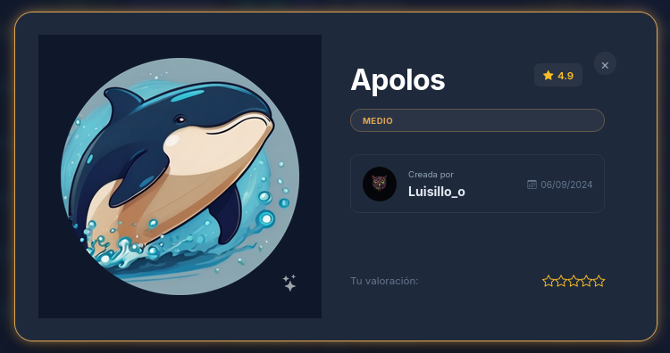

## Introduction

Apolo is a medium-level CTF (Capture The Flag) available on DockerLabs, considered one of the most complex laboratories due to the multiple challenges presented and the various techniques necessary to progressively compromise the system.

---

## Phase 1: Reconnaissance

### Connectivity verification

The process begins with a ping to verify connectivity with the target:

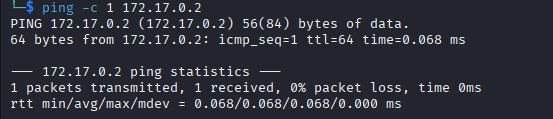

### Port scanning

A rapid scan is performed with `nmap` using the flag `-T4`. However, in real environments it is recommended to use `-T2` or lower to minimize noise generated during scanning:

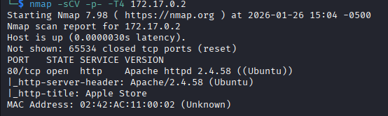

From the analysis, it is identified that port 80 runs an HTTP service and no other open services are found. Therefore, an initial reconnaissance visit to this service is conducted.

### Inspection of the web service

The HTTP service is accessed to examine its content:

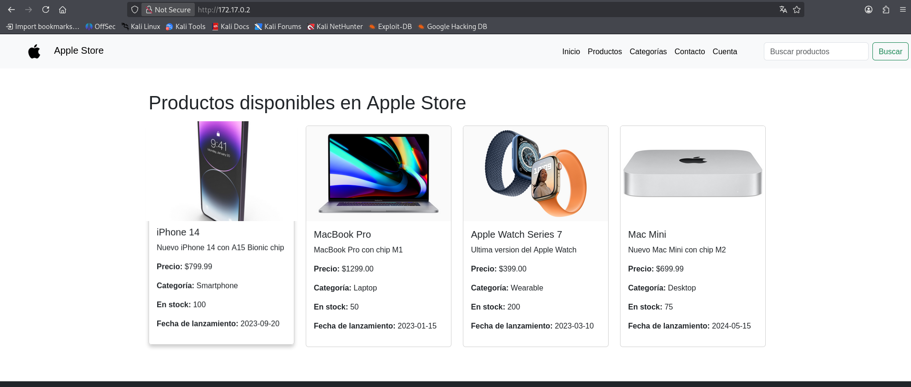

It is identified that the website simulates an "Apple" product store with various relevant sections. To continue the analysis, a scan is performed with `gobuster` to search for directories and hidden files:

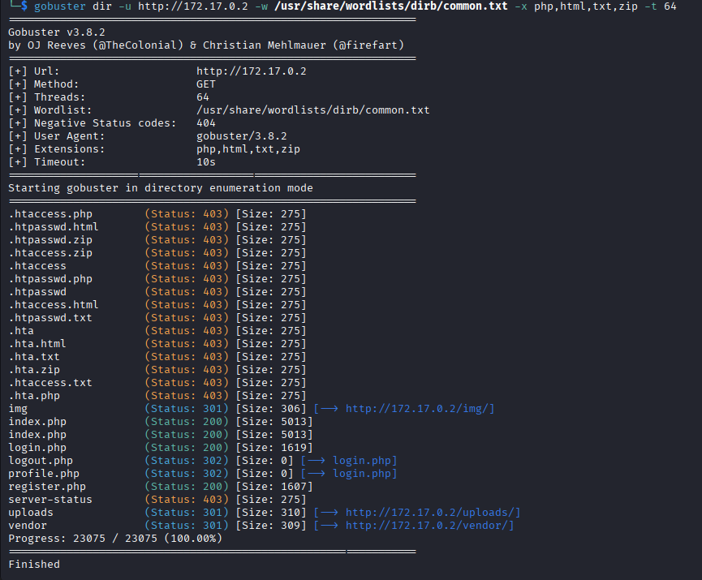

---

## Phase 2: Enumeration and vulnerability search

Several directories are identified with HTTP status codes 200 and 301. By investigating these sections, important elements are discovered:

### Registration and user panel

A registration and login form is found:

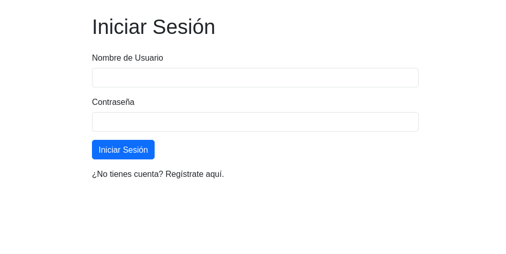

After registering a new user, a user panel with relevant information is observed:

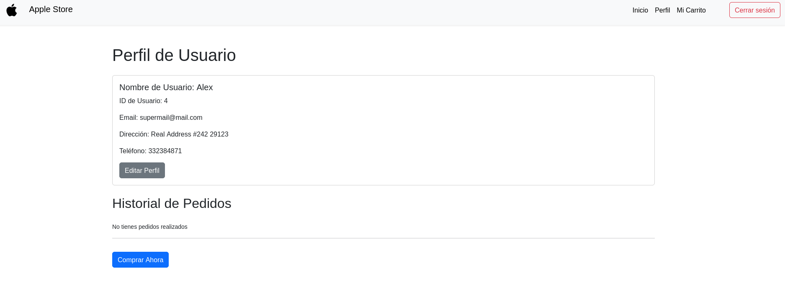

The ID field with value 4 for the new user is highlighted, indicating the existence of multiple registered users. This observation suggests a possible **SQL injection (SQLi)** vulnerability.

### Product search panel

A panel with a search form is discovered:

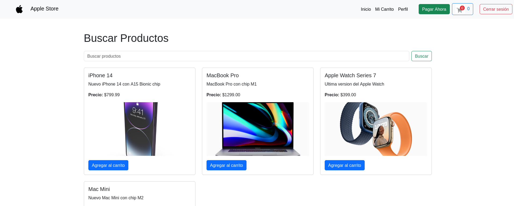

---

## Phase 3: SQL injection exploitation

### Vulnerability identification

`sqlmap` is used to verify the existence of SQL vulnerabilities in the search form:

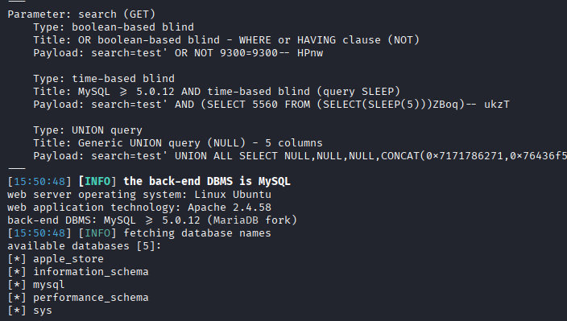

The existence of a **Union-based SQL injection** vulnerability is confirmed. Proceed to extract information from the database:

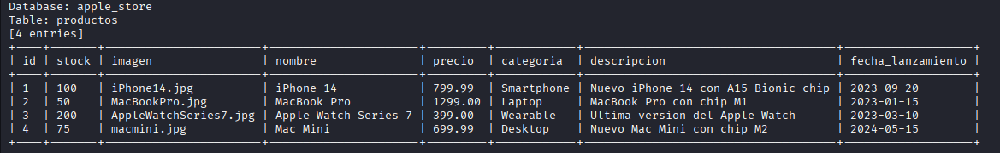

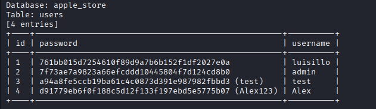

Two crucial tables are obtained: products and users. The users table contains administrative credentials. It is noted that the password is hashed. An online service is used to decrypt it:

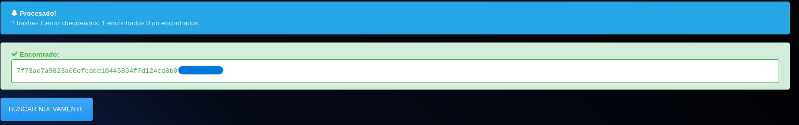

---

## Phase 4: Access as administrator

Logged in with the administrator credentials obtained. In the user panel, a new option is observed:

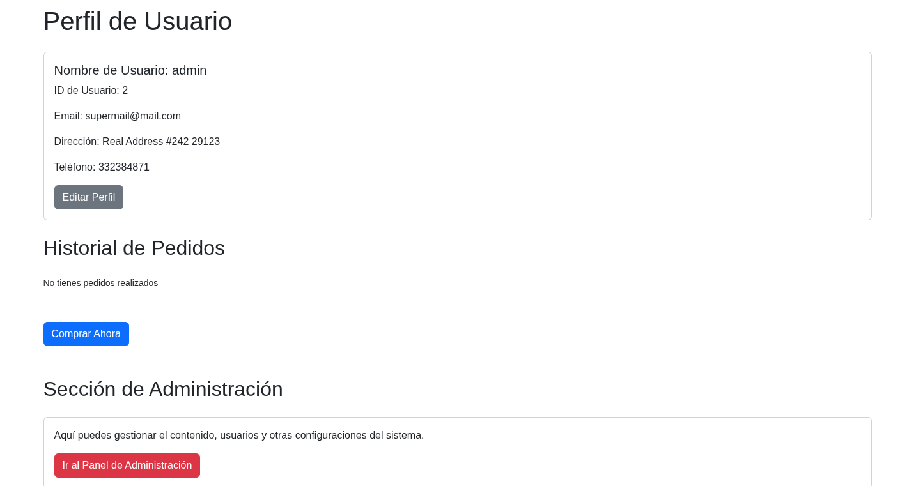

The administration panel is accessed which offers several interaction options:

---

## Phase 5: Bypass restrictions and code execution

### File upload attempt

A configuration section is identified that allows file uploads. An attempt is made to upload a PHP web shell file:

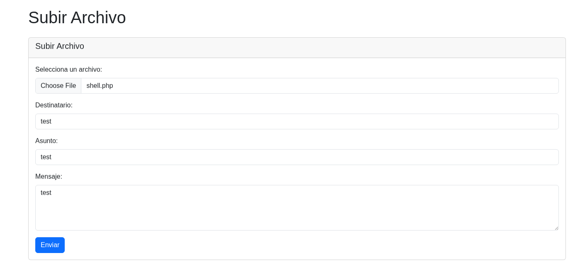

The system rejects files with the `.php` extension:

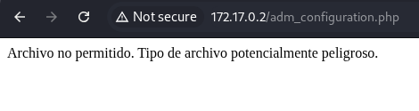

### Bypass with alternative extension

The request is intercepted with BurpSuite and sent to the repeater to test alternative extensions:

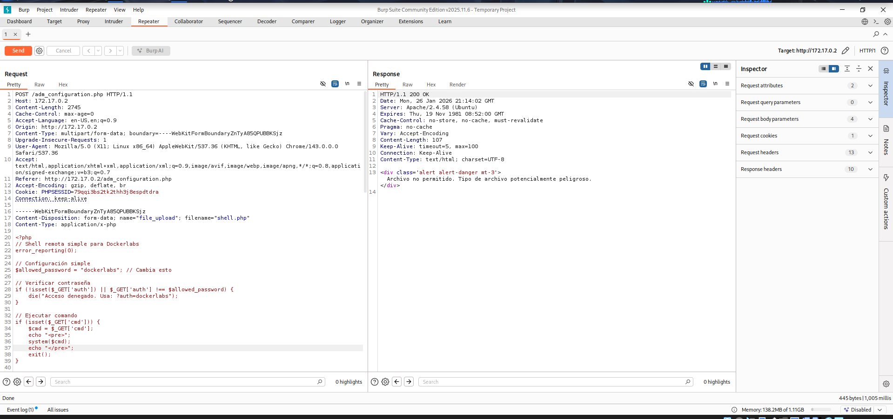

Success is achieved by using the `.phtml` extension:

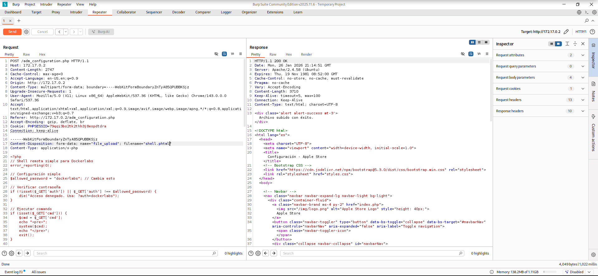

### Interface to interact with the web shell

A small graphical interface is developed to facilitate interaction with the web shell:

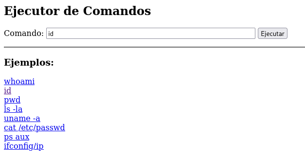

Functionality is verified by executing the `id` command:

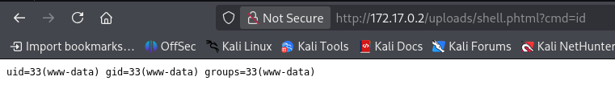

---

## Phase 6: Reverse shell

To improve interaction, a reverse shell is established. A listener is placed on port `4444` on the attacking machine using `nc`:

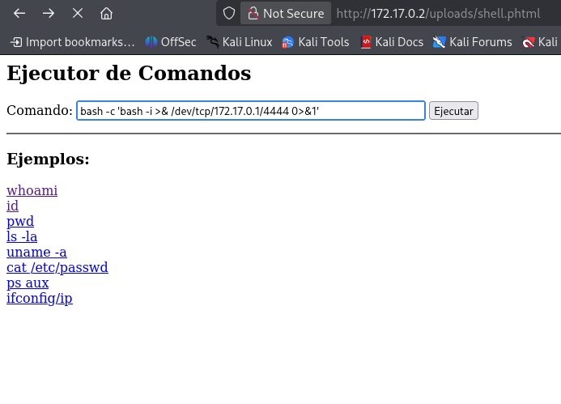

A more intuitive connection is obtained:

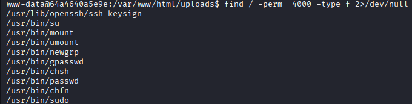

---

## Phase 7: Privilege escalation - First level

### User enumeration

The `/etc/passwd` file is examined to identify system users.

A user called `Luisillo` is identified with hashed credentials. A brute force attack is performed against the `su` command using a script and the `rockyou.txt` dictionary.

A Python server is started on port 8081 to download the script and dictionary:

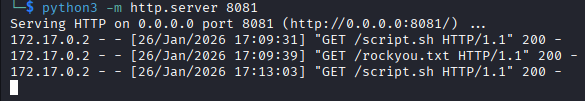

Execution permissions are granted to the script and it is executed:

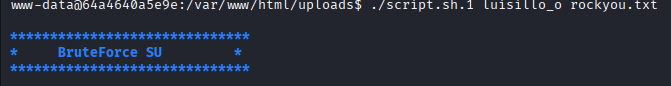

**Note:** The script is modified to omit the output of failed attempts, improving the presentation:

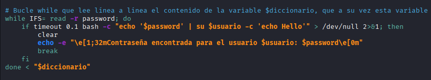

The password of `Luisillo` is obtained:

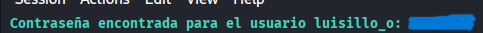

### Testing permissions of the Luisillo user

A session is initiated with the user and their capabilities are tested:

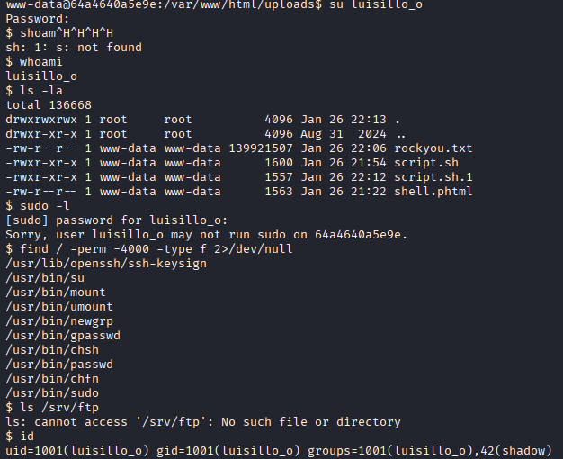

---

## Phase 8: Privilege escalation - Root level

### Access to the shadow file

It is identified that the user `Luisillo` belongs to the `shadow` group, which allows access to system password hashes:

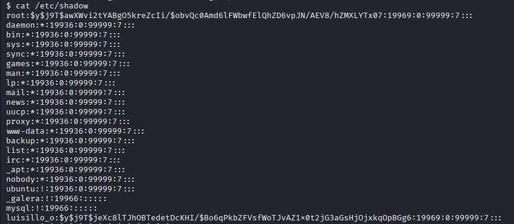

Credential hashes are extracted. `john the ripper` is used with the `rockyou.txt` dictionary to decrypt them:

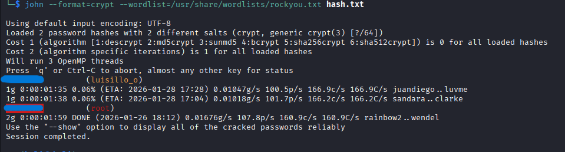

The root password is successfully obtained. A session is initiated with these credentials:

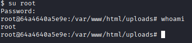

---

## Summary of vulnerabilities found

### 1. SQL Injection

A **Union-based SQL injection** vulnerability was identified in the product search form, allowing the extraction of sensitive information from the database.

**Mitigation recommendations:**
- Use prepared statements with bound parameters to prevent user input from being interpreted as SQL code.
- Implement strict server-side input validation, restricting special characters and suspicious patterns.
- Apply the principle of least privilege in database credentials, assigning limited permissions specifically necessary for each operation.

### 2. Malicious file upload

File uploads were allowed on the server, facilitating the upload of web shells and malicious code without adequate file type validation.

**Mitigation recommendations:**
- Implement file type validation on both client and server, verifying allowed extensions and MIME types.
- Store uploaded files in directories outside the webroot to prevent accidental code execution.
- Rename uploaded files to random names to prevent direct access and hide them from the end user.
- Disable script execution in storage directories by properly configuring the web server.

### 3. Reverse shell and remote code execution (RCE)

The ability to execute malicious code allowed obtaining an interactive session on the server with web user privileges.

**Mitigation recommendations:**
- Run the web application with a low-privilege system user, isolated from the rest of the system.
- Implement a WAF (Web Application Firewall) to detect and block remote code execution patterns.
- Actively monitor the behavior of the application process, alerting on suspicious network connections or anomalous system commands.

### 4. Weak passwords and insecure storage

User credentials were weakly hashed, allowing their recovery through common dictionaries.

**Mitigation recommendations:**
- Use modern and resistant hashing functions such as bcrypt, scrypt, or Argon2 instead of weak algorithms like MD5 or SHA1.
- Implement a unique "salting" mechanism for each password, increasing the complexity of brute force attacks.
- Establish robust password policies that require minimum length, complexity, and periodic changes.

### 5. Membership in privileged groups

The user `Luisillo` was a member of the `shadow` group, allowing them to access system credential hashes.

**Mitigation recommendations:**
- Regularly audit system group membership, ensuring users have the minimum privileges necessary.
- Implement a strict privilege separation policy, limiting access to sensitive files such as `/etc/shadow`.
- Use role-based access control (RBAC) to clearly define which groups can access sensitive information.

---
