# Collections

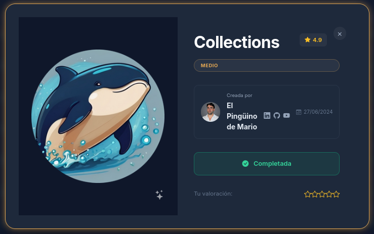

## Descripción General

**Collections** es un CTF de nivel medio en Dockerlabs que expone vulnerabilidades relacionadas con **WordPress** y extensiones vulnerables a modificaciones peligrosas. Entre estas se encuentra **Hello Dolly**, una extensión conocida por permitir la ejecución de código remoto (RCE) al activarla desde el panel administrativo.

## Fase 1: Reconocimiento Inicial

El proceso comienza de forma estándar con escaneos de **Nmap** y **Gobuster**. Para agilizar este procedimiento, se utiliza un script localizado en el repositorio de scripts disponible en este mismo espacio. 

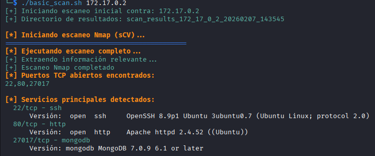
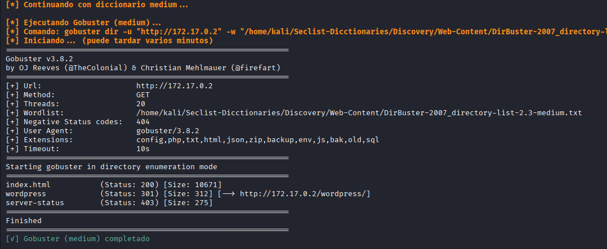

> **Nota:** El script realiza, en un único comando, un análisis exhaustivo de puertos y dos escaneos con Gobuster: uno empleando el diccionario básico `commons.txt` y otro que utiliza el diccionario de nivel medio de SecList. Es fundamental especificar la ruta donde se encuentran estos diccionarios en la máquina local. 

Al analizar los resultados, se identifican los siguientes puertos abiertos:

- **Puerto 22** — Servicio SSH
- **Puerto 80** — Servicio HTTP
- **Puerto 27017** — Base de datos MongoDB 

## Fase 2: Enumeración del Servicio HTTP

Se procede a examinar el puerto 80, donde se descubre un sitio web que utiliza una plantilla estándar de WordPress con información genérica predeterminada. 

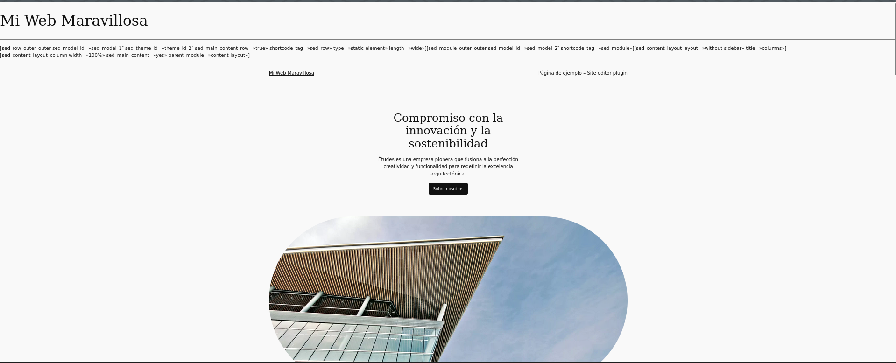

> **Nota:** Si la página no carga correctamente en un inicio, es necesario agregar el dominio correspondiente (`collections.dl`) al archivo `/etc/hosts` en la línea con la dirección IP `172.17.0.2`. 

Al revisar el contenido, se observa que la mayoría de la información es genérica sin cambios relevantes. Sin embargo, al desplazarse hacia abajo en la página, se identifica un posible usuario llamado **chocolate**:

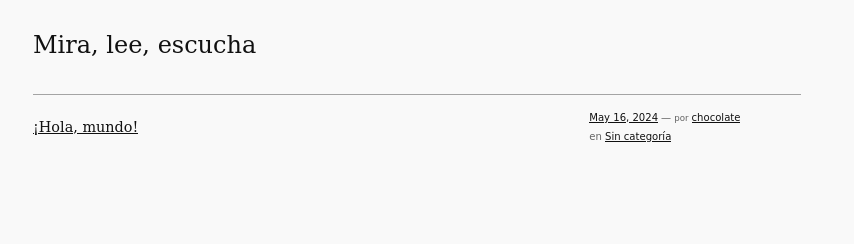

## Fase 3: Análisis de WordPress con WPScan

Dado que no se encuentran más pistas evidentes, se procede a utilizar **WPScan** para obtener información adicional relevante:

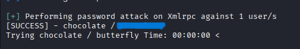

Exitosamente, WPScan realiza un ataque de fuerza bruta automático contra el panel `wp-admin.php`, que es estándar en todas las instalaciones de WordPress. Con las credenciales obtenidas, se inicia sesión en el panel administrativo:

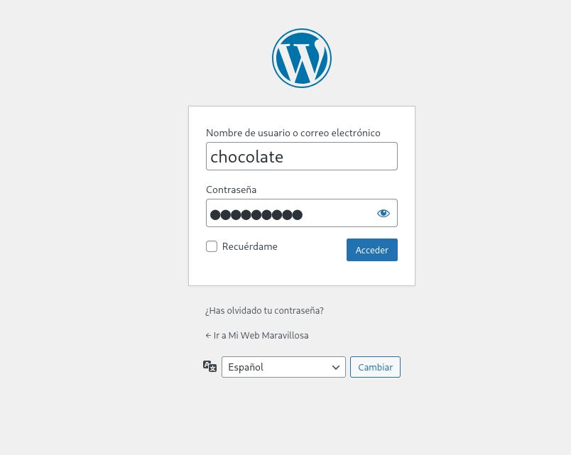
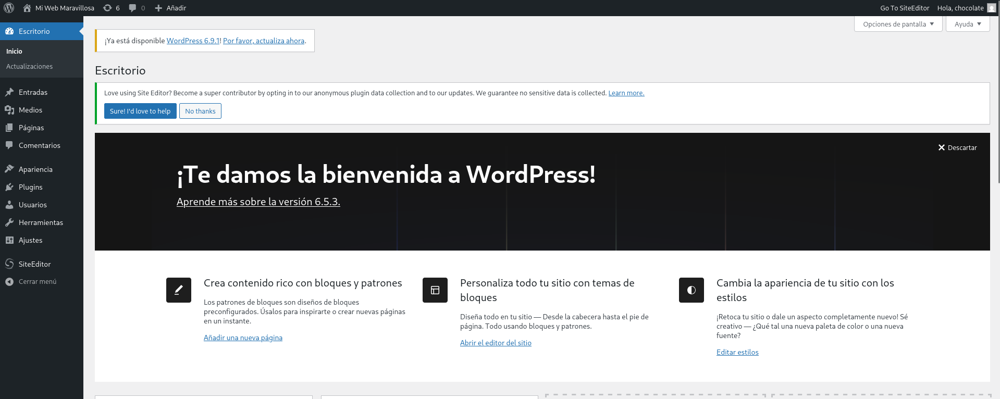

## Fase 4: Explotación de la Extensión Hello Dolly

En el panel administrativo se pueden observar varias opciones. Entre las más relevantes se encuentran las correspondientes a extensiones y carga de archivos. Se intenta la carga de archivos sin éxito, ya que la protección implementada es robusta. Sin embargo, se identifica una extensión vulnerable llamada **Hello Dolly**, conocida por ser susceptible a RCE mediante payloads de reverse shell, tal como el payload de **Pentestmonkey**.

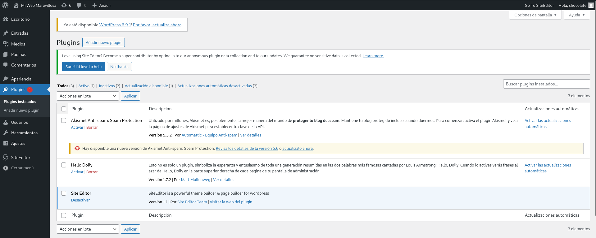

Se procede a buscar e insertar el payload en el código fuente de la extensión para obtener acceso remoto.

### Payload Utilizado:

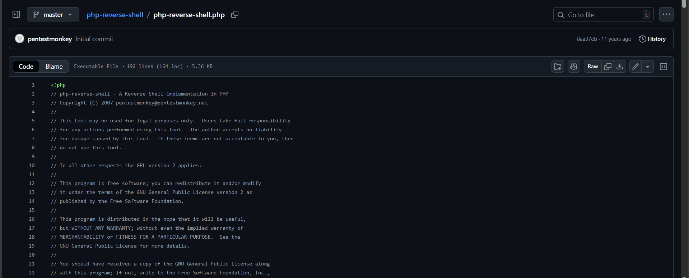

### Cambios Realizados:

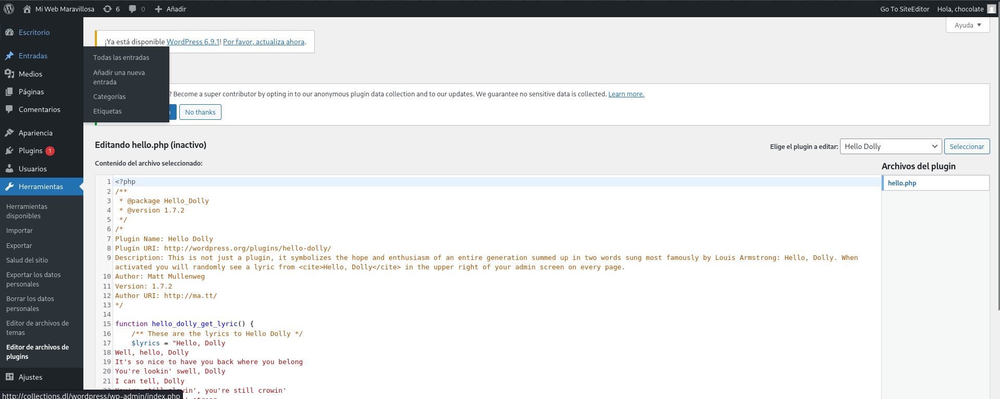

> **Nota Importante:** Es fundamental cambiar la dirección IP y el puerto del payload con los correspondientes valores de la máquina atacante y el puerto configurado para escuchar la reverse shell. El payload se inserta al inicio del código de la extensión, preservando el código original de esta.

## Fase 5: Obtención de Reverse Shell

Posterior a la modificación, se obtiene una reverse shell web en la máquina atacante:

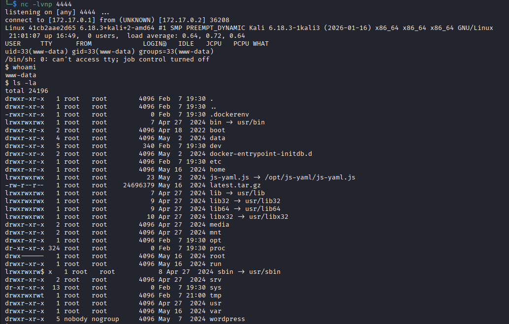

Se exploran archivos importantes utilizando comandos como `ls`, aunque inicialmente no se encuentra información significativa en el directorio actual. 

Se procede a leer el archivo `/etc/passwd` y se identifican usuarios potenciales:

- **chocolate**
- **dbadmin**

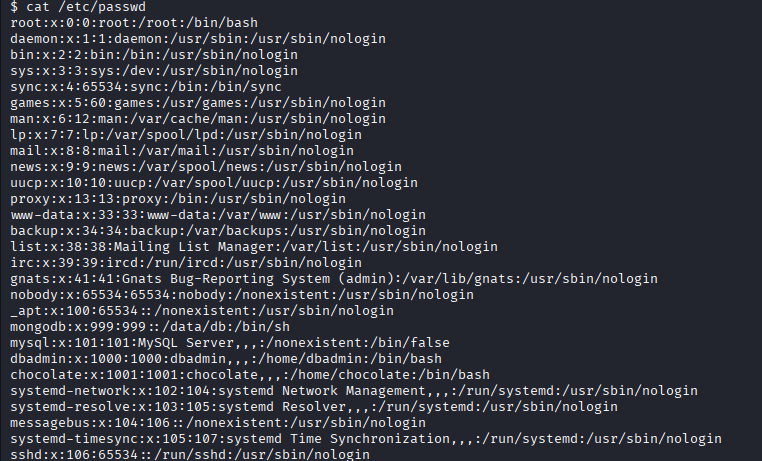

## Fase 6: Extracción de Credenciales

Al analizar el contenido del directorio `/var/www/html/wordpress`, se encuentran varios archivos relevantes. Especialmente importante es `wp-config.php`, archivo que típicamente contiene credenciales críticas:

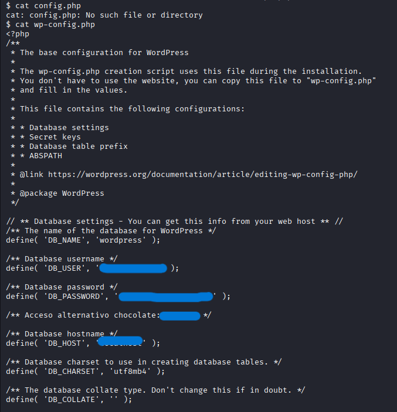

Se obtienen credenciales relacionadas con la base de datos y, más importante aún, las credenciales del usuario **chocolate** observado anteriormente. Para confirmar su validez, se realiza un ataque de fuerza bruta con **Hydra** contra el puerto 22 para el usuario chocolate:

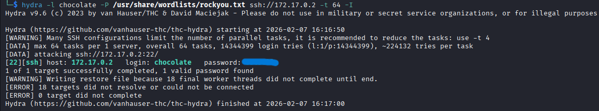

Las credenciales se confirman exitosamente, permitiendo iniciar sesión vía SSH:

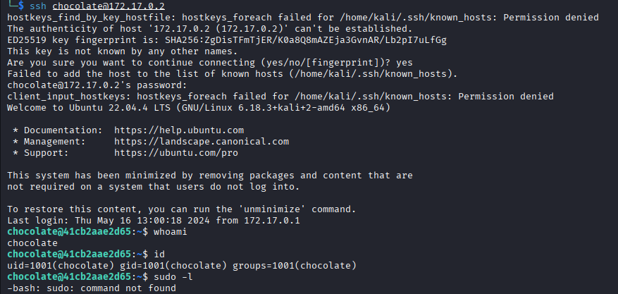

## Fase 7: Escalada de Privilegios

Al listar los archivos y directorios del usuario chocolate, se descubre una carpeta relacionada con la base de datos MongoDB:

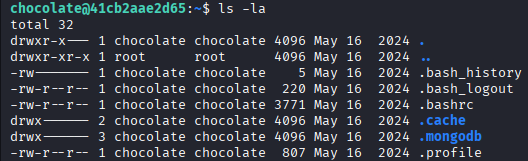

Al explorar el contenido, se encuentra un archivo de historial que contiene credenciales para un usuario con jerarquía superior, **dbadmin**, identificado anteriormente:

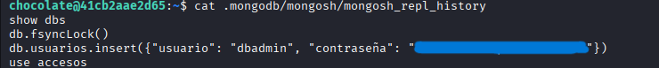

Utilizando estas credenciales, se logra iniciar sesión como el usuario **dbadmin** vía SSH:

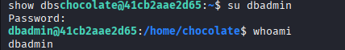

Habiendo agotado las opciones de escalada desde este usuario, y considerando que el nombre sugiere una autoridad superior, se prueba la misma contraseña para el usuario **root**:

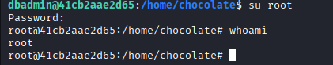

**¡Éxito!** La contraseña es compartida, permitiendo acceder como usuario **root** y completar el CTF exitosamente.

## Recomendaciones de Mitigación

### 1. **Gestión de Credenciales**
- ✅ Implementar contraseñas únicas y complejas para cada usuario
- ✅ Usar gestores de contraseñas en entornos empresariales
- ✅ Evitar nombres predecibles de usuarios administrativos
- ✅ Aplicar cambio de contraseñas periódico (cada 90 días)
- ✅ Nunca reutilizar contraseñas entre usuarios o servicios

### 2. **Protección del Panel WordPress**
- ✅ Cambiar la URL predeterminada de `wp-admin.php` a una personalizada
- ✅ Implementar autenticación de dos factores (2FA)
- ✅ Limitar intentos de login fallidos (brute-force protection)
- ✅ Usar WAF (Web Application Firewall) para bloquear ataques
- ✅ Deshabilitar enumeración de usuarios con plugins de seguridad

### 3. **Gestión de Extensiones y Plugins**
- ✅ Mantener todos los plugins actualizados constantemente
- ✅ Eliminar plugins no utilizados o desactualizados
- ✅ Auditar el código de extensiones personalizadas
- ✅ Restringir edición de código de plugins a usuarios administradores
- ✅ Implementar revisión de cambios (code review) para modificaciones

### 4. **Seguridad de Archivos de Configuración**
- ✅ Proteger `wp-config.php` con permisos restrictivos (600)
- ✅ Mover `wp-config.php` fuera del directorio raíz web
- ✅ No exponer archivos de configuración en control de versiones
- ✅ Encriptar credenciales sensibles en bases de datos
- ✅ Usar variables de entorno para almacenar credenciales

### 5. **Control de Acceso y Privilegios**
- ✅ Aplicar principio de menor privilegio (least privilege)
- ✅ Limitar acceso SSH solo a personal autorizado
- ✅ Deshabilitar login root directo vía SSH
- ✅ Usar claves SSH en lugar de contraseñas
- ✅ Implementar sudoers con comandos específicos permitidos

### 6. **Monitoreo y Auditoría**
- ✅ Implementar logging exhaustivo de accesos y cambios
- ✅ Monitorear intentos de acceso fallidos (fail2ban)
- ✅ Auditar cambios en archivos críticos del sistema
- ✅ Revisar logs regularmente para detectar actividades sospechosas
- ✅ Configurar alertas para eventos críticos de seguridad

### 7. **Endurecimiento del Sistema**
- ✅ Actualizar todos los servicios y componentes del sistema
- ✅ Desactivar servicios innecesarios
- ✅ Configurar firewall restrictivo (solo puertos necesarios)
- ✅ Implementar SELinux o AppArmor
- ✅ Realizar backups regulares con verificación de integridad

### 8. **Validación y Sanitización de Entrada**
- ✅ Validar toda entrada de usuarios en formularios
- ✅ Usar prepared statements en consultas SQL
- ✅ Escapar caracteres especiales en salida HTML
- ✅ Implementar Content Security Policy (CSP)
- ✅ Prevenir inyección de código mediante validación estricta