# Dance Samba

**Level**: Medium  
**Laboratory**: Dockerlabs

## Executive Summary

Dance Samba is a medium-level penetration testing laboratory that demonstrates how multiple configuration vulnerabilities, when chained together correctly, can completely compromise a Linux system. Through a combination of anonymous FTP access, poor SMB configuration, insecure credential storage, and excessive sudo permissions, it is possible to escalate privileges from an unprivileged user to obtain complete root access.

## Phase 1: Reconnaissance and Enumeration

### 1.1 Port Scanning

The laboratory begins with an nmap scan that reveals the following active services:

| Port | Protocol | Service | Version |
|------|----------|---------|---------|
| 21/TCP | FTP | vsftpd | 3.0.5 |
| 22/TCP | SSH | OpenSSH | 9.6p1 Ubuntu |
| 139/TCP | NetBIOS-SSN | Samba smbd | 4 |
| 445/TCP | NetBIOS-SSN | Samba smbd | 4 |

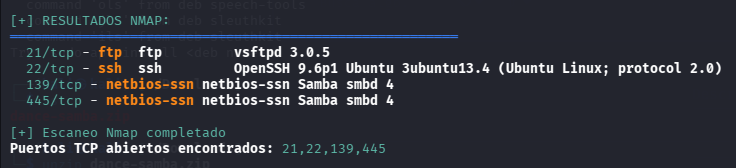

### 1.2 Attack Vector Identification

Since there are no accessible web services, attention is directed to the FTP service. Without obvious credentials available, an attempt is made to access with username `anonymous` and empty password, which succeeds:

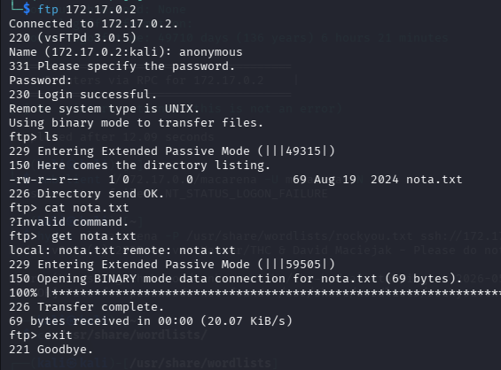

In parallel, SMB services are enumerated, revealing the existence of a personal shared resource: `macarena`.

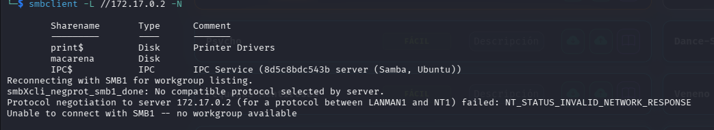

## Phase 2: Credential Extraction

### 2.1 Discovery of Clues in FTP

Within the FTP service, a note is discovered and downloaded to the local machine:

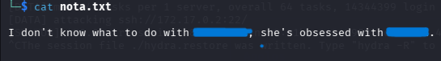

This note provides critical clues about possible credentials for accessing the SMB shared resource of macarena.

### 2.2 Access to SMB Resource

Using the clues obtained, a session is initiated on the SMB shared resource:

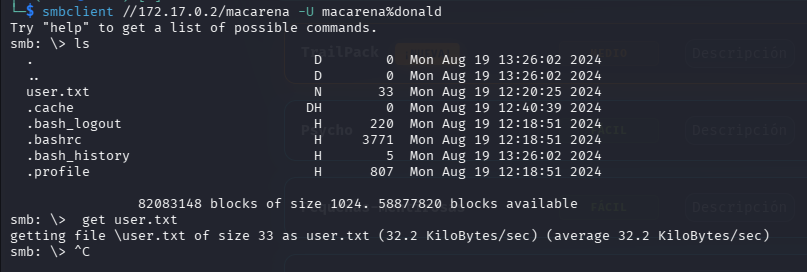

Access is successful. The file `user.txt` is downloaded, revealing the first flag:

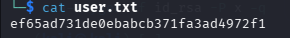

## Phase 3: SSH Authentication Bypass

### 3.1 SSH Key Injection Technique

Given that no other apparent avenues of progress exist, an advanced evasion technique is implemented: a local RSA key pair is generated and uploaded to the `authorized_keys` directory in `.ssh` within the SMB resource. This technique works because SSH trusts the keys present in this directory regardless of their origin, provided the SMB configuration is deficient:

```bash
ssh-keygen -f id_rsa -P x -q
mv id_rsa.pub authorized_keys
```

**Note**: It is necessary to create the `.ssh` directory in the SMB and use `put` to upload the `authorized_keys` file. This technique only works if the SMB resource is misconfigured and allows write access to critical directories.

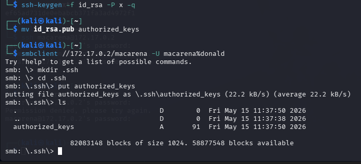

### 3.2 Successful SSH Access

Subsequently, SSH access is achieved without providing a password, as the injected key works correctly:

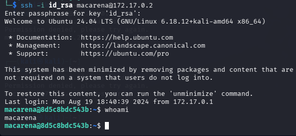

## Phase 4: Local System Enumeration

### 4.1 Search for Additional Users

The `/etc/passwd` file is examined to search for other potential users. The results show that only two users exist: `root` and `macarena`.

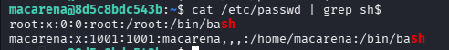

### 4.2 Search for SUID Binaries

A search is performed for binaries with the SUID bit set using `find`, but nothing exploitable is discovered:

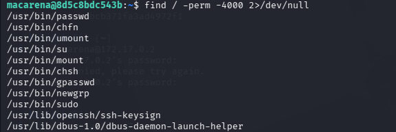

### 4.3 Discovery of Hidden Credential

While exploring the file system, a directory called `secret` is discovered containing a hash file:

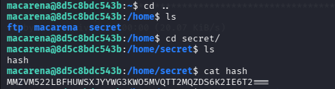

## Phase 5: Credential Decoding

### 5.1 Multiple Decoding

A command that chains two decodings is used to reveal the hidden credential:

```bash
echo "MMZVM522LBFHWXSJYYWG3KW05MVQTT2MQZDS6K2IE6T2==" | base32 -d | base64 -d
```

The first attempt with `base32 -d` produces another hash; however, this hash is encoded in base64, so another decoding is applied to obtain the final credential:

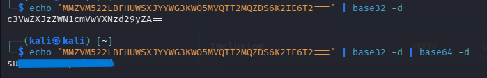

## Phase 6: Privilege Escalation

### 6.1 Verification of Sudo Permissions

Using the decoded credential for the `macarena` user (recall that SSH access was through key injection, not password), `sudo -l` is executed and the password is provided. The output reveals a dangerous sudoers configuration: the user can execute the `file` command without a password as root:

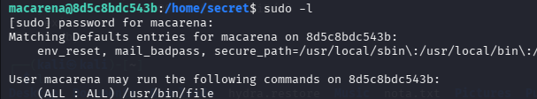

### 6.2 Reading Protected File

An exploration of the system is performed and a critical file is identified in `/opt/password.txt` that can only be read by root:

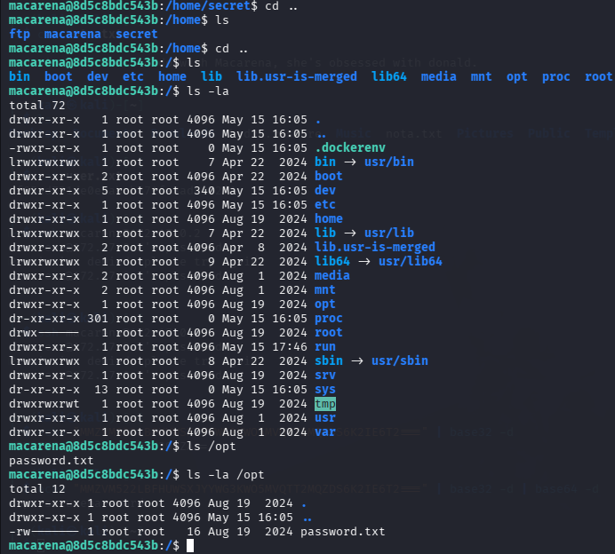

Using the sudo privilege on `file`, this protected file can be read via:

```bash
sudo file -f /opt/password.txt
```

**Note**: Several command variants were tested before arriving at this successful syntax.

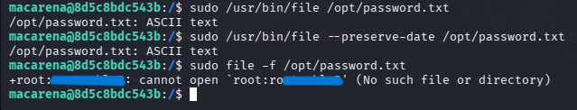

### 6.3 Successful Root Access

The revealed credential corresponds to the `root` user. Authentication is successful with these credentials, obtaining complete administrative access to the system:

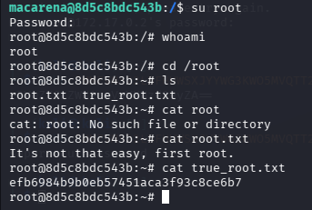

## Vulnerability Analysis

| # | Vulnerability | Description | CVSS |
|---|---|---|---|
| 1 | Anonymous FTP Access | FTP service allows unauthenticated access | 7.5 |
| 2 | Poor SMB Configuration | Allows write access to critical directories such as `.ssh` | 8.8 |
| 3 | Insecure Credential Storage | Credentials encoded in the file system | 9.1 |
| 4 | Excessive Sudoers Configuration | `file` binary executable as root without validation | 8.4 |

## Mitigation Recommendations

### 1. Disable Anonymous FTP Access
**Vulnerability**: Anonymous access to the FTP service  
**Recommendation**: Disable anonymous authentication in vsftpd by editing `/etc/vsftpd.conf` and setting `anonymous_enable=NO`. This requires valid credentials to access any FTP resource.

### 2. Secure SMB Permission Configuration
**Vulnerability**: Misconfigured SMB allowing write access to critical directories  
**Recommendation**: Implement restrictive permissions in the Samba configuration (`/etc/samba/smb.conf`). Set `writable=no` for resources that do not require write access, configure appropriate ACLs, and avoid mapping sensitive system directories like `.ssh`.

### 3. Implement Secure Credential Management
**Vulnerability**: Credentials stored in plaintext and encoded insecurely in the file system  
**Recommendation**: Use a secrets manager (e.g., HashiCorp Vault, AWS Secrets Manager) to store credentials. Never store secrets on disk in plaintext. Implement periodic credential rotation and access auditing.

### 4. Restrict Sudoers Configuration
**Vulnerability**: Excessive permissions in sudoers allowing execution of complex binaries as root  
**Recommendation**: Review and restrict sudoers configuration in the `/etc/sudoers` file using `visudo`. Specify only the specific commands and arguments necessary for each user. Implement sudoers logging, consider using `sudo` without NOPASSWD for sensitive operations, and implement MFA for critical operations.

---

**Creation Date**: 2026  
**Laboratory Type**: Pentesting - Vulnerability Chaining  
**Difficulty**: Medium
