# DebugMe - Hacking Laboratory CTF


## Executive Summary

The DebugMe laboratory is a practice environment for Capture The Flag (CTF) that simulates a realistic penetration testing scenario. The objective is to obtain root-level access through the strategic combination of reconnaissance techniques, exploitation of known vulnerabilities, brute force attacks, privilege escalation, and process manipulation. This exercise provides practical learning on multiple common attack vectors found in real infrastructure.

---

## Phase 1: Reconnaissance and Enumeration

### 1.1 Service Scanning (Nmap)

The laboratory begins with a port scanning operation using Nmap, which is the standard procedure in any security assessment. The scan revealed the existence of three active services on ports 22 (SSH), 80 (HTTP), and 443 (HTTPS).

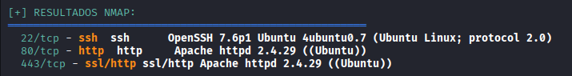

### 1.2 Directory Discovery (Gobuster)

Subsequently, a directory scanning operation is performed using Gobuster. This scan identified a critical point of interest: the **info.php** file, which should not be publicly accessible.

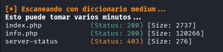

---

## Phase 2: Analysis of Sensitive Information

### 2.1 Information Disclosure in info.php

Upon accessing info.php, information is observed that ordinarily should be protected. However, during the analysis, an even more critical element is discovered: the presence of the **ImageMagick** library being used by the server.

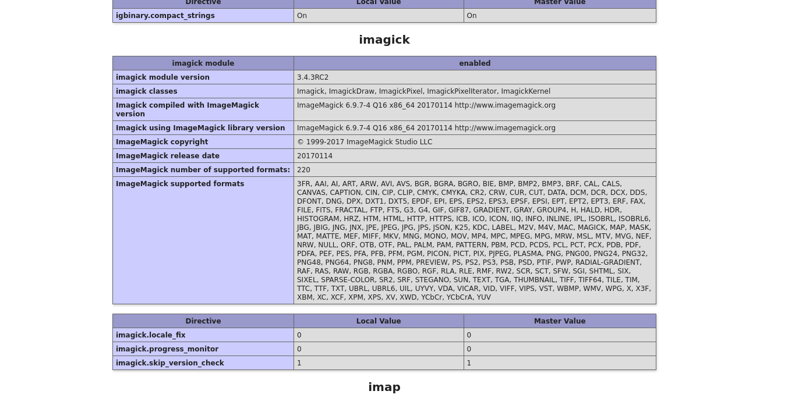

---

## Phase 3: ImageMagick Vulnerability Exploitation (CVE-2022-44268)

### 3.1 Vulnerability Identification

Investigation and identification of **CVE-2022-44268**, a Local File Inclusion (LFI) vulnerability present in the specific version of ImageMagick used by the server. This vulnerability allows extraction of files from the system by manipulating image metadata.

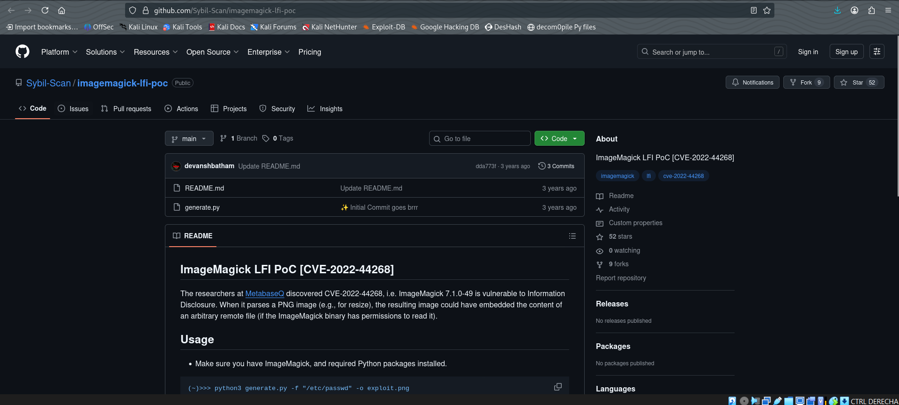

### 3.2 Exploit Preparation

To execute the exploit, the following steps were performed:

1. Clone the corresponding exploitation repository using `git clone URL`
2. Use the Python module available in the repository to generate a specially crafted image
3. The generated image exploits the vulnerability to extract critical system files, in this case `/etc/passwd`

The command used was:

```bash
python3 generate.py -f /etc/passwd -o passwd.png
```

### 3.3 Payload Upload and Download

The resulting PNG file was uploaded using the HTTP service available on port 80.

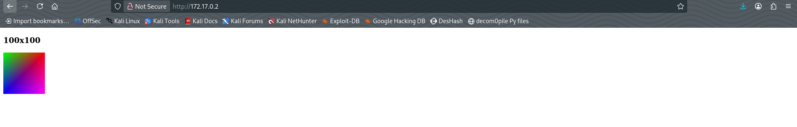

Once the upload is complete, the image must be downloaded from the server and analyzed using image processing tools:

```bash
identify -verbose DownloadImage.png
```

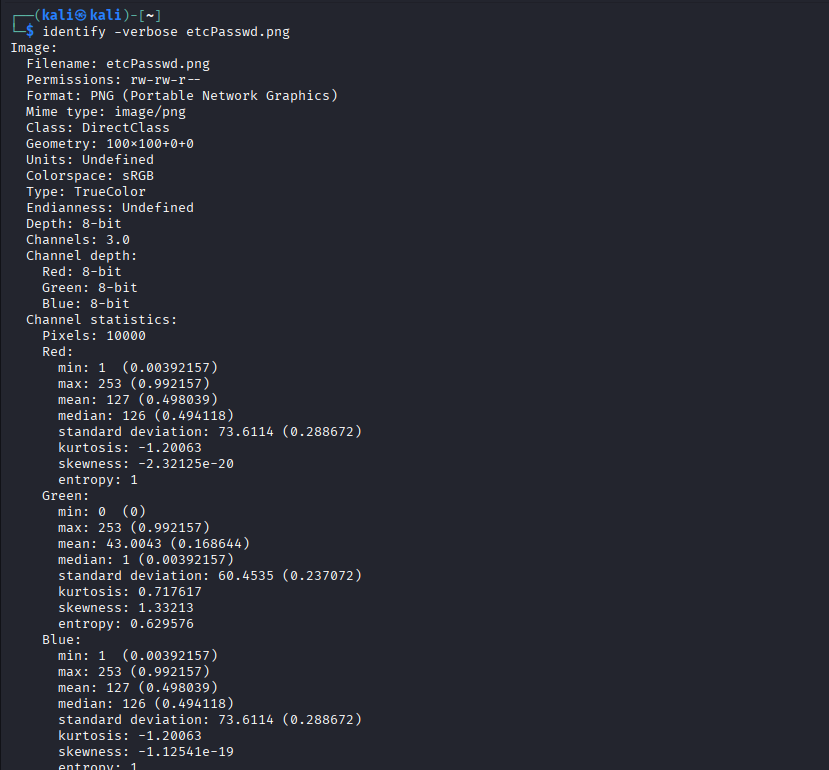
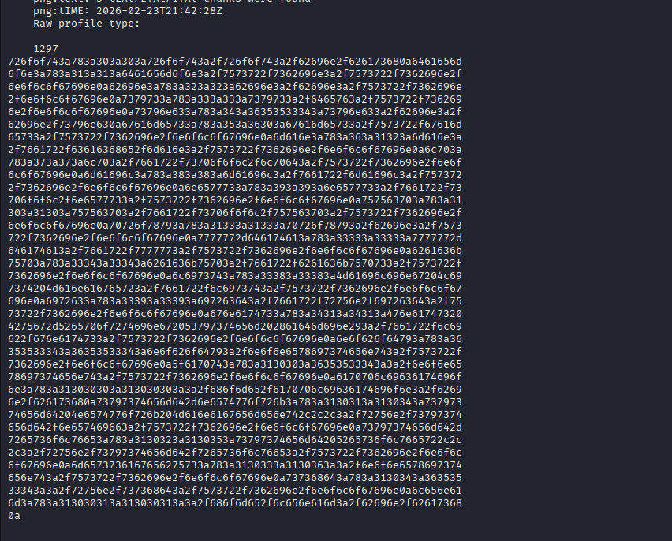

### 3.4 Data Decoding

The extracted information was encoded in hexadecimal format. Python or other tools were used to convert the data to readable text:

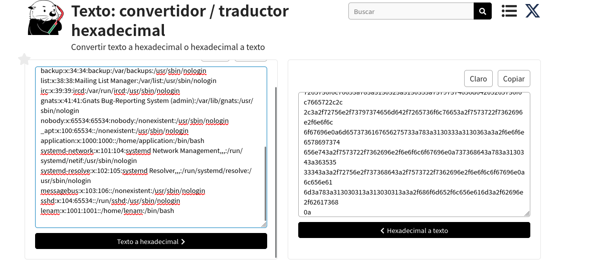

---

## Phase 4: Brute Force Attack on SSH Credentials

### 4.1 Valid User Identification

From the analysis of the `/etc/passwd` file, two potential users capable of executing bash shell were identified: **lenam** and **application**.

### 4.2 Dictionary Attack

Since no alternative vectors were available, a brute force attack was executed against both users using tools such as Hydra. The attack was successful against the **lenam** user, revealing its credentials.

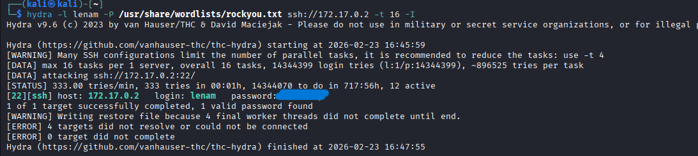

---

## Phase 5: Initial Access and Privilege Escalation Reconnaissance

### 5.1 SSH Connection

With the obtained credentials, an SSH session was established with the user lenam.

### 5.2 Sudo Permissions Analysis

`sudo -l` was executed to enumerate the administrative capabilities available to the user. It was discovered that the user has permission to execute `/bin/kill` as root without requiring a password.

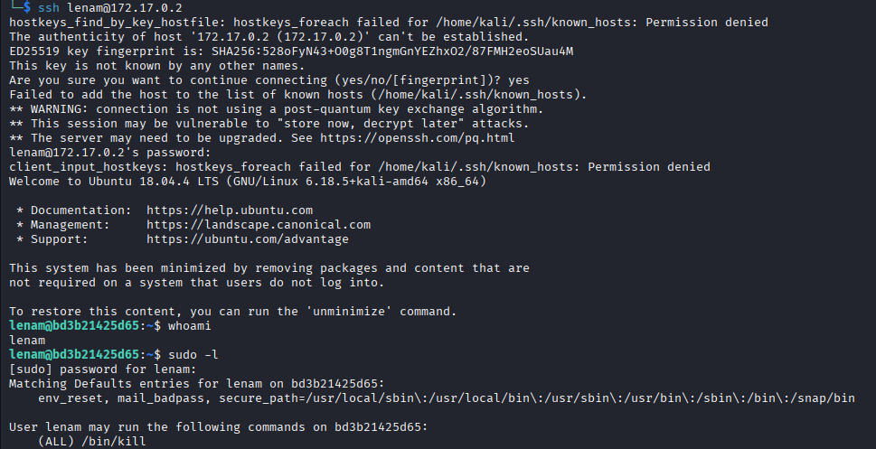

### 5.3 Local Services Enumeration

A comprehensive analysis of ports and local services was performed by executing:

```bash
netstat -ano
```

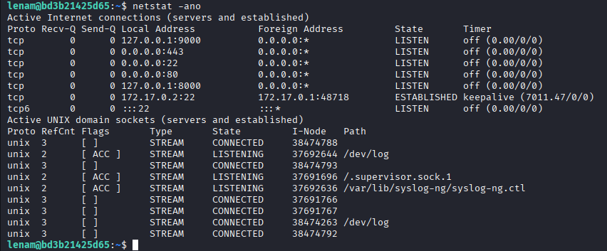

This analysis revealed the existence of two services listening on local interfaces:
- **127.0.0.1:8000**
- **127.0.0.1:9000**

Each service was verified using Curl, obtaining a positive response on **localhost:8000**, where the presence of a running Node.js service was confirmed.

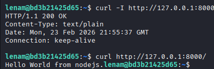

---

## Phase 6: Privilege Escalation through Process Manipulation

### 6.1 Attack Vector

A strategic attack vector was formulated consisting of:

1. Using the sudo permission on `/bin/kill` to stop the Node.js process
2. Capturing the Node.js debug shell that activates during restart
3. From the debug shell, executing a reverse shell as root

### 6.2 Identification of Node.js Process PID

The process identifier (PID) of the Node.js service running as root was identified:

```bash
ps aux | grep node
```

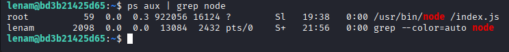

### 6.3 Command Execution with Elevated Privileges

A command was created and executed using `exec` to send a reverse shell with root privileges.

**Important Note:** Before executing this command, a listener must be configured on the attacking machine:

```bash
nc -lnvp PORT
```

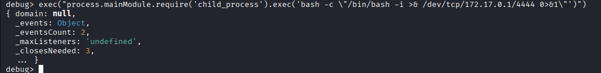

### 6.4 Root Access Obtained

The execution was successful, resulting in an interactive shell with administrator privileges:

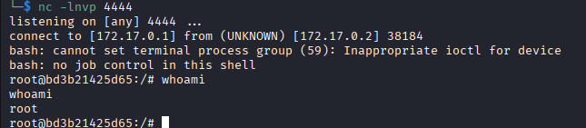

---

## Summary of Success

The exploitation chain has been successfully completed, obtaining root-level access to the target system. This laboratory demonstrates the criticality of implementing multiple layers of security and the importance of defense in depth.

---

## Identified Vulnerabilities and Mitigation Recommendations

### 1. Sensitive Information Disclosure (info.php)

**Vulnerability:** A file that exposes server information through the `phpinfo()` function or similar.

**Mitigation Recommendation:**
- Completely remove test and diagnostic files (info.php, test.php, etc.) from production environments.
- Implement a file management policy that prohibits the inclusion of diagnostic scripts in deployments.
- Configure the web server to deny access to certain files through directives in `.htaccess` or nginx.conf.
- Perform periodic audits of the publicly accessible directory tree.

### 2. Local File Inclusion (LFI) via CVE-2022-44268 in ImageMagick

**Vulnerability:** The version of ImageMagick used contains an LFI vulnerability that allows extraction of files from the server through manipulated image metadata.

**Mitigation Recommendation:**
- Immediately update ImageMagick to the latest version that includes the security patch for CVE-2022-44268.
- Implement rigorous validation on file uploads: verify MIME types, enforce maximum sizes, and run malicious content analysis.
- Execute ImageMagick in a sandboxed environment or container with limited permissions.
- Establish a vulnerability management process that includes monitoring of published CVEs for critical libraries.

### 3. Weak Credentials and Brute Force Attacks

**Vulnerability:** The lenam user possessed a weak password susceptible to dictionary attacks.

**Mitigation Recommendation:**
- Implement a robust password policy requiring a minimum of 12 characters with complexity (uppercase, lowercase, numbers, and special characters).
- Configure login failure limits (e.g., lock after 5 attempts) with exponential increase in wait time.
- Implement multi-factor authentication (MFA) for all users, especially for SSH access.
- Disable password-based authentication on SSH in favor of public key-based authentication (SSH keys).
- Monitor and log failed login attempts using SIEM or centralized logging systems.

### 4. Insecure Sudo Permissions Configuration

**Vulnerability:** The lenam user has permission to execute `/bin/kill` as root without a password, which can be exploited to manipulate critical processes.

**Mitigation Recommendation:**
- Apply the principle of least privilege: limit sudo permissions only to strictly necessary commands.
- Require a password even for permitted commands in sudoers using `PASSWD` along with the command.
- Implement detailed auditing of all commands executed with sudo using `sudoedit`, `sudo_logsrvd`, or similar tools.
- Periodically review the sudoers configuration (file `/etc/sudoers`) for excessive permissions.
- Avoid allowing dangerous commands such as `/bin/kill`, `/bin/su`, `/bin/bash` without additional validations.

### 5. Node.js Service Exposed Locally as Root

**Vulnerability:** A critical Node.js service running with root privileges is accessible through localhost, facilitating privilege escalation.

**Mitigation Recommendation:**
- Run application services with the minimum required privileges, never as root.
- Implement a containerization model (Docker) or isolated virtual machine where the application does not require root access.
- Restrict access to local services using host-based firewalls (iptables, Windows Firewall) to allow only authorized process traffic.
- Implement an API gateway and reverse proxy with authentication for internal services.
- Monitor running processes and alert on unexpected services running with elevated privileges.

### 6. Process Manipulation and Debug Shell Exploitation

**Vulnerability:** The ability to terminate root processes combined with the availability of debugging in Node.js allows obtaining privileged access.

**Mitigation Recommendation:**
- Disable debugging tools and verbose logging in production environments (including Node.js inspect mode).
- Implement protection of critical processes using AppArmor, SELinux, or Seccomp to prevent termination by unauthorized users.
- Use process managers that automatically restart services without allowing debugging interaction.
- Implement process isolation and containerization to prevent process termination from exposing debugging shells.
- Apply kernel hardening through disabling ptrace in production when possible.

---
