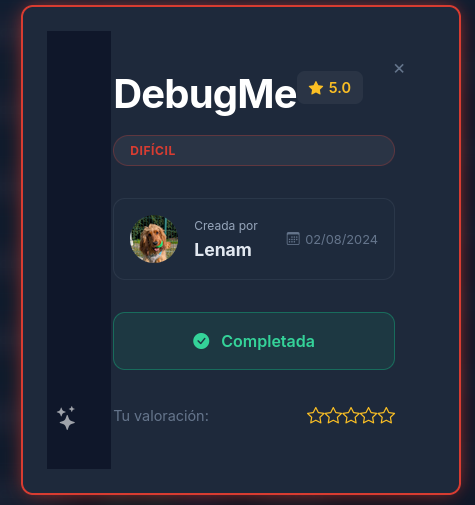

# DebugMe - Laboratorio de Hacking CTF



## 📋 Descripción (Español)

**DebugMe** es un laboratorio de seguridad avanzado diseñado para practicar técnicas de penetración en un ambiente controlado y educativo. Este CTF (Capture The Flag) desafía a los participantes a identificar y explotar múltiples vulnerabilidades en cadena para obtener acceso administrativo a un sistema comprometido.

### Objetivos del Laboratorio

- Desarrollar habilidades de reconocimiento y enumeración
- Aprender a identificar y explotar vulnerabilidades conocidas (CVEs)
- Practicar técnicas de ataque de fuerza bruta
- Comprender vectores de escalada de privilegios
- Aplicar defensa en profundidad y hardening de sistemas

### Vulnerabilidades Cubiertas

1. **Divulgación de Información Sensible** - Exposición de archivos de diagnóstico
2. **CVE-2022-44268** - Local File Inclusion en ImageMagick
3. **Ataques de Fuerza Bruta** - Debilidad en políticas de contraseñas
4. **Sudoers Inseguro** - Configuración inadecuada de permisos administrativos
5. **Servicios Expuestos Localmente** - Node.js ejecutándose como root
6. **Manipulación de Procesos** - Explotación de shells de debug

### Dificultad

🟨 **Alto** - Requiere conocimientos medios de seguridad ofensiva y familiarity con herramientas Linux estándar

---

## 📌 Requisitos Previos

### Software Requerido

- **Sistema Operativo Atacante:** Linux (Kali Linux, Parrot, o similar)
- **Contenedor:** Docker o Docker Compose (si está disponible)
- **Herramientas Necesarias:**
  - `nmap` - Escaneo de puertos
  - `gobuster` - Descubrimiento de directorios
  - `hydra` - Ataque de fuerza bruta
  - `curl` o `wget` - Descarga de archivos
  - `netcat` - Listeners y reverse shells
  - `hexdump` o `python3` - Decodificación de datos
  - ImageMagick tools - `identify` command
  - Git - Para clonar exploits

### Instalación de Herramientas (Kali Linux)

```bash
sudo apt-get update
sudo apt-get install -y nmap gobuster hydra curl wget netcat imagemagick git
```

---

## 🚀 Inicio Rápido

### Opción 1: Usar Docker (Recomendado)

```bash
# Descargar y ejecutar la imagen
docker run -d --name debugme -p 22:22 -p 80:80 -p 443:443 [DOCKER_IMAGE]

# Obtener la dirección IP del contenedor
docker inspect debugme | grep IPAddress

# Conectar con el laboratorio
nmap -sV [CONTAINER_IP]
```

### Opción 2: Instalación Manual

```bash
# Clonar este repositorio
git clone https://github.com/[REPO_URL] debugme
cd debugme

# Revisar la documentación de instrucciones de instalación
cat INSTALL.md
```

---

## 📚 Documentación

| Archivo | Descripción |
|---------|-------------|
| [DebugMe.md](DebugMe.md) | Writeup completo en español con explicaciones detalladas |
| [DebugMeEn.md](DebugMeEn.md) | Full writeup in English with detailed explanations |
| [QuickStart.md](QuickStart.md) | Guía de pasos rápidos (Español e Inglés) |
| [README.md](README.md) | Este archivo - Información general del proyecto |

---

## 💡 Consejos para Resolver

1. **Comienza con reconnaissance:** Enumera todos los servicios y directorios accesibles
2. **Documenta tus hallazgos:** Mantén notas de IPs, puertos y servicios descubiertos
3. **Busca vulnerabilidades públicas:** Cuando identifiques software, busca sus CVEs conocidos
4. **Prueba múltiples vectores:** Una sola vulnerabilidad raramente es suficiente
5. **Automatiza lo posible:** Usa herramientas de ataque de fuerza bruta apropiadamente
6. **Escala gradualmente:** Si tienes acceso básico, busca maneras de obtener mayores privilegios

---

## ⚠️ Advertencias Legales y Éticas

- **Este laboratorio es únicamente para propósitos educativos.**
- Solo practícalo en ambientes autorizados que tengas permiso para probar.
- El uso no autorizado de herramientas de hacking es ilegal en la mayoría de jurisdicciones.
- Respeta siempre la ley y las políticas de seguridad de las organizaciones.

---

## 📧 Soporte y Contribuciones

Para reportar bugs, sugerir mejoras o contribuir al proyecto, por favor:

1. Abre un issue describiendo el problema
2. Proporciona pasos para reproducir el problema
3. Incluye versiones de software relevantes

---

## 📋 Description (English)

**DebugMe** is an advanced security laboratory designed to practice penetration testing techniques in a controlled and educational environment. This CTF (Capture The Flag) challenges participants to identify and exploit multiple chained vulnerabilities to gain administrative access to a compromised system.

### Laboratory Objectives

- Develop reconnaissance and enumeration skills
- Learn to identify and exploit known vulnerabilities (CVEs)
- Practice brute force attack techniques
- Understand privilege escalation vectors
- Apply defense in depth and system hardening

### Covered Vulnerabilities

1. **Sensitive Information Disclosure** - Exposure of diagnostic files
2. **CVE-2022-44268** - Local File Inclusion in ImageMagick
3. **Brute Force Attacks** - Weak password policies
4. **Insecure Sudoers** - Improper administrative permission configuration
5. **Locally Exposed Services** - Node.js running as root
6. **Process Manipulation** - Debug shell exploitation

### Difficulty Level

🟨 **Higt** - Requires intermediate offensive security knowledge and familiarity with standard Linux tools

---

## 📌 Prerequisites

### Required Software

- **Attacker OS:** Linux (Kali Linux, Parrot, or similar)
- **Container:** Docker or Docker Compose (if available)
- **Required Tools:**
  - `nmap` - Port scanning
  - `gobuster` - Directory discovery
  - `hydra` - Brute force attacks
  - `curl` or `wget` - File downloads
  - `netcat` - Listeners and reverse shells
  - `hexdump` or `python3` - Data decoding
  - ImageMagick tools - `identify` command
  - Git - For cloning exploits

### Tool Installation (Kali Linux)

```bash
sudo apt-get update
sudo apt-get install -y nmap gobuster hydra curl wget netcat imagemagick git
```

---

## 🚀 Quick Start

### Option 1: Using Docker (Recommended)

```bash
# Download and run the image
docker run -d --name debugme -p 22:22 -p 80:80 -p 443:443 [DOCKER_IMAGE]

# Get the container IP address
docker inspect debugme | grep IPAddress

# Connect with the laboratory
nmap -sV [CONTAINER_IP]
```

### Option 2: Manual Installation

```bash
# Clone this repository
git clone https://github.com/[REPO_URL] debugme
cd debugme

# Review installation instructions documentation
cat INSTALL.md
```

---

## 📚 Documentation

| File | Description |
|------|-------------|
| [DebugMe.md](DebugMe.md) | Complete writeup in Spanish with detailed explanations |
| [DebugMeEn.md](DebugMeEn.md) | Full writeup in English with detailed explanations |
| [QuickStart.md](QuickStart.md) | Quick steps guide (Spanish and English) |
| [README.md](README.md) | This file - General project information |

---

## 💡 Tips for Solving

1. **Start with reconnaissance:** Enumerate all accessible services and directories
2. **Document your findings:** Keep notes of discovered IPs, ports, and services
3. **Search for public vulnerabilities:** When you identify software, look up its known CVEs
4. **Test multiple vectors:** A single vulnerability is rarely sufficient
5. **Automate where possible:** Use brute force tools appropriately
6. **Scale gradually:** If you have basic access, look for ways to gain higher privileges

---

## ⚠️ Legal and Ethical Warnings

- **This laboratory is for educational purposes only.**
- Only practice on authorized environments where you have permission to test.
- Unauthorized use of hacking tools is illegal in most jurisdictions.
- Always respect the law and organizational security policies.

---

## 📧 Support and Contributions

To report bugs, suggest improvements, or contribute to the project, please:

1. Open an issue describing the problem
2. Provide steps to reproduce the issue
3. Include relevant software versions

---