# HackZone

This document concisely describes the walkthrough performed in the "HackZone" CTF, focused on exploiting a file upload to deploy a webshell, discovering exposed credentials, and performing privilege escalation.

## Scenario summary

1. Initial reconnaissance by port scanning and service enumeration.

	- Three relevant ports were identified: `22` (SSH), `53` (DNS) and `80` (HTTP).

	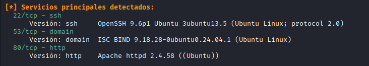

2. DNS enumeration

	- A DNS zone transfer was attempted, yielding useful information for host and name enumeration.

	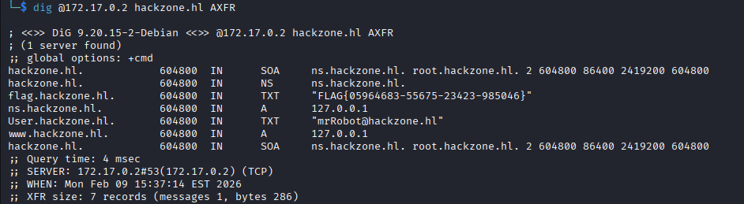

	- Among the results, a potential user named `mrRobot` was discovered.

3. Web enumeration

	- Directory discovery with `gobuster` revealed additional paths once the lab domain (`hackzones.hl`) was specified.

	

	- Resources related to file management were identified: an `uploads` directory and an `upload.php` script responsible for handling uploads.

4. Interaction with the web application

	- The `dashboard.html` page showed a profile section with file upload functionality.

	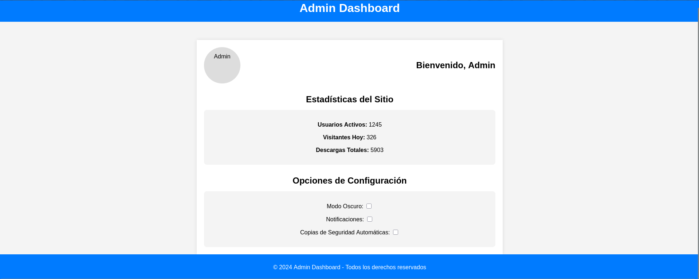

	- The upload functionality was abused to upload a PHP webshell.

	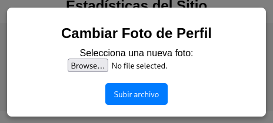
	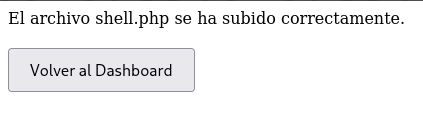

5. Obtaining a reverse shell

	- Executing the webshell on the server established a reverse connection to the attacker machine (ensure a listener with `nc -lvnp <port>` is running on the attacker machine).

	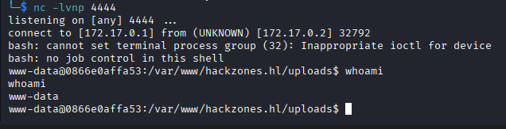

	- The session was upgraded to a proper TTY for interactive use.

	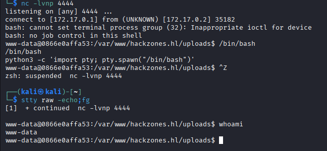

6. Credentials and lateral movement

	- Credentials that granted access to the admin panel were found, indicating insecure secret management.

	- Inspecting `/etc/passwd` confirmed the presence of the `mrrobot` user.

	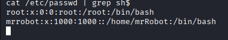

	- A script was found that concatenates hexadecimal values to form a secret string (likely a password).

	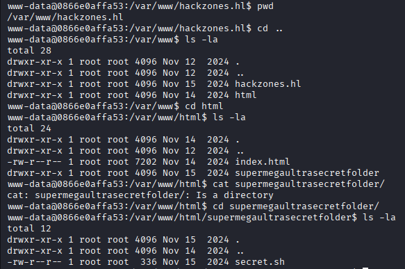
	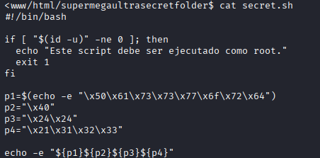

	- The derived password allowed switching to `mrrobot` via `su`.

	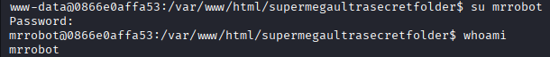

7. First flag

	- The first flag was located in the `mrrobot` user's directory.

	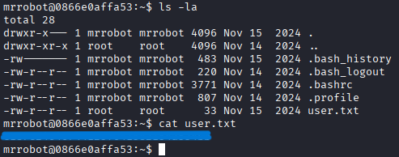

8. Privilege review and escalation

	- `sudo -l` revealed that the user could run `cat` via `sudo` without a password.

	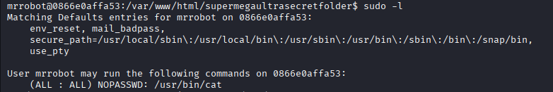

	- Directly reading the second flag was prevented by an access control measure.

	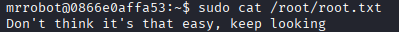

	- Further inspection revealed a file in `/opt` containing elevated (root) credentials.

	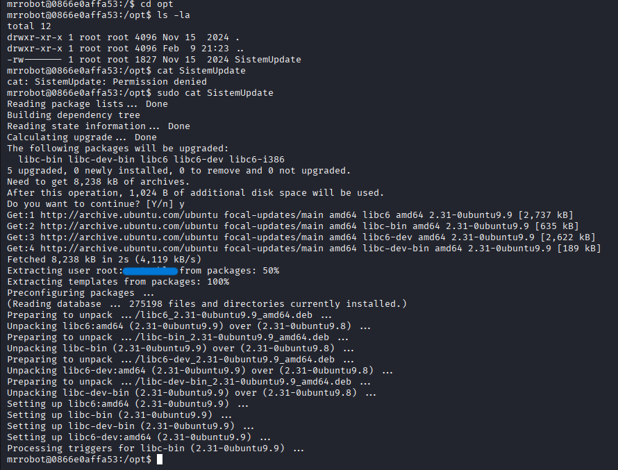

	- Using those credentials, root access was obtained and the second flag was read.

	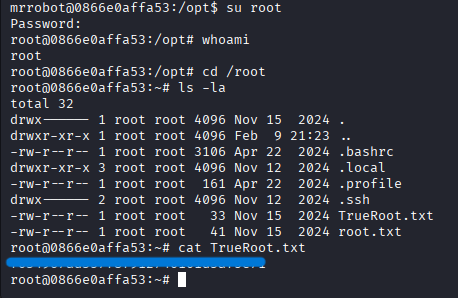

## Vulnerabilities identified

- Unvalidated file uploads allowed execution of server-side code.
- Sensitive credentials exposed in files readable by local users.
- DNS zone transfers were permitted to unauthorized hosts.
- Insecure `sudo` configuration (`NOPASSWD`) enabled potential sensitive file reads.
- Insufficient access control and credential management.

## Mitigations (5 key actions)

1. Harden file upload handling: validate file types and contents, store uploads outside the webroot, and reject executable scripts.
2. Remove credentials from disk and use a secrets manager; rotate credentials regularly.
3. Restrict DNS zone transfers to authorized hosts and consider DNSSEC.
4. Enforce principle of least privilege and remove `NOPASSWD` entries from `sudoers` unless explicitly required and audited.
5. Implement centralized logging, alerts for anomalous activity (file uploads, reverse shells) and network segmentation.

## Conclusion

The lab demonstrates common compromise patterns: insecure uploads, exposed secrets and overly permissive configurations. Remediation requires changes in application logic, secret management and infrastructure configuration.

