# Inclusion — CTF (DockerLabs)


## Introduction

**Inclusion** is a DockerLabs CTF lab (medium difficulty) designed to demonstrate and analyze a Local File Inclusion vulnerability (**LFI**). The objective is to identify the vulnerability, exploit it to obtain sensitive data, and use the findings to escalate privileges to root.

---

## Methodology

The validation and exploitation process followed these steps:

1. Network and service reconnaissance (port scanning and service detection).
2. Web resource enumeration (directory discovery using wordlists).
3. Identification and exploitation of LFI vulnerabilities.
4. Extraction of sensitive information (e.g., `/etc/passwd`) and identification of accounts.
5. Brute-force attacks and transfer of tools for local testing.
6. Internal reconnaissance and verification of escalation vectors (`sudo` policies, SUID files, etc.).

---

## Findings

### 1) Reconnaissance

A port scan identified **HTTP (port 80)** and **SSH (port 22)** as open services, indicating a web application and a remote access service.

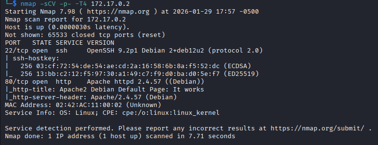

### 2) Web enumeration

The default HTTP page was accessible. Directory enumeration with `gobuster` discovered the `/shop` directory.

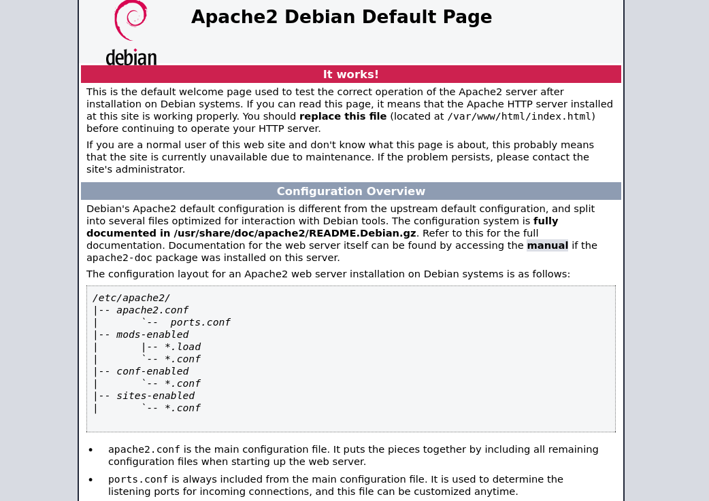
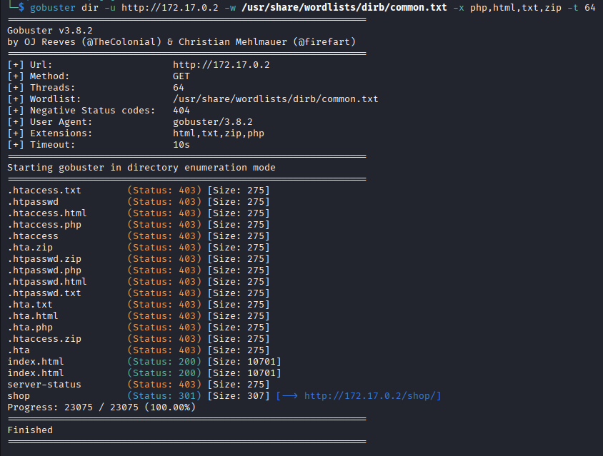

The `/shop` endpoint returned an error containing:

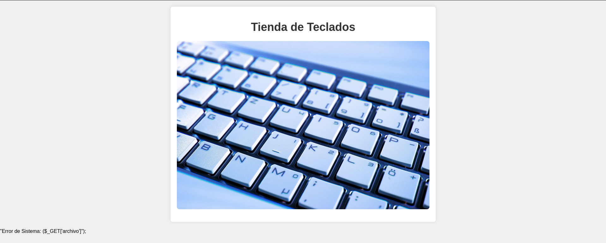

> "Error del sistema: ($_GET['archivo'])"

This indicates a parameter-based file inclusion (LFI) vulnerability.

### 3) LFI exploitation

Including `/etc/passwd` via the vulnerable parameter returned the file contents, confirming a functional LFI.

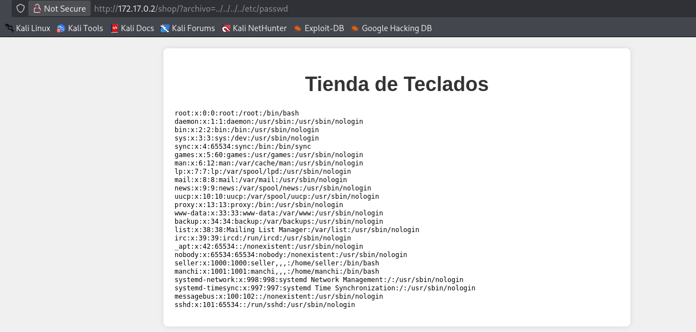

> **Important:** Sensitive data seen in the lab must remain within a controlled environment.

### 4) Credential attack

From `/etc/passwd`, candidate users (`seller`, `manchi`, `root`) were identified. A brute-force attack with `hydra` revealed credentials for `manchi`, allowing SSH access.

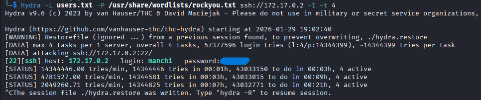
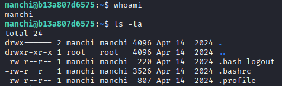

### 5) Internal reconnaissance and escalation

No obvious SUID binaries were found via `ls -la`. A local brute-force against `su` using a script and `rockyou.txt` (transferred via `scp`) revealed the password for `seller`:

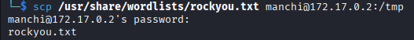
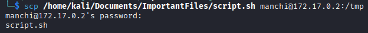
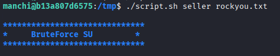
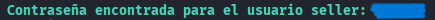

Inspecting `sudo` policies (`sudo -l`) showed a rule allowing `php` execution without password. Exploitation via:

```bash
sudo php -r "system('/bin/bash');"
```
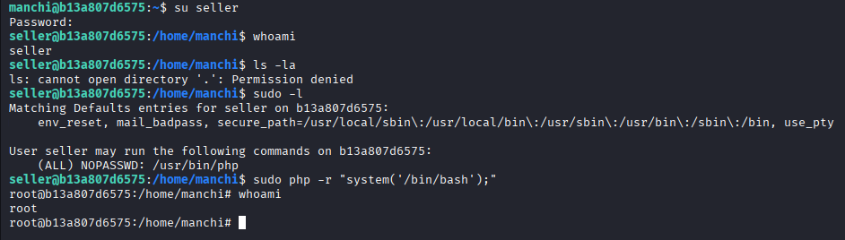

resulted in a root shell.

---

## Conclusion

The lab confirms a high-impact LFI vulnerability that exposes sensitive files and facilitates account enumeration. Coupled with permissive `sudo` rules (allowing interpreter execution without authentication), this enabled privilege escalation to root. The overall risk is high, especially in production environments.

---

## Mitigation

- Validate and sanitize user-supplied file path parameters; implement whitelisting and path normalization.
- Remove dynamic inclusion of files from user input; if necessary, use strict mapping and safe read-only views.
- Audit and tighten `sudo` rules: do not permit interpreters to be run passwordless; apply least privilege.
- Rotate exposed credentials and harden account authentication (disable unused accounts, enable MFA where possible).
- Implement monitoring and alerting for suspicious accesses and error patterns.

---

**End of lab — Inclusion (DockerLabs)**
