Predictable

# Summary

This lab walks the student through analyzing and exploiting an HTTP service that exposes a numeric sequence generated by a Linear Congruential Generator (LCG). Starting from a port scan, discoverable services are identified, the generator is partially reversed to predict values, credentials are obtained, SSH access is achieved into a restricted Python jail (pyjail), and finally a misconfigured `sudo` entry is leveraged to obtain a root shell.

# Initial discovery

The lab begins with a port scan using Nmap. Two relevant services are identified: SSH on port 22 and an HTTP service on port 1111.

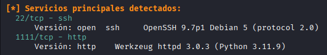

# HTTP service analysis

Accessing the HTTP service reveals an interface exposing a sequence of numbers that follow a predictable pattern.

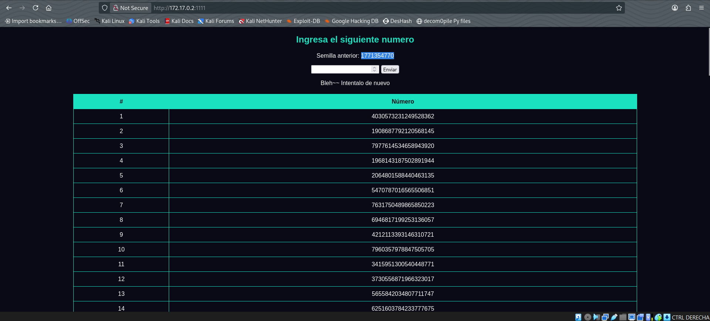

# Reverse-engineering the LCG

Source analysis shows the sequence is produced by a Linear Congruential Generator (LCG). 

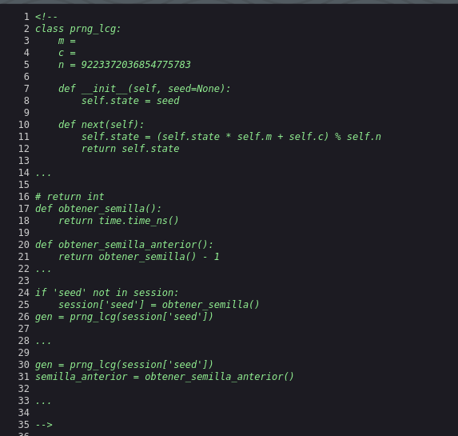

To recover missing values, the LCG formula is reverse-engineered. Due to calculation challenges and potential margin of error, a third-party script by Ghxstsec is used; once the required parameters are supplied it allows predicting the next number in the sequence.

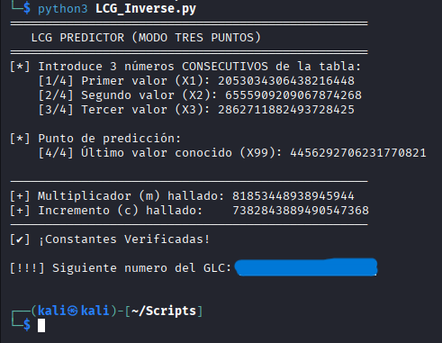

# Obtaining credentials and SSH access

After predicting the necessary value, the HTTP service discloses information that appears to be credentials. Those credentials are tested against SSH and allow logging in, resulting in a restricted `pyjail` environment.

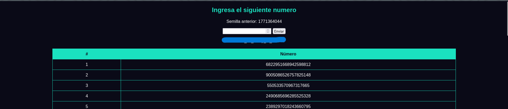
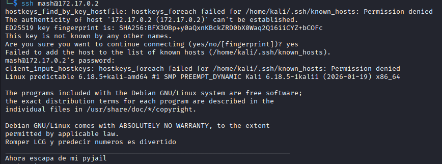

# Interacting with the pyjail and local escalation

The pyjail environment includes multiple restrictions that prevent escaping the jail.

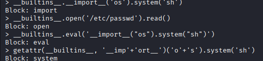

After several attempts (including AI-suggested approaches), a function is identified that ultimately provides a functional shell as user `mash`.

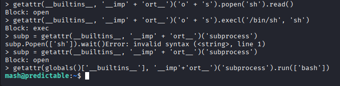

# Privilege enumeration and analysis of the `shell` binary

Running `sudo -l` reveals the user can execute a script named `shell` in `/opt` without a password, but it requires a parameter to run correctly. Invoking `shell -h` yields a hint: `radare2` is installed on the system.

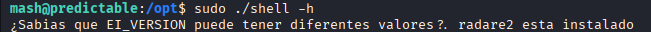

The `shell` script is analyzed with `radare2`, focusing on the `main` function via `pdf @main`.

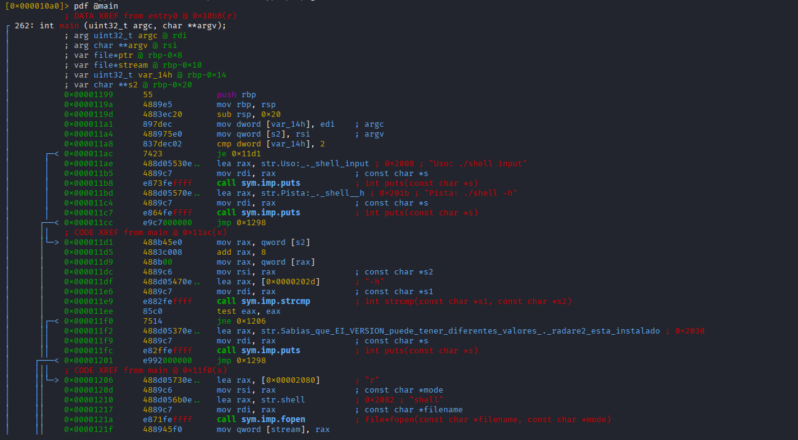

The analysis discloses conditions required for the script to open a root shell:

- The first bit must not be 1.
- The first bit must be 0.
- At least 6 bits must be read, and the last must not be `x01`.

# Exploitation and obtaining root

After multiple unsuccessful attempts to satisfy the exact conditions, a pragmatic approach is used: create a new `shell` file in a different directory containing values that meet the constraints (for example, six zeros), and from that directory run the target script via `sudo /opt/shell 0`. This invocation results in a root shell being granted.

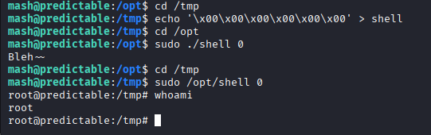

# Mitigation recommendations

Recommendations to reduce attack surface and prevent similar vectors exploited in this lab:

- **Secure exposed services:** Do not expose unnecessary services. Restrict SSH access by IP/VPN and use key-based authentication and strong password policies.
- **Input validation and parameter checking:** Scripts allowed to run via `sudo` must strictly validate parameters and must not assume unsafe formats. Avoid executing scripts from directories writable by unprivileged users.
- **Restrict sudo rules:** Minimize `/etc/sudoers` entries. Do not allow passwordless execution of sensitive binaries or scripts; if necessary, restrict execution to absolute paths and validated parameter sets.
- **Harden sandboxed environments (pyjail):** Add controls such as seccomp, namespaces, strict permission limits and path restrictions, and audit potential escape vectors.
- **Use cryptographically secure generators:** Do not rely on simple deterministic generators (like LCG) for unpredictability. Use CSPRNGs for tokens, keys, and other sensitive values.
- **Logging and monitoring:** Enable detailed logging and alerts for unusual activity (scans, failed authentications, sudo executions). Centralize logs for forensic analysis.
- **Code review and security testing:** Review scripts and services before deployment; perform black-box/white-box tests and static analysis to detect insecure patterns.
- **Principle of least privilege:** Run services under dedicated, least-privileged accounts and avoid running as root unless strictly necessary.

---

