# Reporte de Auditoría de Seguridad: Laboratorio RealGob.DL

## Introducción

El presente informe documenta los hallazgos de seguridad identificados durante una evaluación técnica integral del laboratorio Repot-Dockerlabs (RealGob.DL). Este laboratorio fue diseñado para simular un entorno web corporativo real, replicando múltiples vectores de ataque y vulnerabilidades comunes en aplicaciones modernas. El objetivo de esta auditoría es identificar, clasificar y proporcionar recomendaciones técnicas para la mitigación de riesgos de seguridad.

## Metodología

La evaluación fue conducida siguiendo una metodología de pruebas de penetración estándar en la industria:

1. **Reconocimiento**: Identificación de activos activos mediante escaneo de puertos
2. **Enumeración**: Descubrimiento de servicios, versiones y directorios accesibles
3. **Análisis de Vulnerabilidades**: Pruebas de vulnerabilidades comunes (SQLi, XSS, LFI, etc.)
4. **Explotación**: Confirmación de vulnerabilidades mediante pruebas prácticas
5. **Escalada de Privilegios**: Identificación de caminos hacia acceso privilegiado

---

## Hallazgos Técnicos

### 1. Escaneo Inicial de Puertos

Como punto de partida de la evaluación, se realizó un escaneo de puertos Nmap que reveló los siguientes servicios activos:

- **Puerto 80**: Servidor web HTTP (Aplicación web vulnerable)
- **Puerto 22**: Servicio SSH
- **Puerto 3306**: Base de datos MySQL

⚠️ **Nota Importante**: Se utilizó el flag `-T4` en el escaneo Nmap. Este parámetro acelera significativamente el proceso de escaneo, pero en entornos reales de producción debe evitarse, ya que puede generar ruido detectable en sistemas de monitoreo (IDS/IPS).

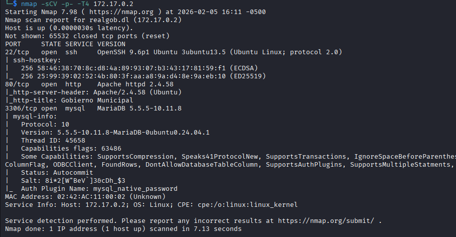

### 2. Enumeración de Servicios HTTP y Configuración de Hosts

Posteriormente, se procedió al análisis del puerto 80 en búsqueda de contenido vulnerable, puntos de entrada de LFI y formularios susceptibles a inyección SQL.

**Nota Crítica**: Por defecto en sistemas Linux, la redirección de la dirección IP al dominio `realgob.dl` requiere una entrada manual en el archivo `/etc/hosts`. Sin esta configuración, la resolución del dominio fallará.

Se identificaron múltiples secciones funcionales en la aplicación web:
- Formulario de autenticación de usuarios (inicio de sesión)
- Sistema de registro de nuevos usuarios
- Sección de noticias
- Formulario de contacto
- Página informativa sobre la organización ficticia

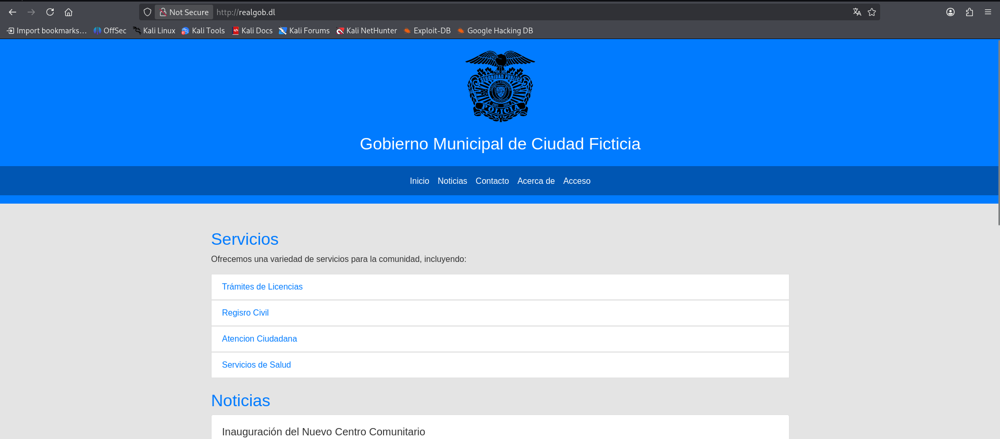

### 3. Descubrimiento de Directorios Ocultos - [ALTA]

Se ejecutó un escaneo de directorios utilizando Gobuster, que reveló múltiples rutas no indexadas en el servidor web:

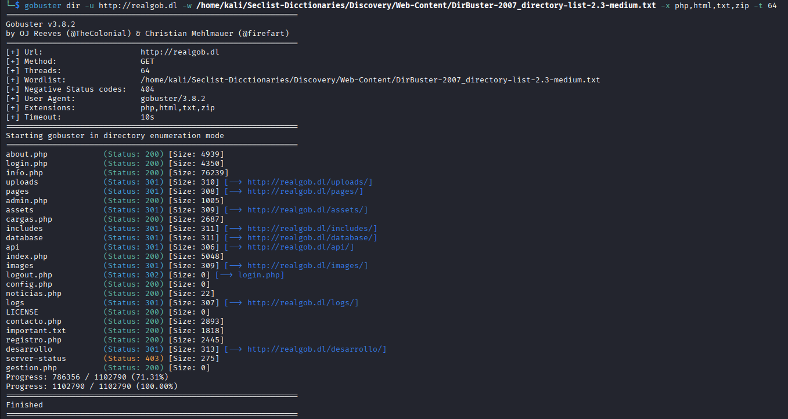

**Directorios y Archivos Descubiertos:**

#### **important.txt** - [MEDIA]
Archivo de texto que contiene un mensaje del creador del laboratorio. Su exposición pública permite recopilar información del sistema.

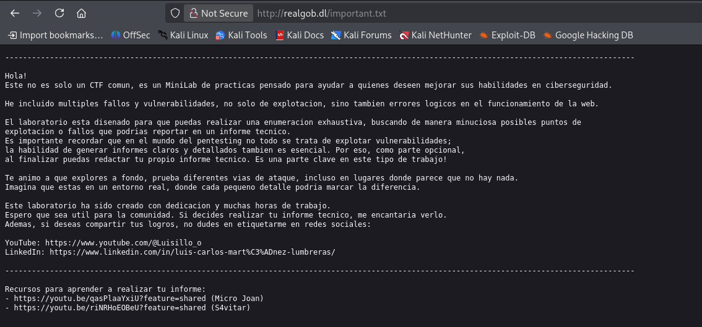

#### **info.php** - [CRÍTICA]
Exponía información sensible de la configuración de PHP, incluyendo:
- Versión de PHP y módulos cargados
- Directivas de configuración críticas
- Rutas de sistema de archivos
- Extensiones habilitadas

**Impacto**: Esta información facilita la identificación de vulnerabilidades específicas de la versión y vector de ataque.

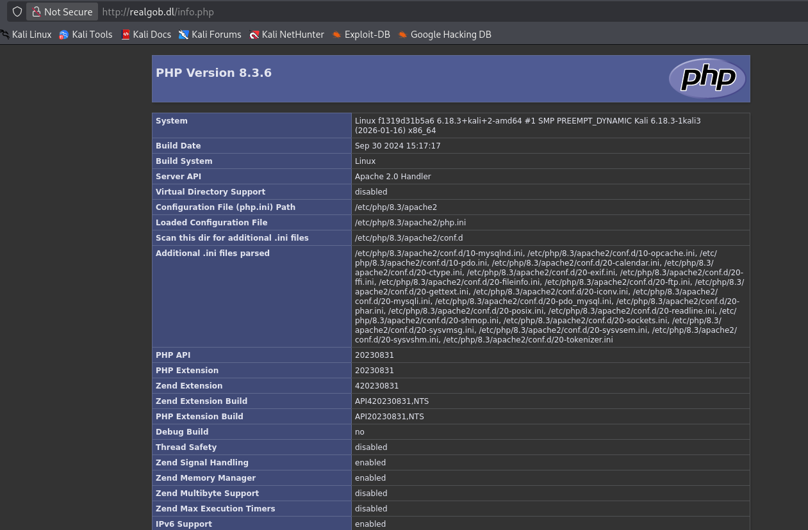

#### **Uploads** - [ALTA]
Directorio accesible públicamente que contiene documentos subidos tanto por administradores como por usuarios. La visibilidad pública de archivos subidos puede exponer información sensible.

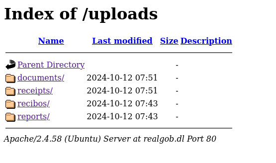

#### **admin.php** - [ALTA]
Panel de administración protegido por autenticación básica (usuario y contraseña). Sin embargo, no se implementan mecanismos adicionales de seguridad como captchas, rate limiting o protección contra fuerza bruta.


### 4. Vulnerabilidad de Carga de Archivos - [CRÍTICA]

#### Sector "Cargas" - Bypass de Validación de Tipos de Archivo

Se identificó un vector de ataque crítico en la funcionalidad de carga de archivos:

**Flujo del Ataque:**

1. **Primer Intento**: Intento directo de cargar un script PHP con extensión `.php` fue rechazado.


2. **Rechazo Inicial**: El servidor rechazó la carga indicando que el tipo de archivo no es permitido.

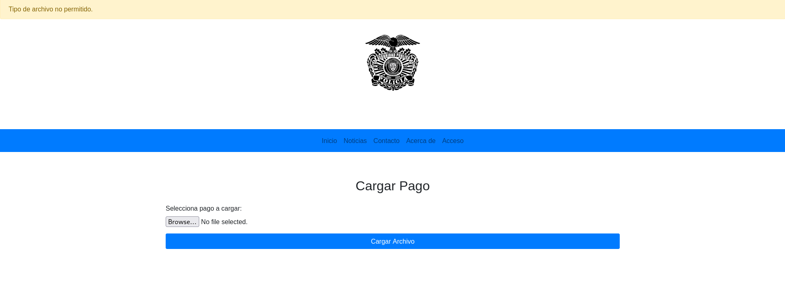

3. **Bypass de Validación**: Utilizando Burp Suite como intermediario, se interceptó la solicitud POST y se modificó el `Content-Type` de la solicitud HTTP de `application/x-php` a `image/gif`. El servidor aceptó la carga bajo este encabezado falso.

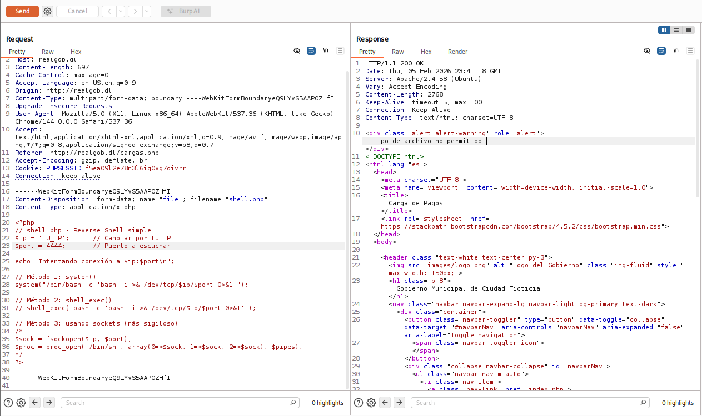

4. **Carga Exitosa**: Con el tipo MIME modificado, el servidor permitió la carga del archivo malicioso.

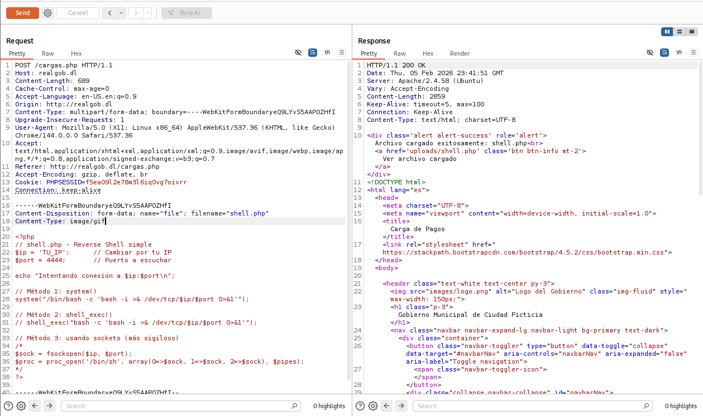

5. **Acceso al Archivo Subido**: El archivo fue almacenado en el directorio de uploads y fue accesible directamente a través del navegador.

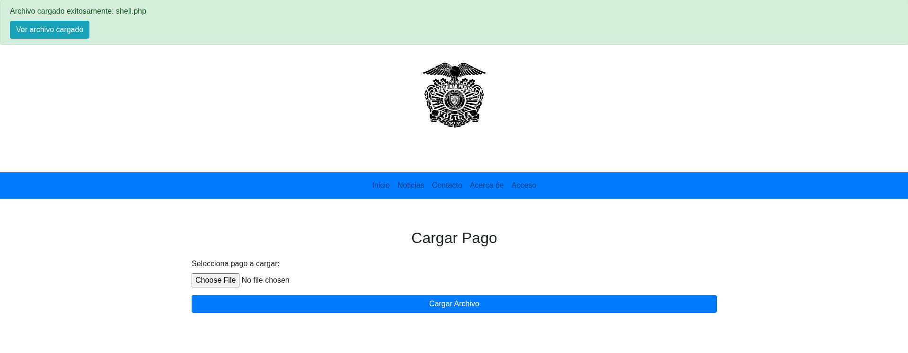
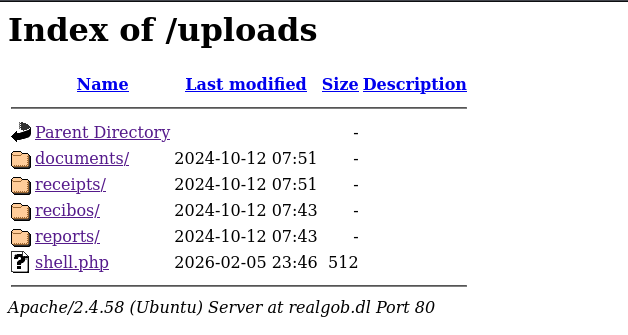

6. **Ejecución de Código Remoto**: Se logró acceso de shell reversa, permitiendo la ejecución de comandos del sistema con privilegios del servidor web.

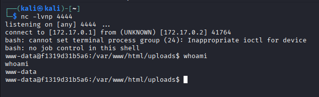

**Impacto**: Esta vulnerabilidad permite la ejecución de código arbitrario en el servidor con privilegios del usuario del servidor web.

### 5. Exposición de Estructura de Base de Datos - [ALTA]

#### Sección "database.php" - Enumeración de Esquema

Se identificó un panel que exponía información sobre las bases de datos del servidor MySQL:

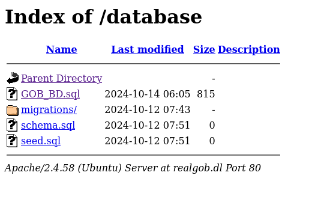

La base de datos funcional `GOB_BD` permite visualizar:
- Nombres de tablas
- Estructura de columnas
- Tipos de datos
- Restricciones

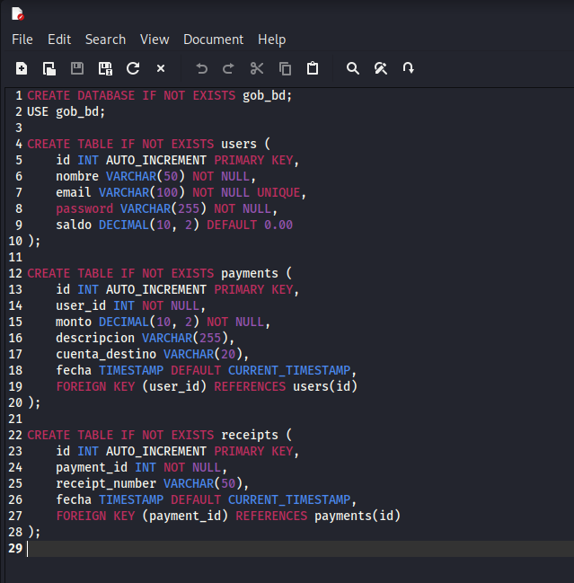

**Impacto**: Aunque no se tienen credenciales de acceso en este punto, la exposición de la estructura de base de datos proporciona información crítica para diseñar ataques de inyección SQL dirigidos.

### 6. Enumeración de API - [MEDIA]

#### Sección "api.php"

Se descubrió un panel que lista archivos y elementos relacionados con una posible API utilizada por la aplicación:

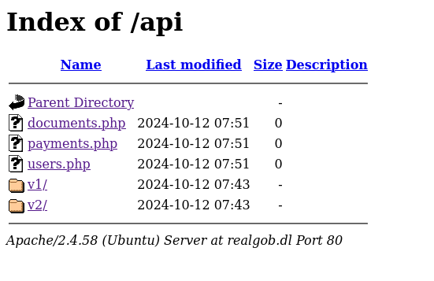

**Impacto Potencial**: Expone puntos de integración y posibles vectores de ataque adicionales.

### 7. Vulnerabilidad de Inclusión Local de Archivos (LFI) - [CRÍTICA]

#### Sección "Acerca de" con Parámetro en URL

En la sección "Acerca de", se identificó un botón "Leer más" que genera una solicitud con parámetro en la URL. El parámetro estaba nombrado de forma literal sin hash u ofuscación.

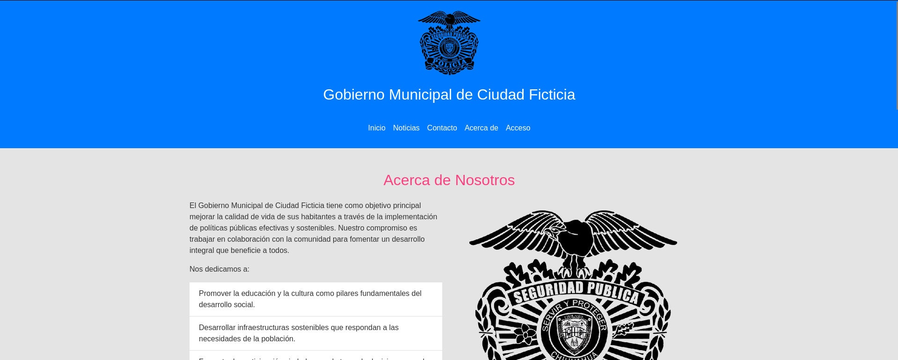

**URL Vulnerable**: `http://realgob.dl/about.php?file=iniciativas.html`


**Prueba de Concepto**: Se intentó cargar el archivo `/etc/passwd` mediante el parámetro, y el servidor devolvió el contenido del archivo sin validación:

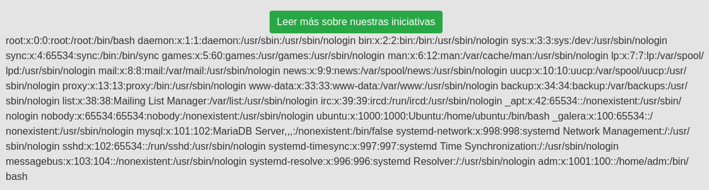

**Impacto**: Esta vulnerabilidad permite la lectura arbitraria de archivos del sistema, potencialmente exponiendo:
- Archivos de configuración sensibles
- Claves privadas
- Credenciales almacenadas
- Código fuente

### 8. Exposición de Registros del Sistema - [MEDIA]

#### Sección "Logs"

Se identificó un panel que expone dos archivos de registro del sistema:

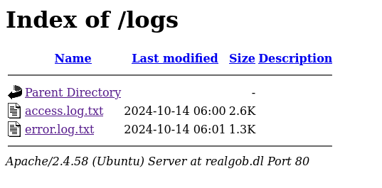

**Logs Accesibles:**

1. **access.log** - Registro de accesos HTTP

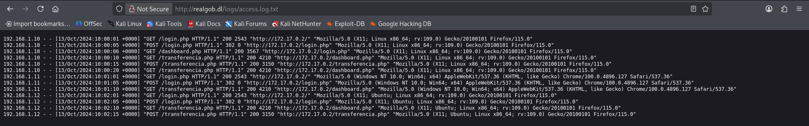

2. **error.log** - Registro de errores de la aplicación

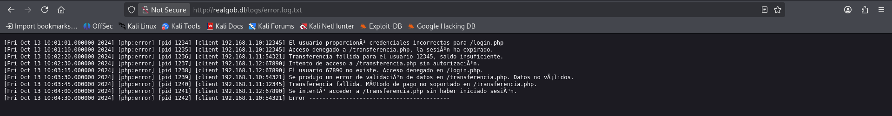

**Nota**: En este laboratorio, los logs presentan contenido simulado. Sin embargo, en un entorno de producción, la exposición de logs reales permitiría ataques de **Log Poisoning**, donde un atacante inyecta código malicioso en los logs que posteriormente son ejecutados por herramientas de monitoreo.

**Impacto**: Exposición de información operativa y potencial surface para técnicas avanzadas de explotación.

### 9. Vulnerabilidad de Cross-Site Scripting (XSS) - [ALTA]

#### Formulario de Contacto

Se identificó una vulnerabilidad XSS reflejada en el formulario de contacto de la aplicación:

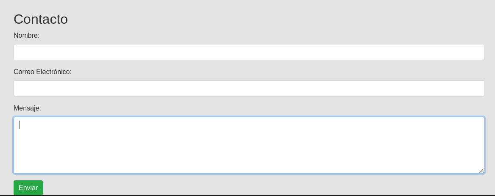

**Payloads Exitosos**:

- Campo Nombre: `<script>alert('XSS')</script>`
- Campo Mensaje: `<script>alert(1)</script>`

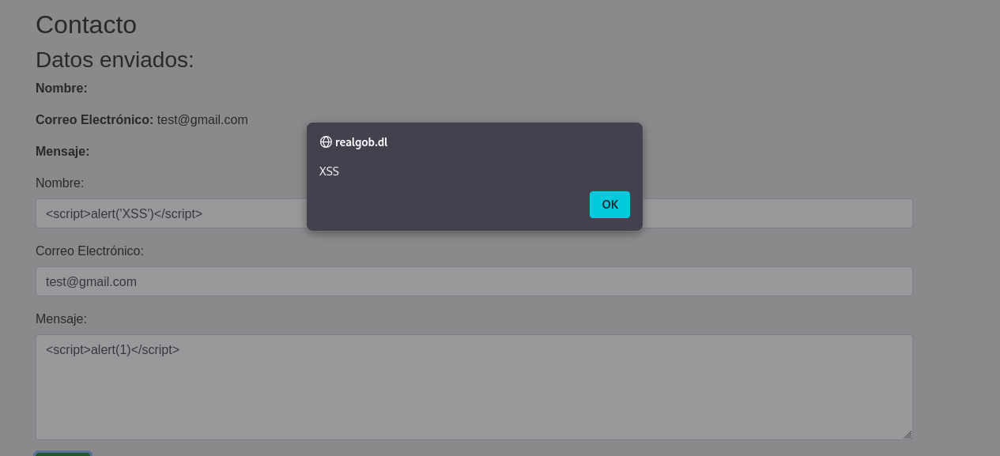

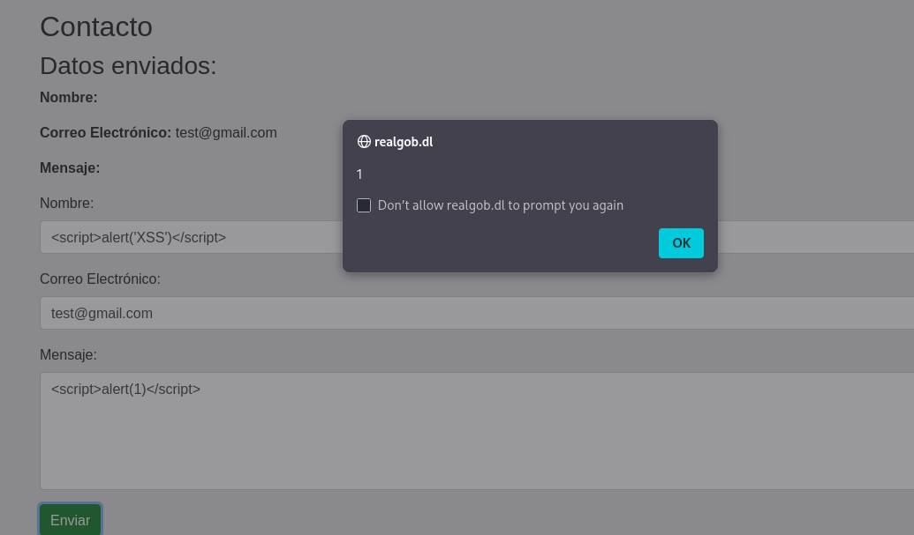

**Impacto**: Un atacante puede inyectar código JavaScript malicioso que se ejecutará en el navegador de usuarios que visualicen el formulario, permitiendo:
- Robo de sesiones (cookies)
- Redireccionamiento a sitios maliciosos
- Captura de credenciales

### 10. Vulnerabilidades en Autenticación y Autorización - [CRÍTICA]

#### Formularios de Inicio de Sesión y Registro

Se identificaron múltiples vulnerabilidades críticas en el módulo de autenticación:

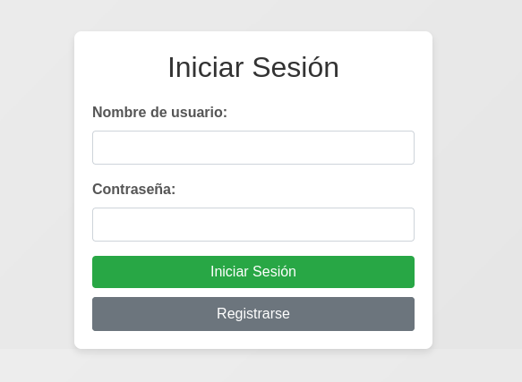

**Vulnerabilidad A: Enumeración de Usuarios - [ALTA]**

Los formularios de inicio de sesión y registro generan mensajes de error diferenciados:

- Error de usuario incorrecto: "Nombre de usuario no encontrado"
- Error de contraseña incorrecta: "Contraseña incorrecta"

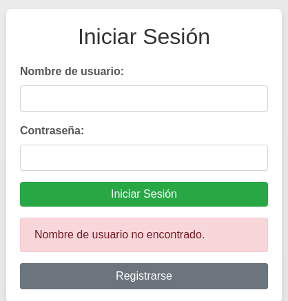

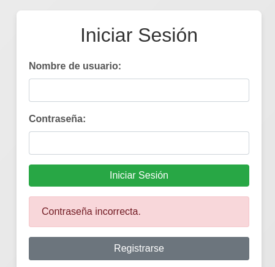

Este comportamiento permite ataques de enumeración para identificar usuarios válidos en el sistema, facilitando posteriores intentos de fuerza bruta contra usuarios existentes.

**Vulnerabilidad B: Insecure Direct Object Reference (IDOR) - [CRÍTICA]**

Tras iniciar sesión, se accede a un panel de usuario que contiene información personal:

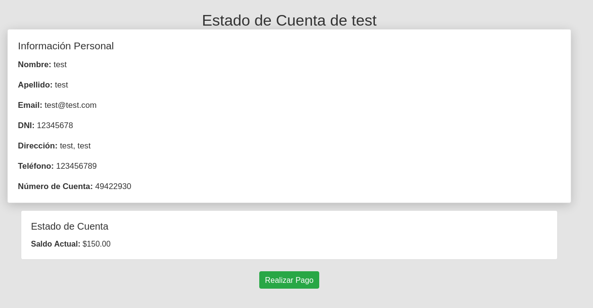

La URL del panel contiene un parámetro ID numérico secuencial: `?id=2`

Modificando el valor del parámetro ID, un atacante puede acceder a información de otros usuarios del sistema sin autorización:

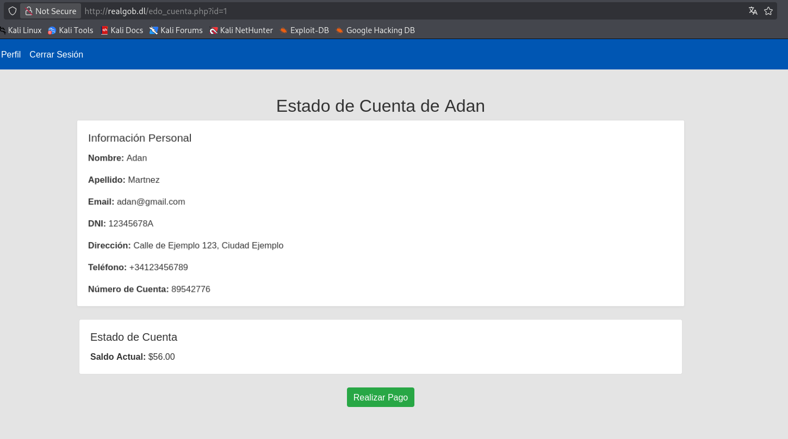

**Impacto**: Acceso no autorizado a información privada de otros usuarios, incluyendo:
- Datos personales
- Información de contacto
- Información financiera asociada

### 11. Vulnerabilidad de Manipulación de Transacciones Financieras - [CRÍTICA]

#### Funcionalidad de Transferencia de Fondos

Se identificó una vulnerabilidad crítica en el módulo de transferencia de dinero entre cuentas:

**Prueba A: Transferencia con Monto Negativo**

Se intentó iniciar una transferencia con un monto negativo (-200):


El sistema aceptó la transferencia negativa. El resultado fue:
- Fondos sumados a la cuenta del usuario actual
- Fondos restados de la cuenta destino

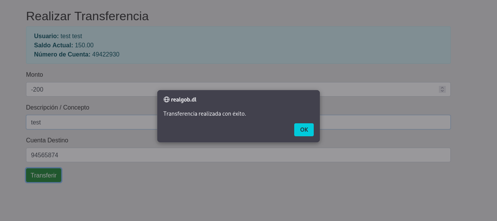

**Impacto en Cuentas:**

Cuenta que envió dinero (debería restar): Se le sumaron fondos

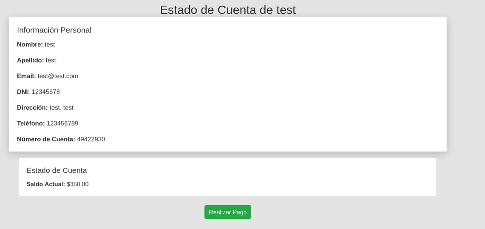

Cuenta receptora: Se le restaron fondos, quedando con balance negativo

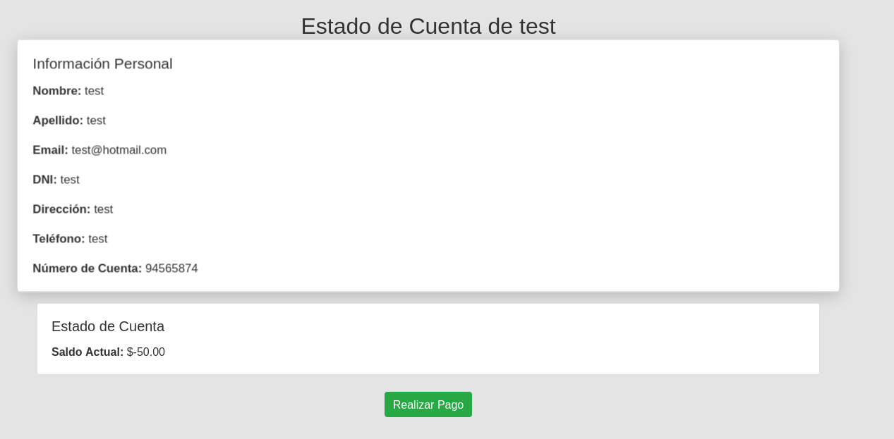

**Vulnerabilidades Identificadas:**

1. **Falta de Validación de Monto**: No se valida que el monto sea positivo
2. **Sin Verificación de Saldo**: No se verifica si el cuenta origen tiene saldo suficiente
3. **Lógica Inverted**: Los montos se aplican en sentido inverso
4. **Creación de Dinero**: El sistema permite crear dinero de la nada mediante transferencias negativas

**Impacto**: Un atacante puede aumentar infinitamente su balance, alterando la integridad del sistema financiero.

### 12. Descubrimiento de Repositorio Git Expuesto - [CRÍTICA]

#### Sección "desarrollo.php" y Carpeta .git

Se identificó un panel de administración adicional bajo la ruta `/desarrollo`:

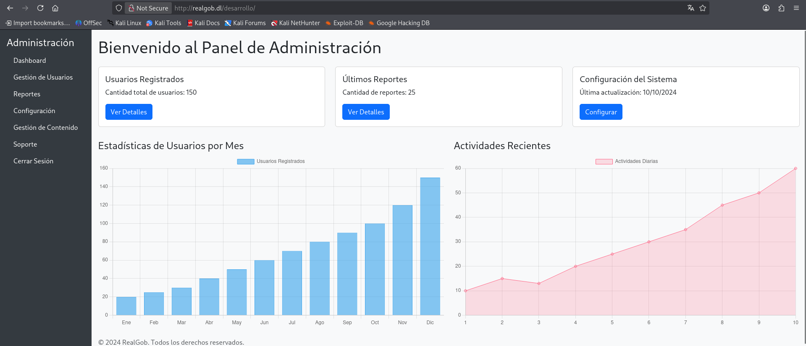

Se ejecutó un escaneo de directorios específico en `/desarrollo` que reveló la existencia de un repositorio Git:

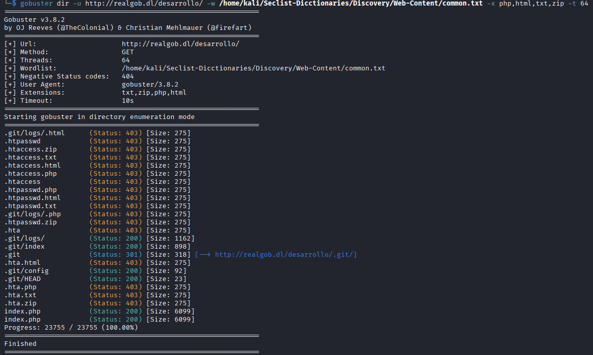

**Explotación con git-dumper:**

Se utilizó la herramienta `git-dumper` para extraer completamente el repositorio Git publicado:

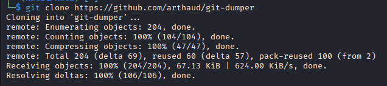

```bash
python3 -m venv venv
source venv/bin/activate
pip3 install -r requirements.txt
python3 git_dumper.py http://realgob.dl/desarrollo/.git/ dump
```

**Contenido Extraído:**

Los archivos del repositorio contenían información crítica:

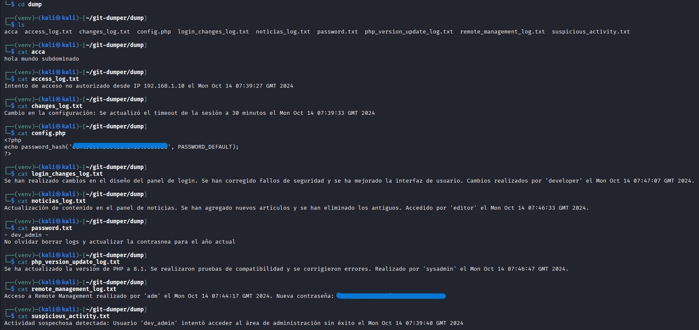

Se extrajeron:
- Nombres de usuarios potenciales para SSH
- Contraseñas o palabras clave asociadas

**Impacto**: Exposición de código fuente, historial de cambios, y credenciales embebidas en archivos de configuración.

### 13. Acceso SSH por Fuerza Bruta - [CRÍTICA]

Utilizando la información extraída del repositorio Git, se compiló una lista de usuarios y contraseñas para ejecutar un ataque de fuerza bruta contra el servicio SSH (puerto 22):

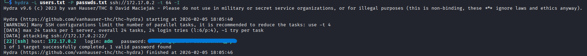

El ataque fue exitoso, obteniéndose credenciales válidas para acceso SSH:

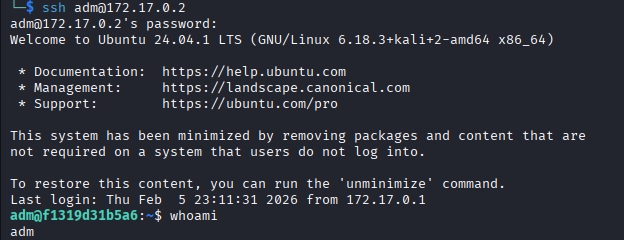

### 14. Escalada de Privilegios via Archivos de Configuración - [CRÍTICA]

Tras obtener acceso SSH como usuario de nivel bajo, se procedió a buscar archivos de configuración que comúnmente contienen credenciales en texto plano:

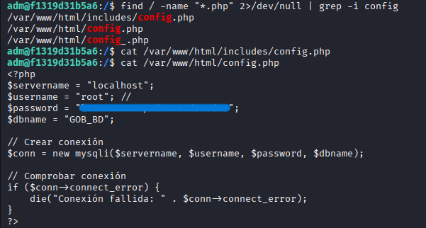

Se descubrieron 3 archivos de configuración. Los dos últimos contenían información idéntica y crítica:
- Credenciales de base de datos MySQL
- Información de acceso a servicios internos

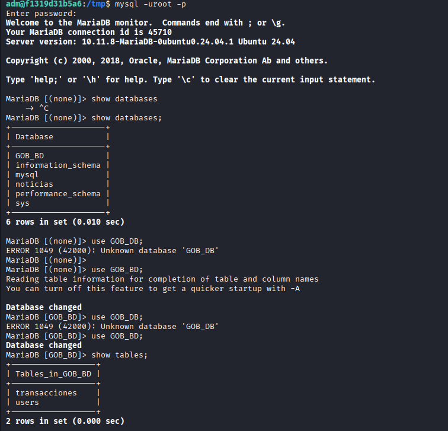

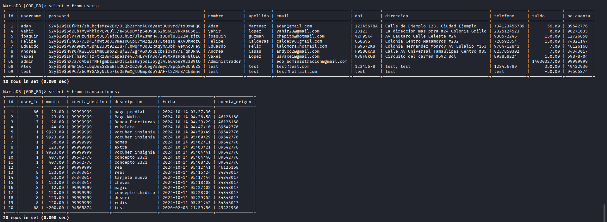

Estos archivos proporcionaron acceso directo a la base de datos MySQL del puerto 3306 (que de otro modo estaría protegido).

### 15. Extracción de Credenciales desde Variables de Entorno - [CRÍTICA]

Se procedió a revisar las variables de entorno del sistema:

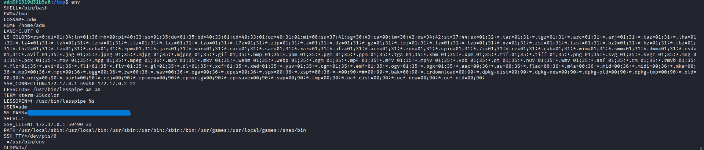

Se identificó una variable de entorno sospechosa: `MY_PASS` que contenía un valor en formato hexadecimal.

Se utilizó una herramienta de conversión en línea para decodificar el valor hexadecimal a texto plano:

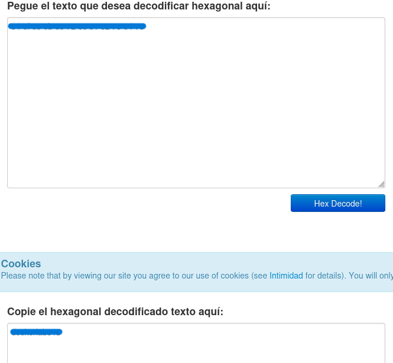

Se obtuvo la contraseña de root, que fue validada exitosamente:

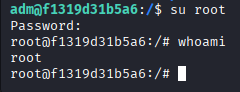

**Impacto**: Acceso de nivel root, compromiso total del sistema.

---

## Conclusión

El laboratorio Report expone un conjunto crítico y variado de vulnerabilidades que, en conjunto, permiten el compromiso total del sistema desde acceso anónimo hasta ejecución de código con privilegios de root. 

**Hallazgos Clave:**

1. **Múltiples Vulnerabilidades Críticas**: El sistema contiene un mínimo de 6 vulnerabilidades clasificadas como CRÍTICA
2. **Exposición de Información Sensible**: La aplicación expone información de configuración, estructura de bases de datos, y archivos del sistema
3. **Cadena de Ataque Lineal**: Las vulnerabilidades están interconectadas, permitiendo una escalada de privilegios progresiva desde acceso anónimo
4. **Control Insuficiente de Validación**: Falta validación en múltiples capas (tipos de archivo, valores numéricos, parámetros de URL)
5. **Gestión Deficiente de Credenciales**: Las credenciales se encuentran expuestas en múltiples ubicaciones sin cifrado

**Riesgo General**: CRÍTICO

La aplicación no debería desplegarse en un entorno de producción sin remediación integral de las vulnerabilidades identificadas.

---

## Recomendaciones y Soluciones

### Vulnerabilidades Críticas

#### [CRÍTICA] 1. Exposición de info.php y Información de Configuración de PHP

**Problema**: El archivo `info.php()` expone la configuración completa de PHP.

**Solución**:
```bash
# Eliminar o renombrar el archivo info.php
rm /var/www/html/info.php

# Alternativa: Proteger el archivo con autenticación .htaccess
cat > /var/www/html/info.php.htaccess << 'EOF'
<Files info.php>
    Order Allow,Deny
    Deny from all
</Files>
EOF
```

**Validación**: Verificar que `http://realgob.dl/info.php` retorne error 403 o no sea accesible.

---

#### [CRÍTICA] 2. Vulnerabilidad de Carga de Archivos - Bypass de Validación MIME

**Problema**: La validación de tipo de archivo se realiza solo mediante `Content-Type`, que puede ser modificado por el cliente.

**Solución**:

```php
<?php
// upload.php - Validación correcta de archivos
$uploadDir = '/uploads/';
$maxFileSize = 5 * 1024 * 1024; // 5MB

// Whitelist de extensiones permitidas
$allowedExtensions = ['jpg', 'jpeg', 'png', 'gif', 'pdf'];
$allowedMimeTypes = ['image/jpeg', 'image/png', 'image/gif', 'application/pdf'];

if ($_SERVER['REQUEST_METHOD'] === 'POST') {
    $file = $_FILES['upload'];
    
    // Validar tamaño
    if ($file['size'] > $maxFileSize) {
        die('Archivo demasiado grande');
    }
    
    // Validar extensión
    $ext = strtolower(pathinfo($file['name'], PATHINFO_EXTENSION));
    if (!in_array($ext, $allowedExtensions)) {
        die('Tipo de archivo no permitido');
    }
    
    // Validar MIME con finfo
    $finfo = new finfo(FILEINFO_MIME_TYPE);
    $mime = $finfo->file($file['tmp_name']);
    
    if (!in_array($mime, $allowedMimeTypes)) {
        die('Tipo MIME no permitido');
    }
    
    // Renombrar archivo
    $newFileName = bin2hex(random_bytes(16)) . '.' . $ext;
    if (move_uploaded_file($file['tmp_name'], $uploadDir . $newFileName)) {
        echo 'Archivo subido correctamente';
    }
}
?>
```

---

#### [CRÍTICA] 3. Local File Inclusion (LFI)

**Problema**: El parámetro `page` es procesado directamente sin validación.

**Solución**:

```php
<?php
$allowedPages = ['principal', 'historia', 'mision', 'vision', 'equipo'];
$page = isset($_GET['page']) ? basename($_GET['page']) : 'principal';

if (!in_array($page, $allowedPages)) {
    $page = 'principal';
}

$filePath = __DIR__ . '/pages/' . $page . '.php';
if (file_exists($filePath)) {
    include $filePath;
}
?>
```

---

#### [CRÍTICA] 4. IDOR en Información de Usuarios

**Problema**: Los IDs de usuario son secuenciales sin verificación de autorización.

**Solución**:

```php
<?php
session_start();

$requestedUserId = isset($_GET['id']) ? intval($_GET['id']) : null;

// Verificar que solo pueda acceder a su propio perfil
if ($requestedUserId !== $_SESSION['user_id']) {
    http_response_code(403);
    die('No tiene permiso');
}

// Obtener datos
$stmt = $pdo->prepare('SELECT id, nombre, email FROM usuarios WHERE id = ?');
$stmt->execute([$_SESSION['user_id']]);
$user = $stmt->fetch();
?>
```

---

#### [CRÍTICA] 5. Manipulación de Transacciones Financieras

**Problema**: Falta validación de montos y verificación de saldo.

**Solución**:

```php
<?php
$monto = floatval($_POST['monto']);

// Validar monto
if ($monto <= 0) {
    die('El monto debe ser mayor a cero');
}

// Verificar saldo
$stmt = $pdo->prepare('SELECT saldo FROM usuarios WHERE id = ?');
$stmt->execute([$origen]);
$userData = $stmt->fetch();

if ($userData['saldo'] < $monto) {
    die('Saldo insuficiente');
}

// Ejecutar en transacción
$pdo->beginTransaction();
$pdo->prepare('UPDATE usuarios SET saldo = saldo - ? WHERE id = ?')->execute([$monto, $origen]);
$pdo->prepare('UPDATE usuarios SET saldo = saldo + ? WHERE id = ?')->execute([$monto, $destino]);
$pdo->commit();
?>
```

---

#### [CRÍTICA] 6. Repositorio Git Expuesto

**Problema**: El directorio `.git` es accesible públicamente.

**Solución - nginx**:
```nginx
location ~ /\.git {
    deny all;
}
```

**Solución - Apache**:
```apache
<FilesMatch "^\.">
    Deny from all
</FilesMatch>
```

---

### Vulnerabilidades Altas

#### [ALTA] 7. Enumeración de Usuarios

**Problema**: Mensajes de error diferenciados permiten enumerar usuarios.

**Solución**:

```php
<?php
$stmt = $pdo->prepare('SELECT id, contraseña FROM usuarios WHERE usuario = ?');
$stmt->execute([$usuario]);
$user = $stmt->fetch();

// Mensaje genérico para ambos casos
if (!$user || !password_verify($contraseña, $user['contraseña'])) {
    die('Usuario o contraseña incorrecto');
}
?>
```

---

#### [ALTA] 8. XSS en Formulario de Contacto

**Problema**: No se valida ni sanitiza la entrada.

**Solución**:

```php
<?php
$nombre = htmlspecialchars($_POST['nombre'], ENT_QUOTES, 'UTF-8');
$mensaje = htmlspecialchars($_POST['mensaje'], ENT_QUOTES, 'UTF-8');
$email = filter_var($_POST['email'], FILTER_SANITIZE_EMAIL);

// Guardar en BD de forma segura
$stmt = $pdo->prepare('INSERT INTO contactos VALUES (?, ?, ?, NOW())');
$stmt->execute([$nombre, $email, $mensaje]);
?>
```

---

#### [ALTA] 9. Acceso SSH no Autorizado

**Problema**: Contraseñas débiles o expuestas.

**Solución**:

```bash
# Cambiar contraseñas
passwd adm
passwd root

# Configurar SSH
sudo nano /etc/ssh/sshd_config
# PasswordAuthentication no
# PermitRootLogin no

sudo systemctl restart ssh
```

---

### Vulnerabilidades Medias

#### [MEDIA] 10. Exposición de Archivos de Configuración

**Problema**: Archivos con credenciales en texto plano.

**Solución**: Usar variables de entorno en lugar de archivos hardcodeados.

```bash
export DB_HOST="localhost"
export DB_USER="app_user"
export DB_PASS="contraseña_fuerte"
```

---

#### [MEDIA] 11. Exposición de Logs

**Problema**: Los logs son accesibles públicamente.

**Solución - nginx**:
```nginx
location ~^/logs/ {
    deny all;
}
```

---

## Cronograma de Remediación

| Prioridad | Hallazgo | Plazo |
|-----------|----------|-------|
| 1 | Bloqueo de .git | Inmediato |
| 2 | info.php | 24 horas |
| 3 | Validación de carga de archivos | 3 días |
| 4 | Protección contra LFI | 3 días |
| 5 | IDOR en perfiles | 5 días |
| 6 | Validación de transacciones | 7 días |
| 7 | XSS en formularios | 5 días |
| 8 | SSH seguro | 3 días |

---

**Conclusión**: El laboratorio Report presenta vulnerabilidades críticas que comprometen completamente la seguridad del sistema. Se requiere remediación inmediata de todos los hallazgos clasificados como CRÍTICA antes de cualquier despliegue en producción.


