# Rock Stars

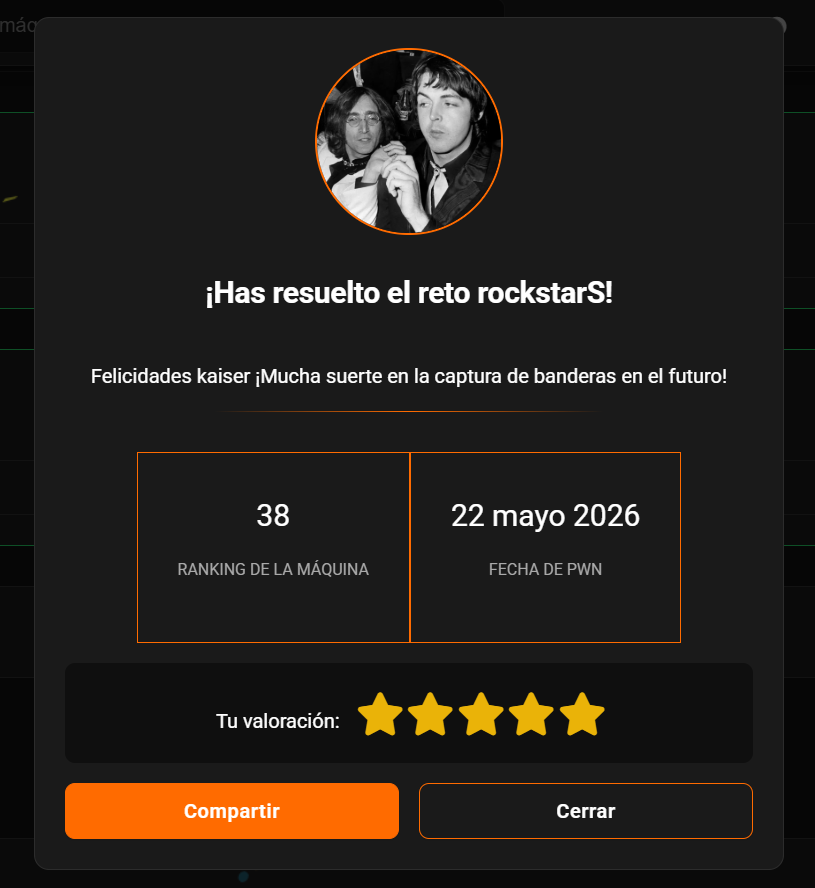

## Executive Summary

This practical hacking lab focuses on exploiting a local file inclusion (LFI) vulnerability and escalating privileges through insecure `sudo` configuration and Python import path manipulation. The objective is to first compromise the `shark` account, then `loseey`, then `username3`, and finally obtain root access.

## Initial Recon

The hacker Labs.

The lab begins with an nmap scan revealing ports 22 and 80 open:

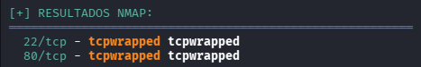

Then a gobuster scan reveals certain exposed directories:

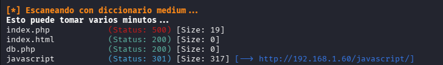

Most of them are blank, but `index.php` shows the phrase "Yo no soy tu marido".

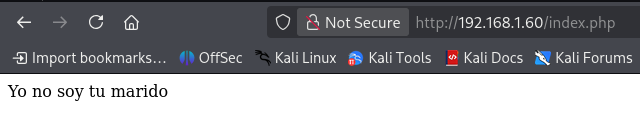

## LFI Vulnerability

With no other clues, a fuzzing attack is launched against the page’s POST method, revealing that the `backdoor` parameter can be abused for an LFI vulnerability.

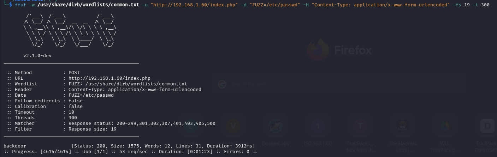

To confirm, a curl request is made with the `-d` parameter and the vulnerability is indeed present:

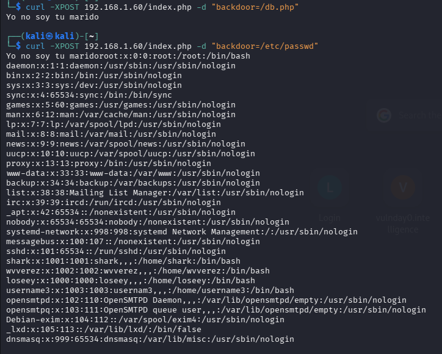

Next the `db.php` file is read, which did not show any information in the browser, but when requested via POST it returns data:

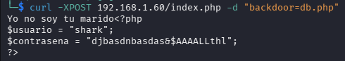

Indeed, it returns credentials for a user named shark.

## Initial Access

Next, the SSH session is initiated using that user:

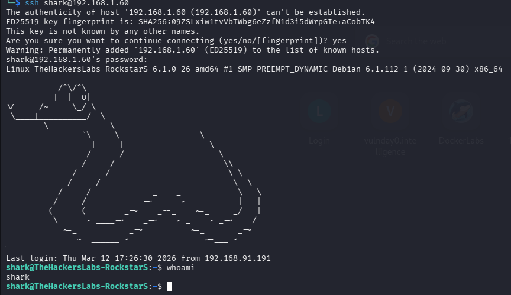

Checking `sudo -l` reveals that this user can run a binary named `bof` as `wvverez` without a password:

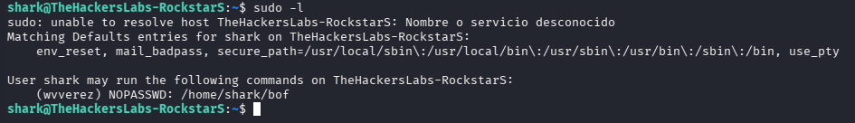

That file is located in shark’s directory:

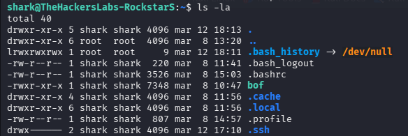

A closer review shows that the document owner is shark, so the file is overwritten to return only a shell while preserving the permissions of wvverez which executes it:

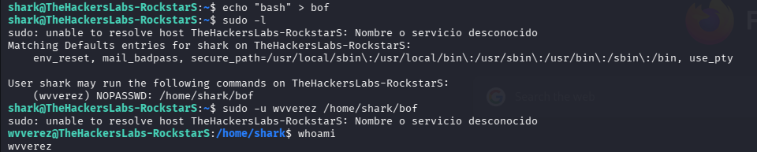

## Local Privilege Escalation

Inspecting this new user’s directory reveals a zip file:

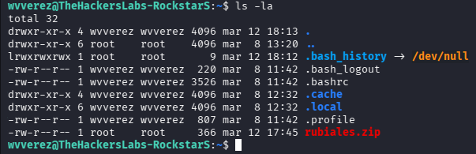

Attempting to unzip it shows that it requires a password, but also provides information about the output file, which contains some user passwords:

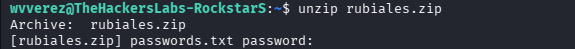

To decompress it, it is first sent to the attacker machine by starting a server on the victim and retrieving it with wget:

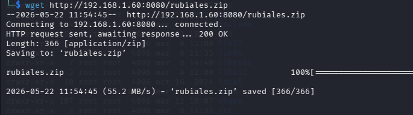

Next the archive’s original hash is obtained and john is used to perform a brute-force attack with the rockyou.txt wordlist, obtaining the password:

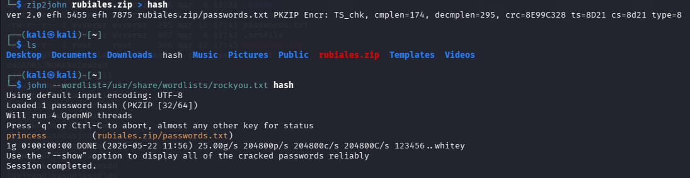

Then the archive is decompressed and indeed it appears to contain several credentials:

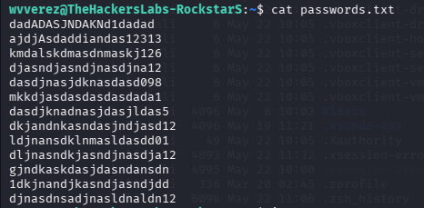

## Additional Enumeration

All system users are listed:

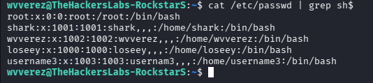

With the possible users identified, brute-force attacks are attempted against the other two users besides root, obtaining credentials for loseey:

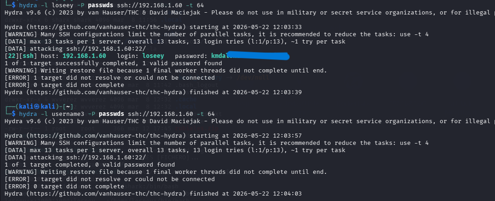

With this, an SSH session is started:

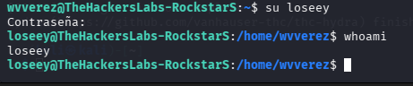

Inspecting this new user’s home directory reveals a file `rubiales.py`, which imports a module that allows viewing total and remaining system memory:

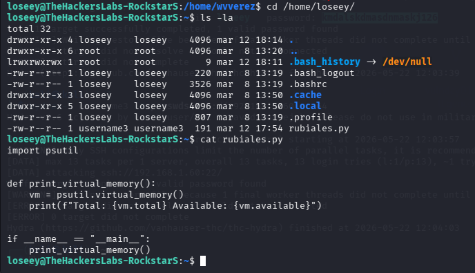

Checking `sudo -l` shows this binary can be used as the user username3 without a password.

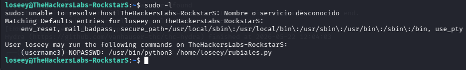

This opens a clear attack vector. In Python, `import` usually prioritizes local paths or `PATH` entries over standard language modules. Therefore, if a file named `psutil.py` is created, the import will refer to that file instead of the installed library. When the other script runs, the malicious module executes, giving a shell as username3:

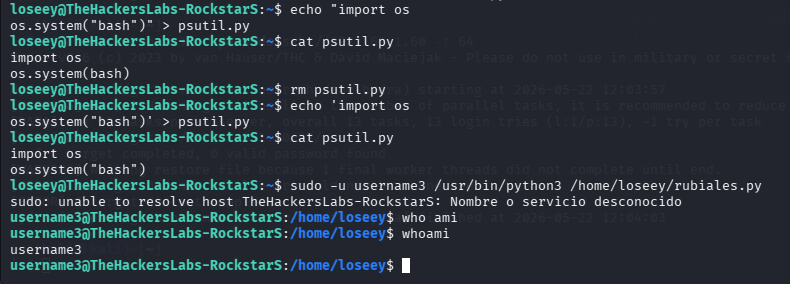

At this stage the first lab flag is obtained:

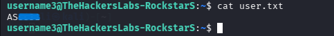

## Root Access

On this new user, `sudo -l` is checked and it shows `bsh` can be executed as root:

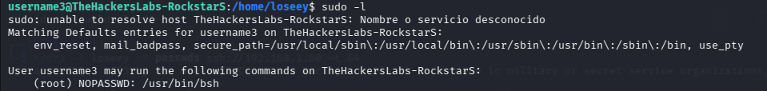

This file opens a kind of Java shell with limited actions:

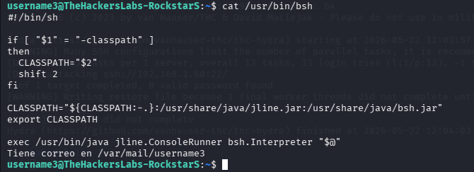

The attack vector at this point is clear: use this shell to open a root shell. However, it is not possible directly, so an alternate path is taken. Since commands can be run in this environment as root, permission is released to open a root shell with `suid` for any user, giving username3 the ability to escalate directly to root:

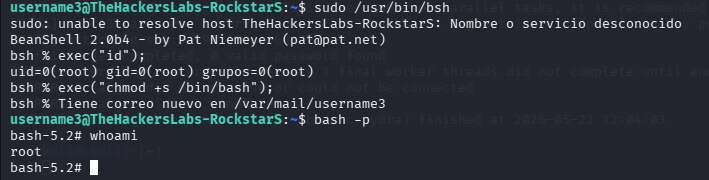

It works, we are root!!

The root flag is searched in its directory:

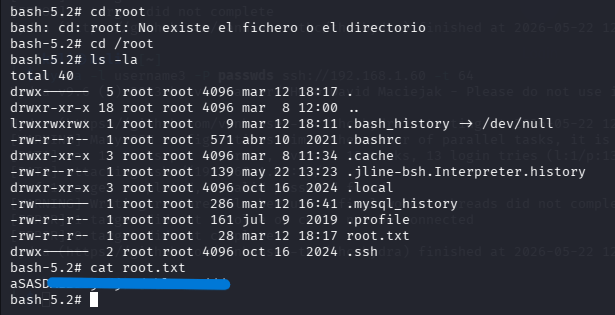

## Recommendations

- Strictly validate and sanitize input parameters to prevent local file inclusion vulnerabilities. Restrict accessible paths and disable arbitrary file inclusion.
- Remove any sensitive configuration files exposed in the web directory, such as `db.php`, and apply proper access controls for credentials and connection data.
- Restrict `sudo` permissions and avoid allowing one user to execute binaries or scripts as another user without an explicit safe command list.
- Avoid storing password-protected archives with weak passwords or leaving them accessible to unprivileged users. Use strong encryption and ensure sensitive data is not unnecessarily exposed.
- Protect Python files and restrict module search paths in untrusted directories to prevent path hijacking attacks. Use absolute imports and proper permissions on working directories.
- Audit and remove unnecessary `bsh` and root-capable command privileges. Do not grant shells or escalation utilities without strict security controls.
