# Sender

## Executive Summary
The **Sender** lab is designed to practice reconnaissance techniques, exploitation of weak credentials, and buffer overflow in a custom service. The ultimate goal is to gain privileged (root) access on the target machine. The two main vulnerabilities addressed are:

1. Credentials obtained through enumeration and brute force based on web content.
2. Buffer overflow in a privileged root-owned binary listening on a TCP port.

The lab workflow covers the use of common tools (nmap, gobuster, hydra, cewl, gdb, metasploit) and culminates in executing a payload to obtain a root shell.

---

## 1. Initial Reconnaissance

We begin with an **nmap** scan, which identifies TCP ports 22 (SSH) and 80 (HTTP) as open:

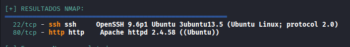

We attempt directory enumeration with **gobuster** but find no additional paths. We then explore the web service.

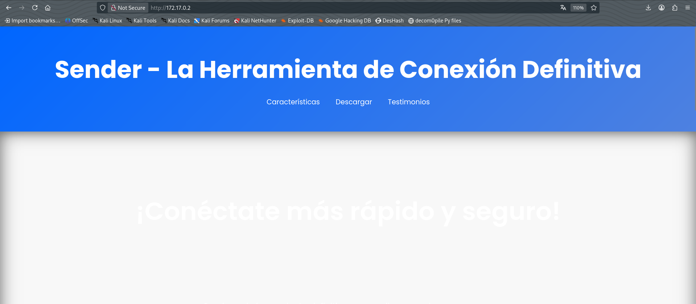

## 2. HTTP Service Exploration

The website presents a theme of a device or application for fast file sharing. One section offers a download of a binary called `sender`. The description suggests that the executable implements a simple TCP system that connects to a specified port and sends information instantly:

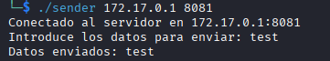

## 3. Credential Enumeration

We try various attack vectors without success. In the comments section we identify three potential user accounts. A dictionary brute‑force attack against SSH using *rockyou.txt* yields no valid passwords. Variations of username guesses also fail.

We eventually employ the **cewl** tool to generate a password wordlist based on the content of a URL. This produces a password for the user `alex`:

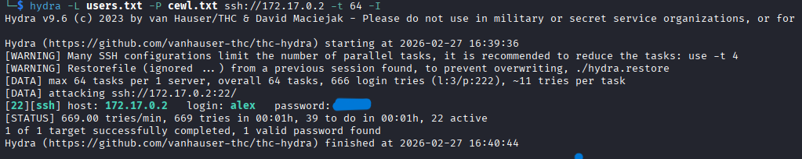

With these credentials, we establish an SSH session:

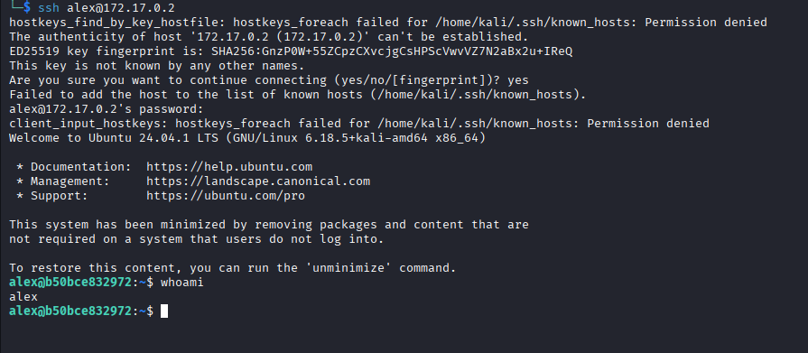

## 4. Post‑Exploitation on User Account

Inside the session as `alex`, running `sudo -l` returns nothing; the account has no sudo privileges. We locate the user flag and an interesting binary named `server`.

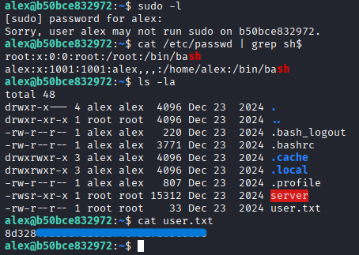

We transfer the binary to the attacker machine for analysis. It is noted that when executed it listens on port 7777 and calls a vulnerable function to receive data. Closer inspection of the function reveals no bounds checking, indicating a potential buffer overflow.

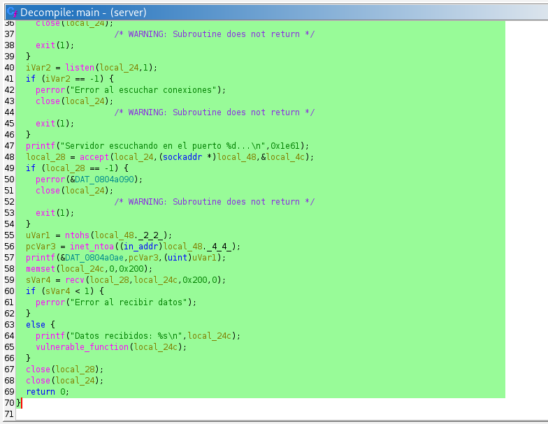
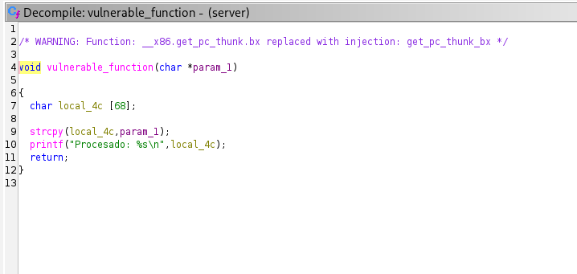

## 5. Vulnerability Confirmation

Running `server` locally and sending excessive data triggers a segmentation fault, confirming the vulnerability. The binary is owned by `root`, making it an escalation vector.

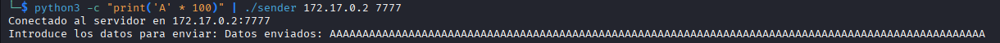
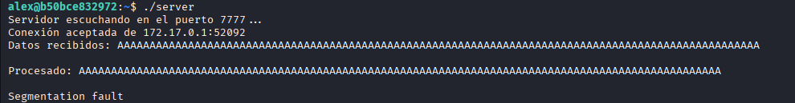

We also note that **gdb** is installed on the victim, facilitating exploit development.

## 6. Calculating the Offset

We generate a pattern with Metasploit's `pattern_create` (`-l 200`). With the server running under gdb (`gdb ./server`), we send the pattern and observe where the crash occurs:

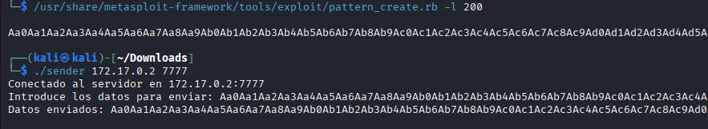
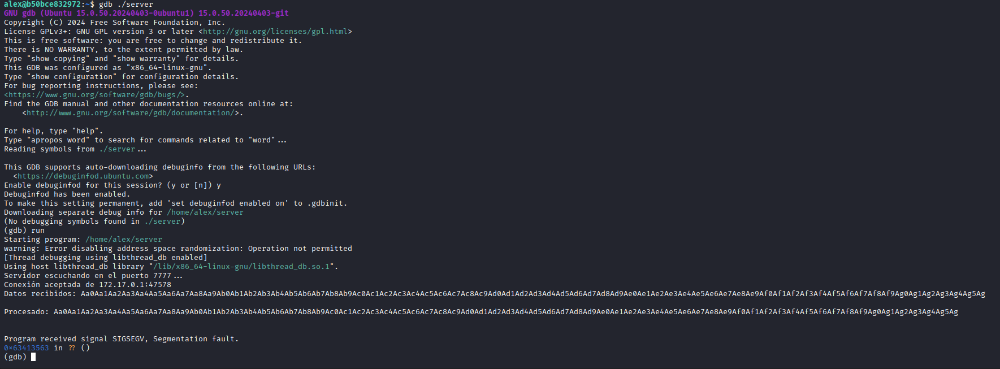

The final marker reveals the number of bytes needed to overwrite the return address. Using `pattern_offset` we determine that the optimal offset is **76 bytes**.

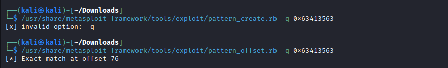

## 7. Environment Preparation

To simplify the exploit, we disable address space layout randomization (`randomize_va_space`) by setting it to 0. This fixes memory addresses and avoids ASLR variations.

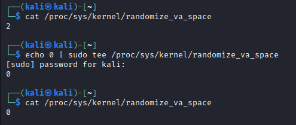

> **Note:** After completing the lab, restore the value to 2 to maintain security protections.

We inspect memory with `x/300wx $esp` in gdb to see where the payload begins loading. Since memory is static, we use the start address `0xffffd370` as a reference for the shellcode.

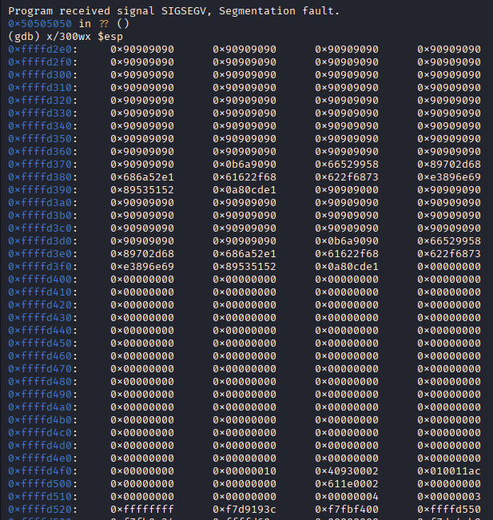

## 8. Exploitation and Escalation

A Python script is developed to build the payload and send it via the `sender` binary using `os` calls. Executing the script from the attacker host causes a buffer overflow that overwrites memory and enables arbitrary code execution.

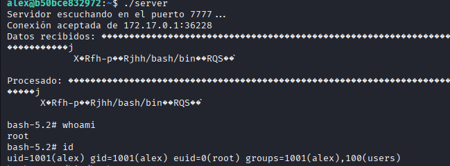

The exploit yields a **root** shell. The root flag is obtained, and the lab is completed.

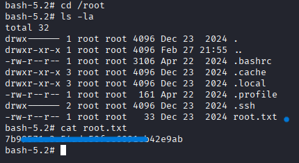

## 9. Recommendations

1. **Weak passwords and brute force:** Implement strong password policies, account lockout after multiple failed attempts, and access monitoring. Also use multi‑factor authentication for SSH.
2. **Protection of privileged binaries:** Compile with overflow mitigations (ASLR, stack canaries, PIE, NX) and review code to properly validate buffer sizes. Limit access to root-owned executables.

---

*End of improved English document.*