# Stranger

## Resumen del laboratorio

Este laboratorio guía al usuario por una ruta de reconocimiento, enumeración y escalada de privilegios en una máquina vulnerable. Se identifican servicios activos (FTP, SSH, HTTP), se descubren recursos web y ficheros sensibles, y se demuestra cómo obtener credenciales y elevar privilegios hasta obtener acceso root.

## Descubrimiento de servicios

Como paso inicial se realiza un escaneo con `nmap` para identificar servicios y puertos abiertos; se detectaron los puertos 21 (FTP), 22 (SSH) y 80 (HTTP).

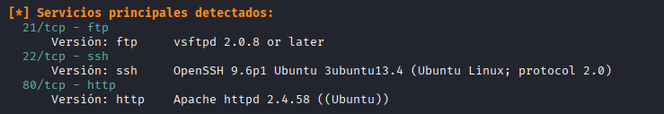

## Enumeración web

Al acceder a la página principal se observa un mensaje con contenido de interés: "Welcome mwheeler". A continuación se ejecuta un escaneo de directorios con `gobuster` contra el servidor web, que revela un recurso llamado `strange`.

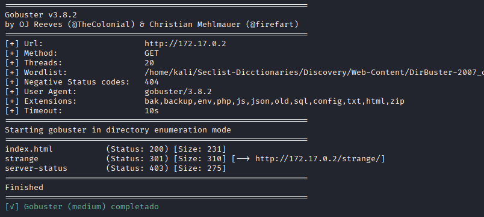

Dentro de `strange` hay contenido temático (referencias a "Stranger Things"), pero también una pista clara: "La contraseña para el archivo encriptado es iloveyou".

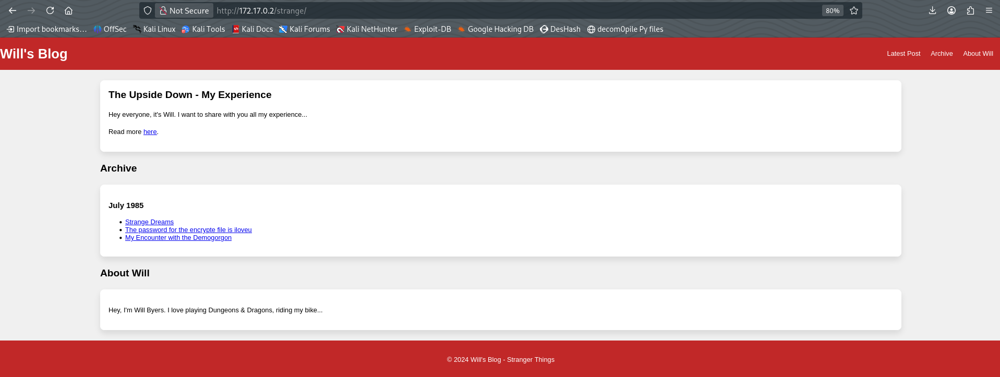

Un análisis adicional con `gobuster` sobre esa ruta revela dos ficheros importantes: `private.txt` y `secret.html`. `private.txt` es un archivo cifrado (se confirma que es RSA), mientras que `secret.html` contiene una pista referente al servicio FTP indicando que existe un usuario `admin` cuya contraseña debe descubrirse.

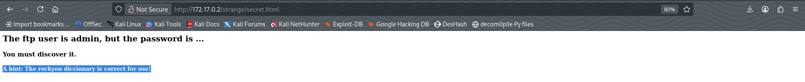

## Ataque por fuerza bruta contra FTP

Basándose en la pista de `secret.html`, se utiliza `hydra` para realizar un ataque de fuerza contra el servicio FTP y determinar la contraseña del usuario `admin`.

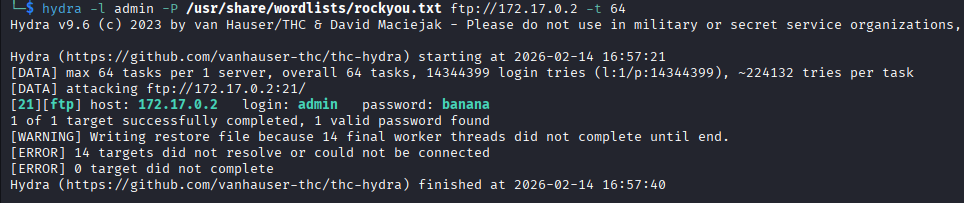

El ataque tiene éxito y permite autenticarse en FTP como `admin`. En el directorio FTP se encuentra un fichero que aparenta ser una clave privada.

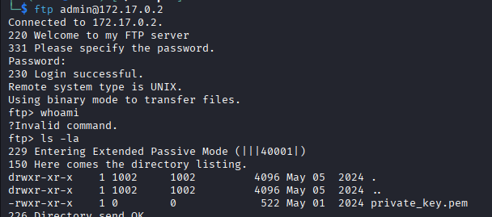

Se descarga el fichero con el comando `get` y, tras inspeccionarlo, se confirma que es una clave privada compatible con la clave pública utilizada para cifrar `private.txt`. Se emplea la clave para descifrar el archivo cifrado, cuyo contenido revela una palabra que podria ser una contraseña.

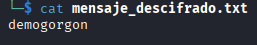

## Acceso inicial por SSH y pivot hacia privilegios superiores

Con la palabra se prueban credenciales en el servicio SSH para distintos usuarios. Se consigue acceso con el usuario `mwheeler`.

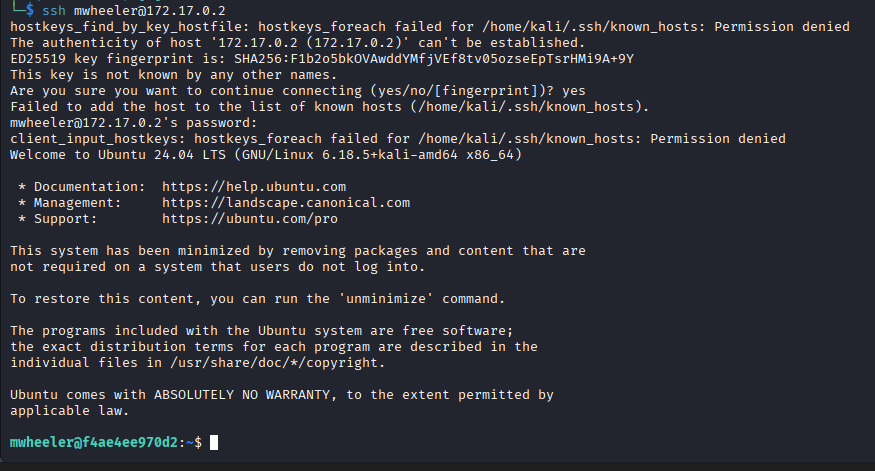

Desde la sesión de `mwheeler` no hay información sensible inmediata, por lo que se intenta el comando `su` usando la contraseña descubierta para `admin`. Esto permite cambiar de usuario a `admin`.

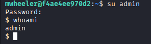

## Escalada de privilegios a root

Como `admin` se comprueba `sudo -l` y se confirma la posibilidad de ejecutar comandos con privilegios elevados. Se utiliza esta capacidad para abrir una shell con permisos de root.

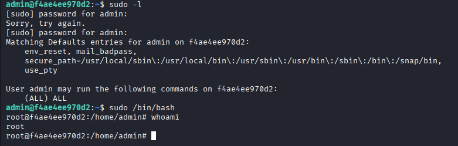

Accediendo al directorio `/root` se localiza la bandera final y se confirma la culminación del laboratorio.

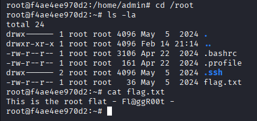

## Recomendaciones para mitigar y prevenir vulnerabilidades

- **Minimizar la exposición de servicios:** Evitar exponer servicios innecesarios (FTP) a redes públicas; utilizar SFTP/FTPS o deshabilitar FTP si no es requerido.
- **Políticas de contraseñas robustas:** Forzar contraseñas complejas y bloqueo de cuenta tras múltiples intentos fallidos para mitigar ataques de fuerza bruta (`hydra`).
- **Monitoreo y alertas:** Implementar IDS/IPS y registrar intentos de autenticación fallidos para detectar enumeración y ataques por fuerza bruta.
- **Gestión de claves privadas:** Proteger claves privadas con permisos restrictivos y almacenarlas en lugares seguros; evitar subir claves sin cifrar a servicios accesibles públicamente.
- **Revisión de permisos sudo:** Limitar privilegios `sudo` y aplicar el principio de menor privilegio; auditar comandos permitidos para usuarios.
- **Actualizaciones y parches:** Mantener software (servidor web, FTP, SSH) actualizado para corregir vulnerabilidades conocidas.
- **Seguridad en la información pública:** Evitar dejar pistas sensibles en páginas públicas o en archivos accesibles por HTTP.

---

