# Talent

## Resumen del laboratorio

Este laboratorio comienza con un escaneo de red que permite identificar un servidor HTTP con Wordpress. A partir de este punto se explorarán múltiples vulnerabilidades, desde credenciales débiles hasta extensiones vulnerables y configuraciones permisivas en el sistema de archivos. El objetivo es obtener una cadena de compromiso completa, escalando primero a un usuario con privilegios y, finalmente, a root. Al finalizar se proponen recomendaciones para mitigar cada vector de ataque.

---

## Identificación del objetivo y descubrimiento inicial

El laboratorio comienza con un escaneo de `nmap` que revela el puerto 80 abierto:

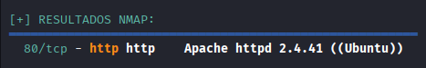

Posteriormente se visita dicho puerto y se identifica una página de Wordpress:

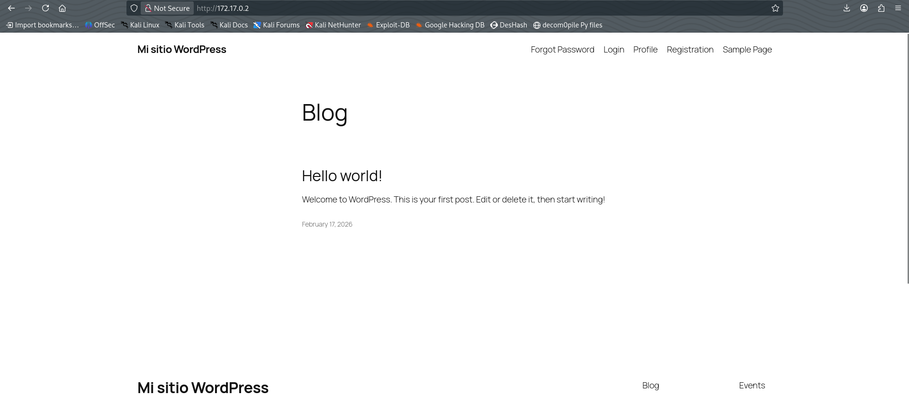

### Paneles disponibles

Se revisan los distintos paneles disponibles: registro de usuarios (función inhabilitada), formulario de inicio de sesión, uno para errores de login y finalmente uno para mostrar el perfil actual:

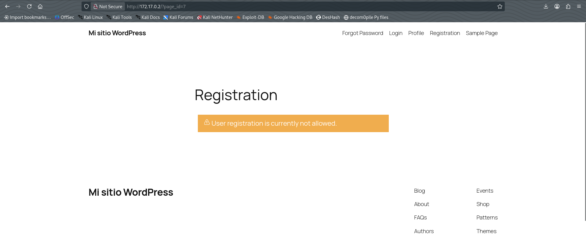

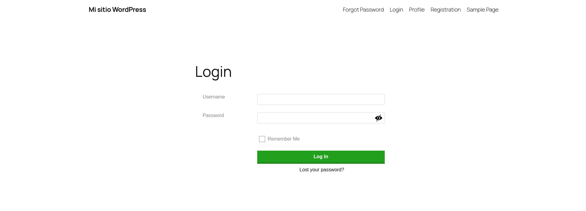

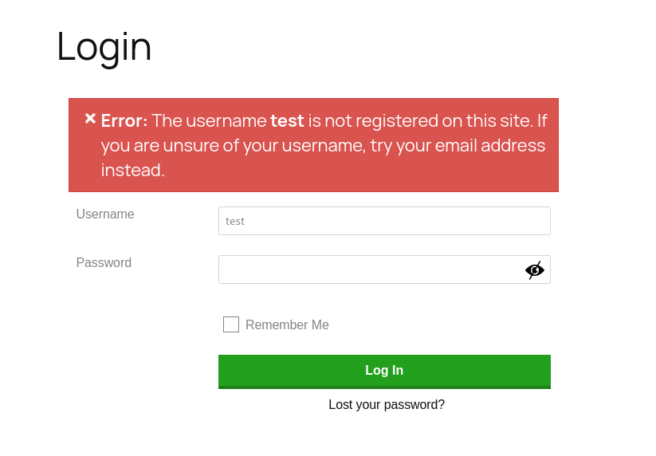

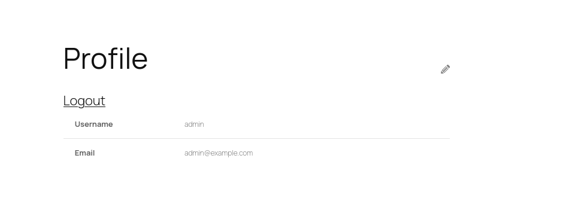

## Autenticación inicial y acceso administrativo

Por metodología personal, probé con el usuario `admin` y una contraseña genérica básica, lo cual funcionó. Esto demuestra una vulnerabilidad grave en un entorno real: credenciales por defecto o débiles permitiendo acceso administrativo.

Con esto se obtiene acceso al dashboard del administrador de Wordpress:

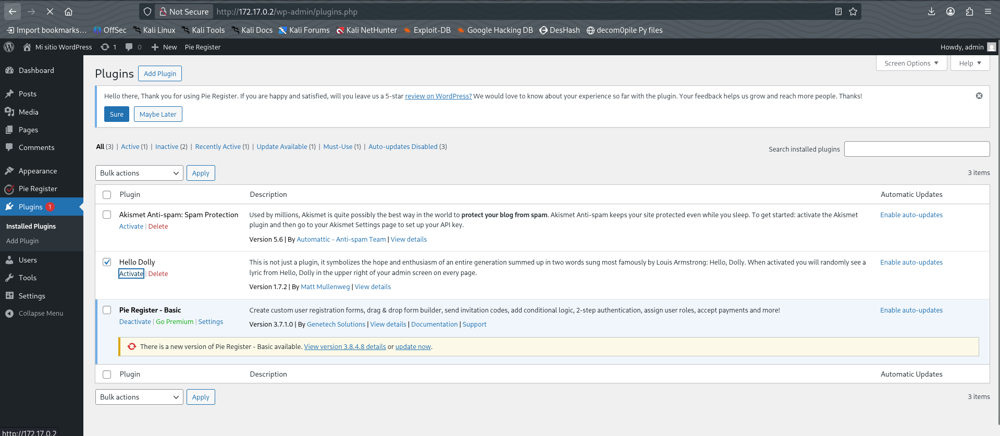

## Explotación de la extensión vulnerable

Al navegar en este dashboard se identifica la extensión **Hello Dolly**; esta es conocida por ser bastante vulnerable. Se utiliza el script de Pentest Monkey para obtener una reverse shell, el cual viene incluido en la mayoría de máquinas Kali:

Ruta usual: `/usr/share/webshells/php/php-reverse-shell.php`


> **Nota:** recordar que se debe especificar al inicio del script el puerto donde se quiere mandar la reverse shell y su respectiva IP de máquina atacante.

Este script debe ser insertado al inicio del código de la extensión (para editarla entrar al apartado de Tools > Editor de plugins) sin borrar el contenido usual de la misma, ya que de ser el caso la extensión se elimina. Poner en escucha el puerto especificado al inicio del script en la máquina atacante con `nc -lnvp PORT` y verificar. En este caso es un éxito:

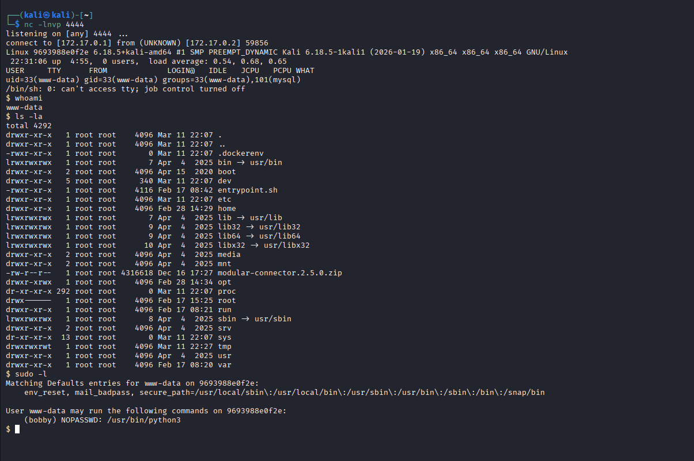

## Estabilización del acceso y enumeración interna

Se le hace **TTY** a la máquina para tener un entorno más adecuado:

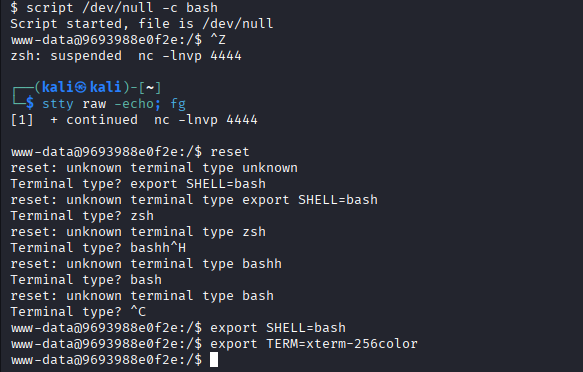

Se lee el archivo `/etc/passwd` para ver qué otros usuarios existen:

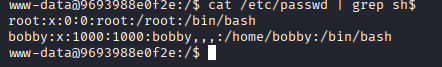

Y al revisar el directorio `/home` se encuentra la primera flag:

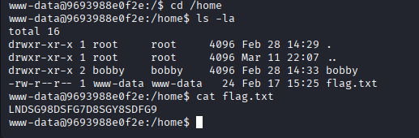

También se encuentra un archivo interesante en `/opt` llamado `backup`:

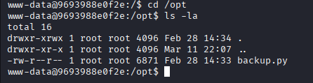

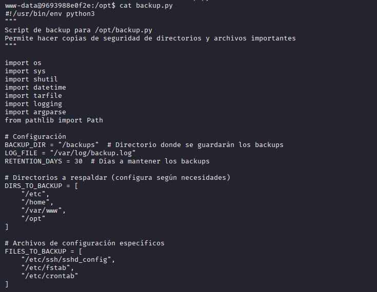

## Escalado de privilegios mediante sudo

Con esto se verifican permisos con `sudo -l`:

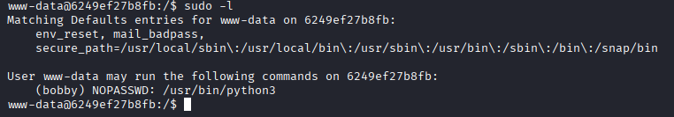

Donde se observa que se puede ejecutar `python3` sin contraseña (por algún motivo el módulo no está en el entorno de Docker).

Para resolverlo, se instala Python en el contenedor:

1. `sudo docker ps -a` 
2. `sudo docker exec -it <ID_DOCKER> bash -c "apt update && apt install python3 -y"`

Luego de ello se ejecuta Python como `bobby` para abrir una shell:

```bash
sudo -u bobby /usr/bin/python3 -c 'import os; os.execl("/bin/bash", "bash")'
```

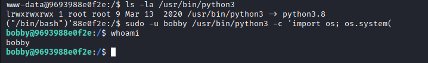

Con ello se abre una shell como este usuario, y se revisan inmediatamente sus privilegios con `sudo -l`:

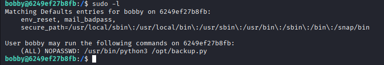

El resultado indica que este usuario puede ejecutar el script `backup.py` como sudo sin contraseña; al hacerlo se hace la recompilación de archivos. En un inicio se pensó en leer el archivo `/etc/shadow` pero este no mostró nada para escalar de privilegios. Se revisa el directorio `/opt` y se verifica algo que había pasado desapercibido: este puede ser editado por cualquiera, junto con su contenido.

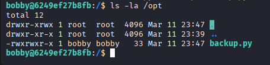

## Compromiso completo: obtención de root

Por lo que con esto se procede a borrar el actual archivo `backup.py`, y se crea uno nuevo con el mismo nombre pero que solo ejecuta una bash como root:

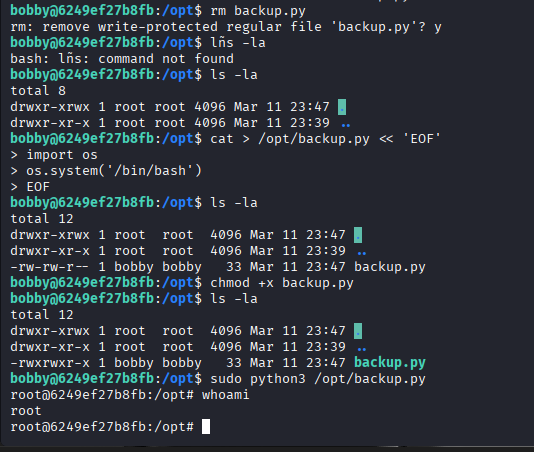

Funciona, ya somos root!!!!

## Recomendaciones

- **Contraseñas débiles/por defecto:** Implementar políticas de contraseñas robustas y forzar el cambio de credenciales administradas. Utilizar mecanismos de autenticación multifactor.
- **Extensión vulnerable (Hello Dolly):** Mantener plugins y extensiones siempre actualizados; eliminar los que no sean necesarios y utilizar listas de control de seguridad para plugins.
- **Editor de plugins alcanzable desde web:** Restringir las capacidades de edición de código directamente desde el dashboard, aplicar validaciones y sanitización, o deshabilitar completamente estas funciones en producción.
- **Perfiles sudo con permisos amplios:** Revisar y limitar las reglas de `sudoers`, evitando permisos genéricos como `NOPASSWD: python3`. Usar herramientas como `sudoedit` y listas blancas forzadas.
- **Directorios escribibles por cualquier usuario (/opt):** Corregir permisos de directorios críticos, asegurando que sólo administradores tengan derechos de escritura.


