# Vulnerame - Laboratorio de explotación

## Resumen ejecutivo

Este laboratorio guía al alumno a través del proceso de identificación y explotación de varias vulnerabilidades en una máquina objetivo que ejecuta servicios comunes (SSH, HTTP y MySQL) y un CMS (Joomla). El objetivo es demostrar técnicas prácticas: reconocimiento, aprovechamiento de una vulnerabilidad conocida del CMS para obtener credenciales, escalada mediante contraseñas descifradas, ejecución de una reverse shell y escalada final a root mediante explotación de un binario con permisos inseguros.

## Descripción del laboratorio

El laboratorio comienza con un escaneo de puertos y servicios para identificar la superficie de ataque. Los puertos descubiertos y servicios relevantes son SSH (22), HTTP (80) y MySQL (3306):

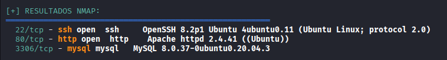

Un escaneo de directorios con Gobuster sugiere la presencia de una página de WordPress:

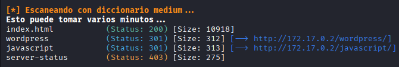

Al visitar la URL en un navegador, la página resulta ser una plantilla del CMS Joomla, no WordPress como parecía indicar el directorio anterior:

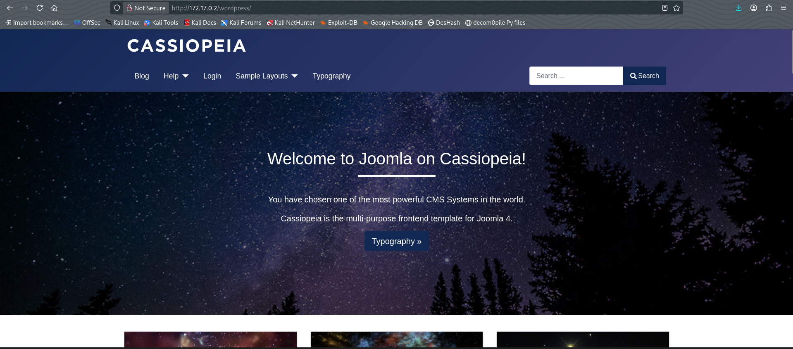

Tras una búsqueda inicial sin resultados útiles, se investiga la versión de Joomla (4) y se localiza un CVE reciente que permite recuperar credenciales de la base de datos (usuario y contraseña) y listar usuarios pertenecientes a grupos privilegiados (usuario y correo electrónico):

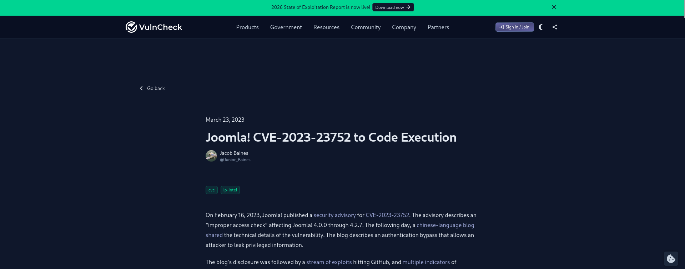

Se utiliza el exploit identificado para extraer las credenciales disponibles desde la instalación vulnerable de Joomla:

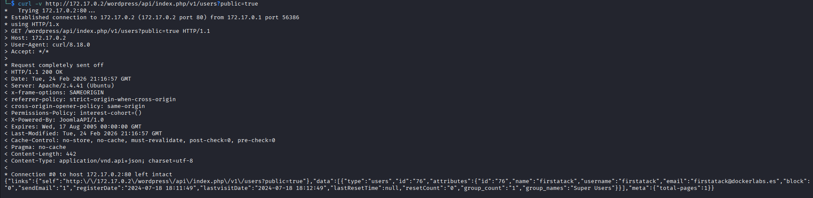
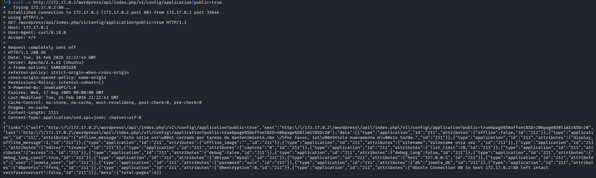

Entre las credenciales recuperadas aparece un usuario activo de la base de datos con su contraseña, con lo que se accede a la base de datos MySQL. En la revisión de la base de datos se identifica la base de datos `joomla_db` y la tabla `users`, la cual contiene el nombre de usuario y la contraseña cifrada de un usuario del sistema (el usuario ya había sido identificado mediante el CVE, pero sin contraseña):

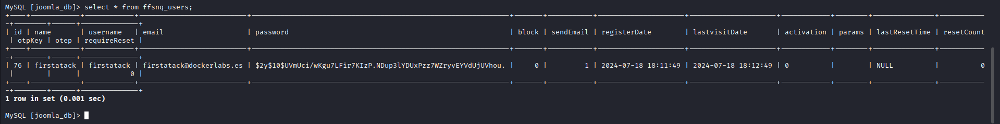

La contraseña almacenada está cifrada/hashada, por lo que se emplea John the Ripper para descifrar/romper el hash y recuperar la contraseña en texto claro:

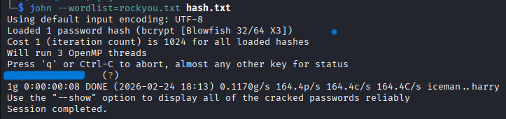

Con la contraseña obtenida se inicia sesión en el panel de administración de Joomla:

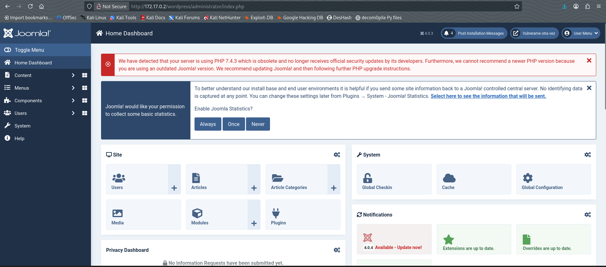

Tras comprobar varios vectores de ataque sin éxito, se decide intentar una reverse shell. La estrategia empleada consiste en modificar contenido editable (por ejemplo `index.html`) y añadir un script de PentestMonkey que, al invocarse, envía una señal y establece una reverse shell hacia la máquina atacante.

> Nota: antes de ejecutar la reverse shell, poner la máquina atacante en escucha con `nc -lnvp PORT`.

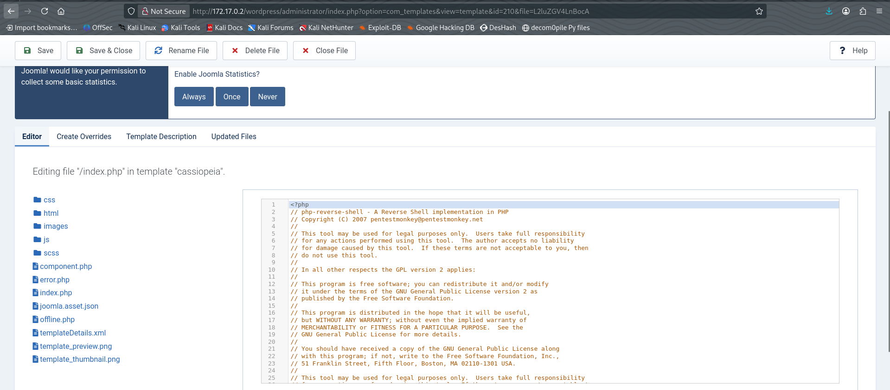

Posteriormente, se obtiene una reverse shell hacia la máquina atacante (en este caso, puerto 4444):

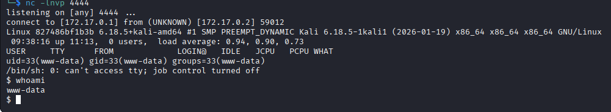

Desde la reverse shell se inspecciona `/etc/passwd` en búsqueda de usuarios locales que puedan ser útiles para avanzar en la escalada de privilegios:

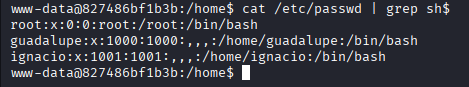

Se identifican dos usuarios con acceso SSH: `guadalupe` e `ignacio`. Como procedimiento se prueba un ataque de fuerza bruta sobre SSH, que resulta exitoso y permite acceder a una de las cuentas:

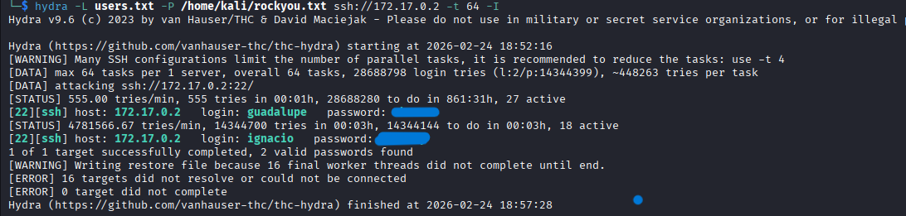

Se inicia sesión SSH con `guadalupe`, pero tras revisar su entorno y probar vectores habituales, no se encuentra información relevante para continuar la escalada:

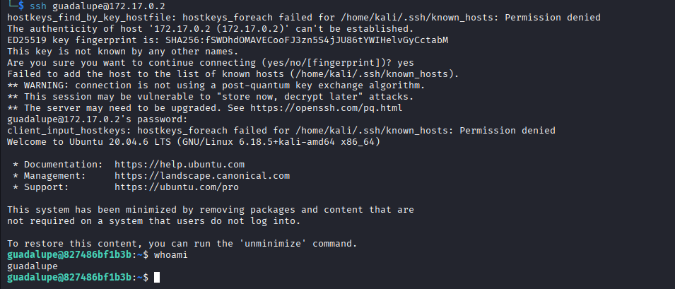

Posteriormente se inicia sesión con `ignacio`. El usuario `ignacio` tiene permisos para ejecutar Ruby a través de un binario del sistema con privilegios (configuración `sudo`):

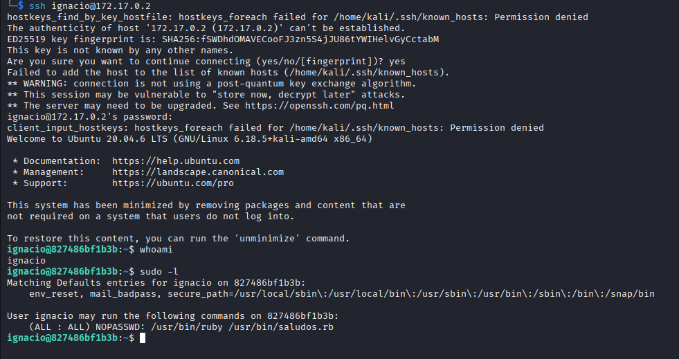

Se examina el binario en cuestión y se realizan pruebas para determinar su comportamiento:

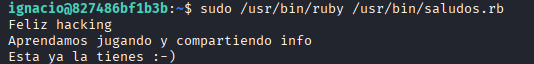

Se descubre que el binario es editable por el usuario, lo que permite modificarlo para insertar una llamada a `system "/bin/sh"`. Al ejecutar el binario modificado este invoca una shell con privilegios, y se obtiene acceso root:

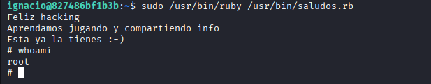

¡Finalmente, se alcanza el usuario `root`!

## Recomendaciones de mitigación

1. Vulnerabilidad: Exposición de un CMS Joomla vulnerable (CVE) que permite extraer credenciales.
	- Recomendación: Mantener Joomla y todos los componentes/canales actualizados; aplicar parches de seguridad tan pronto como estén disponibles y restringir el acceso administrativo desde redes públicas.

2. Vulnerabilidad: Recuperación de credenciales de la base de datos desde la instalación del CMS.
	- Recomendación: No almacenar credenciales sensibles en ubicaciones accesibles por la aplicación; usar variables de entorno con permisos restringidos y cifrar secretos en repositorios o gestores de secretos.

3. Vulnerabilidad: Contraseñas débiles/algoritmos de hashing inadecuados que permiten romper hashes con herramientas de cracking.
	- Recomendación: Aplicar algoritmos de hashing resistentes (bcrypt, Argon2) con salt único por usuario y políticas de contraseñas fuertes (longitud mínima, complejidad y bloqueo de cuentas tras intentos fallidos).

4. Vulnerabilidad: Posibilidad de modificar archivos web editables (p. ej. index.html) desde el panel, permitiendo subida/edición de contenido malicioso.
	- Recomendación: Restringir las capacidades de edición a roles mínimos, validar y sanitizar todo contenido editable, y emplear WAF/filtrado para detectar payloads de shell. Auditar cambios y mantener control de versiones para revertir modificaciones no autorizadas.

5. Vulnerabilidad: Fuerza bruta SSH posible por ausencia de mecanismos de protección.
	- Recomendación: Habilitar autenticación basada en claves (deshabilitar contraseñas para SSH), aplicar rate-limiting, fail2ban o similar, y forzar 2FA para accesos sensibles.

6. Vulnerabilidad: Binario del sistema editable o `sudo` mal configurado que permite ejecución de comandos con privilegios.
	- Recomendación: Revisar y endurecer la configuración de `sudoers`, eliminar permisos innecesarios, asegurar que los binarios con permisos elevados no sean modificables por cuentas no privilegiadas, y ejecutar controles de integridad de ficheros (por ejemplo, AIDE, Tripwire).

---

**Nota**: Todas las acciones descritas en este laboratorio se deben realizar únicamente en entornos controlados y con autorización explícita del propietario del sistema. El uso de estas técnicas en sistemas ajenos sin permiso es ilegal.

