# WhereIsMyWebShell - Writeup

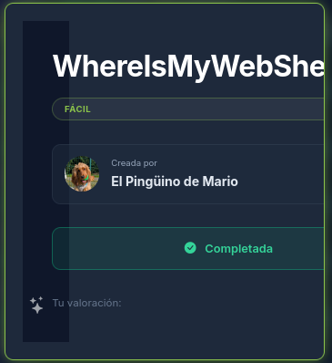

## 📋 General Description

This laboratory provides a valuable opportunity to develop skills in fuzzing techniques and the implementation of reverse shells. Through this machine, it demonstrates the critical importance of identifying and exploiting vulnerabilities in web applications that allow unauthorized command execution.

---

## 🔍 Phase 1: Reconnaissance and Service Identification

### Port Scanning with Nmap

The resolution process begins with an exhaustive port scan using Nmap to identify available services on the target machine:

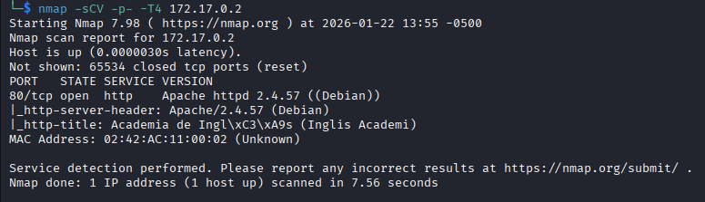

The scan reveals that only one service is active on port 80, corresponding to an HTTP server. This discovery simplifies the attack approach, allowing efforts to be focused on web application exploration.

---

## 🌐 Phase 2: Web Application Exploration

### Initial Access

The process proceeds by visiting the web page at the target machine's address:

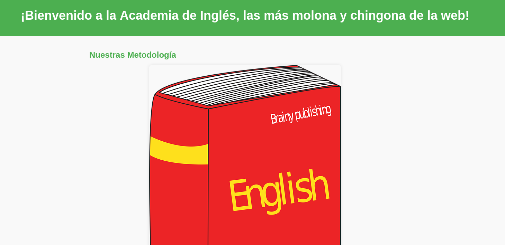

The main page contains general information of no apparent relevance. However, when scrolling down the page, a section is identified that provides crucial guidance for laboratory resolution:

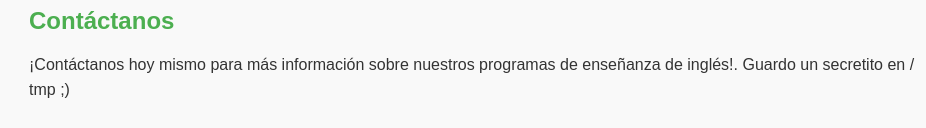

This hint mentions the existence of a secret located in the `/tmp` directory. Direct access attempts to this path do not produce positive results, thus necessitating more sophisticated techniques.

---

## 🔎 Phase 3: Directory and File Discovery

### Fuzzing with Gobuster

A fuzzing attack is performed using Gobuster to identify hidden directories and files on the web server:

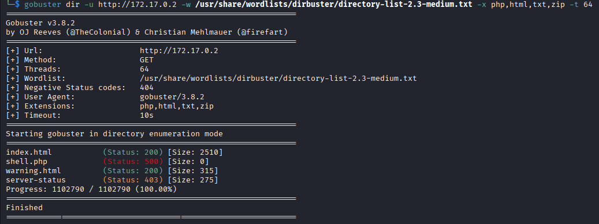

The scan reveals two important findings:

1. **Document with 500 status code**: Indicates a server execution error, suggesting the existence of a file attempting to execute but generating an exception.
2. **Additional HTML file**: Displays a warning message confirming the presence of a web shell that must be discovered.

### Parameter Analysis

The second observation provides critical information: the web application functions through URL parameters, making it potentially vulnerable to parametric fuzzing attacks.

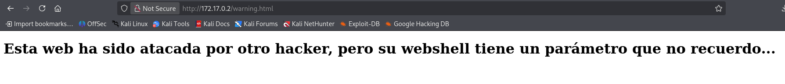

---

## 🎯 Phase 4: Parametric Fuzzing

### Identification of Vulnerable Parameter

A fuzzing attack is executed against the `shell.php` file using the FFuz tool to identify valid parameters:

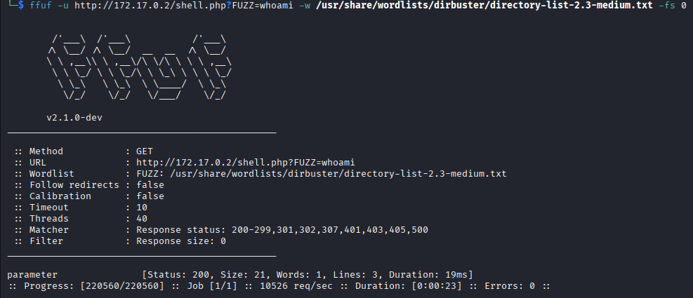

The results demonstrate that only the `parameter` parameter produces significant responses. It should be noted that this parameter was identified after multiple attempts using different attack methodologies, being the only one that allowed command execution.

### Validation of Command Execution

The process proceeds to validate whether the identified parameter allows system command execution. The `whoami` command is used to verify execution capability:

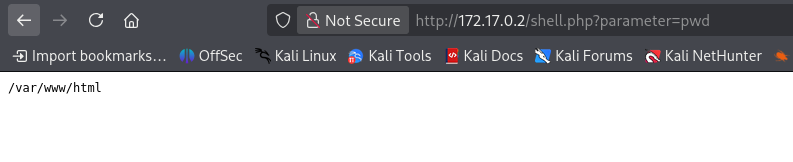

The successful execution of the `whoami` command confirms identification of a vulnerability permitting remote command execution (RCE - Remote Code Execution). However, it is observed that the available shell presents significant restrictions, allowing only the execution of basic commands such as `ls` and `pwd`.

---

## 🚀 Phase 5: Privilege Escalation via Reverse Shell

### Limitations of Web Shell

Due to restrictions of the identified web shell, establishment of a reverse connection (reverse shell) is required to obtain greater control over the system and execute more complex commands.

### Establishing the Reverse Shell

The attacking system is prepared by opening a listening port:

```bash
nc -lvnp 4444
```

From the web application, an adapted instruction is executed to establish a reverse connection toward the attacking machine:

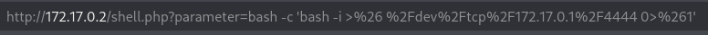

The original instruction was modified to ensure its correct execution through the URL and the previously identified vulnerable parameter.

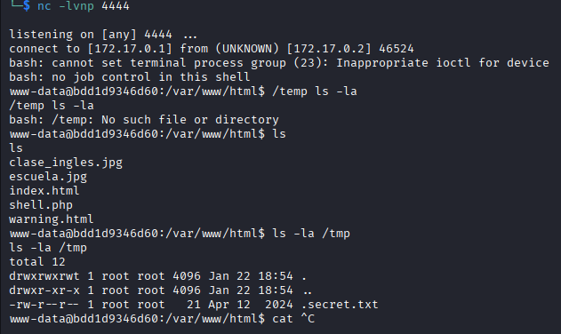

Once the reverse connection is established, a more powerful shell is obtained that permits command execution without previous restrictions.

---

## 📂 Phase 6: Search for Credentials and Sensitive Files

### Return to Initial Hint

Having obtained system control through the reverse shell, the hint provided on the initial page is revisited and the `/tmp` directory is explored:

```bash
ls -la /tmp
```

This command, with the `-la` option to display hidden files, reveals the presence of a particularly interesting file: `.secreto.txt`. The nomenclature with an initial dot indicates it is a hidden file, explaining why it was not identified in previous exploration.

### Credential Extraction

The content of the discovered file is examined:

```bash
cat /tmp/.secreto.txt
```

The file contains a password that permits privilege elevation on the system.

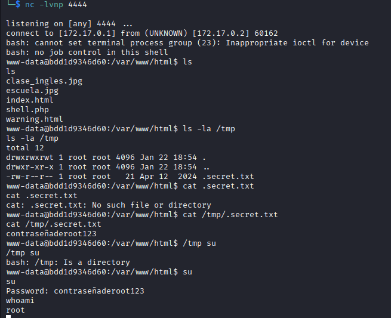

Using the obtained password and the `su` (switch user) command, access is achieved with administrator (root) privileges, successfully completing the laboratory.

---

## 🛡️ Security Recommendations

This laboratory illustrates critical vulnerabilities commonly found in web applications. Below are recommendations to mitigate risks related to remote command execution and reverse shells:

### 1. **Input Validation and Sanitization**
- Implement exhaustive validation of all input parameters received from the client.
- Utilize whitelists of permitted values rather than blacklists.
- Apply sanitization functions that eliminate special and potentially dangerous characters.
- Example in PHP: Utilize `filter_var()`, `htmlspecialchars()` or specialized libraries.

### 2. **Prohibition of Dangerous Functions**
- Disable or eliminate the use of functions that permit system command execution:
  - `exec()`, `system()`, `passthru()`, `shell_exec()`, `proc_open()`
  - If their use is absolutely necessary, implement restrictions and exhaustive auditing.

### 3. **Access Control and Authentication**
- Implement a robust authentication and authorization system.
- Verify that only authenticated and authorized users can access sensitive functionalities.
- Utilize CSRF (Cross-Site Request Forgery) tokens to protect against unauthorized requests.

### 4. **Principle of Least Privilege**
- Execute the web application with the minimum set of required permissions.
- Avoid executing the application with administrator (root) permissions.
- Create specific users with limited permissions for the web service.

### 5. **Web Application Firewall (WAF) Implementation**
- Deploy a WAF that detects and blocks common attack patterns.
- Configure specific rules to detect command injection and reverse shell attempts.
- Monitor and record suspicious attempts for later analysis.