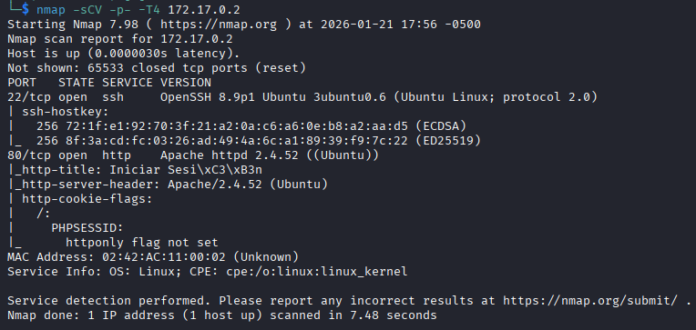
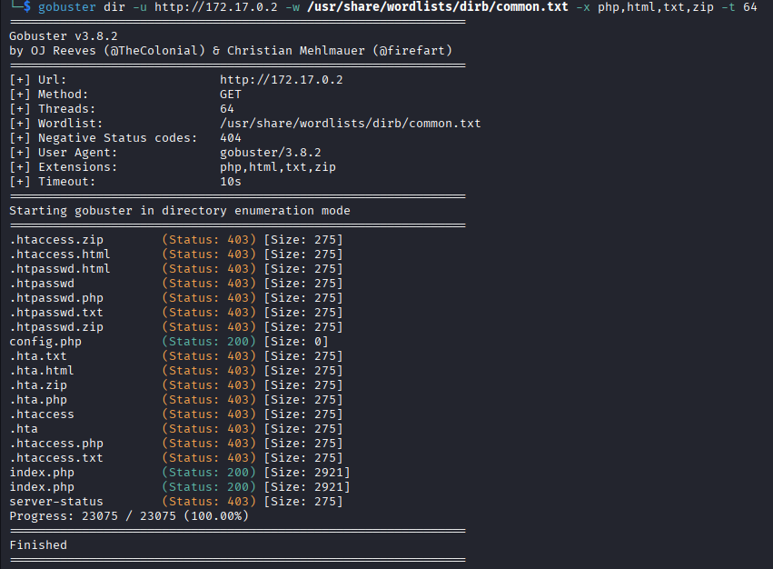
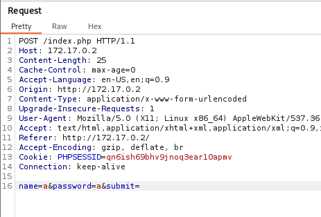
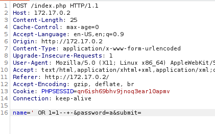
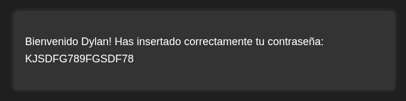
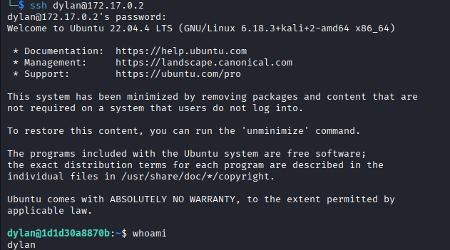
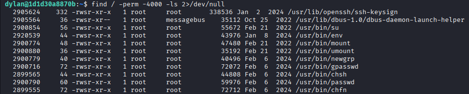

# Injection 🔐

**Injection** is a fairly simple laboratory from **DockerLabs** that, nevertheless, addresses a highly recurring and important topic in cybersecurity: the well-known **SQL injections** or **SQLi**.

---

## 🔍 Initial Reconnaissance

The laboratory begins, as is customary, with a port scan using **Nmap**. The scan is performed with the `T4` parameter to accelerate the process.



### Discovered Ports

Two open ports are found:
- **Port 22**: SSH
- **Port 80**: HTTP

### HTTP Service Analysis

The content of the HTTP service is reviewed, which is a login form with two input fields:
- Username
- Password

No additional elements are visible.


#### Directory Search

Following standard protocol, a search is conducted using **Gobuster**; however, it finds nothing except an empty `config.php` file, likely an error or document from an initial idea that was not implemented.



## 💉 SQL Injection Exploitation

After this, and considering that there are no other avenues, it is decided to take into account the laboratory's name and attempt an **SQL injection**. There are several ways to do this—either through direct input in the form—but it is decided to use **Burp Suite** to examine the structure of the query being executed.



### Query Analysis

A very basic SQL query can be observed, which could have been solved directly, but the process continues in this environment. To proceed with the **SQLi**, the corresponding modifications are made.



In this way, access is obtained and the following is displayed.



### Credentials Obtained

✅ **Bingo!** Credentials and a username are obtained. It is decided to use these in the **SSH** service on port 22.



Access is obtained.

⚠️ **Important note**: In the HTTP service, the username is displayed as `Dylan` with a capital letter; however, in SSH it is `dylan` in lowercase. Since SSH is case-sensitive, this generates failures and potential confusion.

## ⬆️ Privilege Escalation

After this, several things are checked without success, so it is decided to use the `find` command in a search for binaries that allow privilege escalation.



### Vulnerable Binary

And with this, the target is hit, as it can be seen that the `env` binary has **SUID** (set user ID) permissions and belongs to `root`. This means it can be executed with root privileges, and since the `env` binary allows shell execution, the challenge is solved.

> 📝 **Note** that the `-p` flag is used to maintain privileges.

The binary is executed as follows:


### Final Result

🎉 **Finally, root access is achieved!**

---

## 📊 Laboratory Summary

| Step | Description | Tool |
|------|-------------|------|
| 1️⃣ | Port scanning | Nmap |
| 2️⃣ | Directory search | Gobuster |
| 3️⃣ | SQL injection | Burp Suite |
| 4️⃣ | SSH access | SSH Client |
| 5️⃣ | Privilege escalation | find + env |
```
