# Little Liars

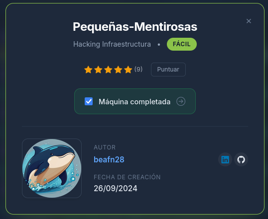

## General Description

This has been a different CTF from others, where new skills are tested such as brute force attacks with Hydra and identification of vulnerable files in critical locations. Although it was an easy-level CTF, it remained a great challenge that allowed learning and developing new skills. Its curious organization and various distractors made it suitable for understanding the importance of prioritizing information and processes.

## Phase 1: Reconnaissance with Nmap

The laboratory was started with a Nmap analysis, performed to verify all ports, using the `-T4` flag to speed up the process (not recommended in production environments).

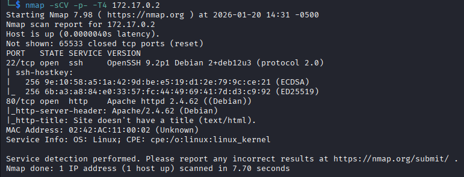

Subsequently, two open ports were identified in the laboratory: **22** (SSH) and **80** (HTTP).

## Phase 2: HTTP Service Enumeration

The content of port 80 was reviewed, visualizing the following:

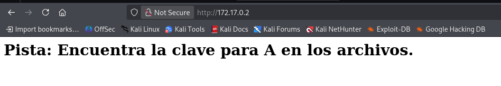

The only visible content was text that read: "Hint: Find the key for A in the files". This allowed analysis to determine that at some point in the laboratory, documents with credentials would be presented. An analysis of the HTTP service with `gobuster` was performed in search of documents, however nothing relevant was found.

## Phase 3: Brute Force Attack against User A

Considering the hint again, it was interpreted that "A" was probably a user. A brute force attack was executed using Hydra with the `rockyou.txt` dictionary.

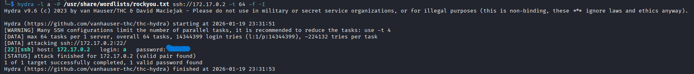

After the attack, the user's password was obtained. With both credentials, the SSH service was accessed.

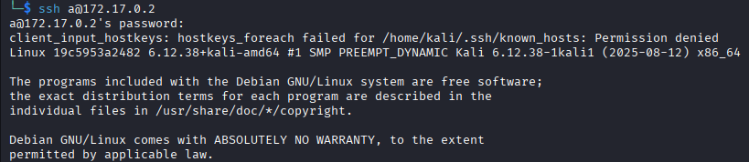

## Phase 4: Analysis of User A

After logging in, common tests were executed to determine available privileges:

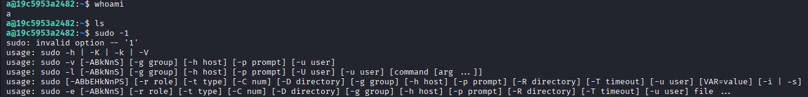

No privileges were found that would allow significant advancement. When executing the `find` command to follow the initial hint, interesting results were obtained:

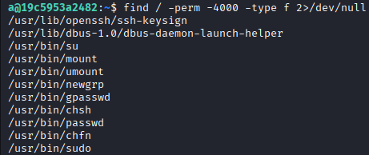

Several binaries were identified such as `passwd`, `gpsswd`, or `sudo`, but they turned out to be intentional distractors since user "A" did not have the necessary privileges to use them.

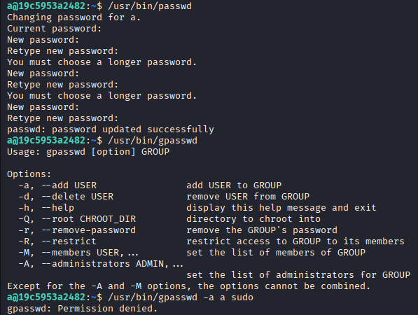

## Phase 5: Discovery of Critical Documents

When reviewing the root directory of the service `/srv/ftp`, documents were found that allowed advancement:

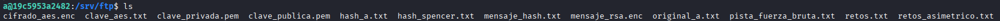

A large amount of information was identified, including files encrypted with AES or RSA. However, these turned out to be additional distractors. The most relevant document was `pista_de_fuerza_bruta.txt`, which mentioned the need to perform another brute force attack to obtain the credentials of another user called "spencer".

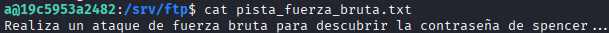

## Phase 6: Brute Force Attack against User Spencer

At this point, two possible approaches existed:

1. Perform another attack with Hydra using the `rockyou.txt` dictionary
2. Use the `hash_spencer.txt` document with a decryption tool

Both methods were functional. Hydra was selected:

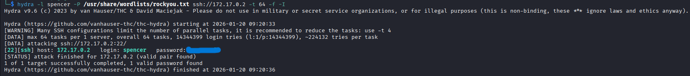

Spencer's credentials were obtained and a session was initiated on SSH with this user.

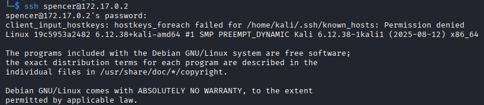

## Phase 7: Privilege Escalation

When executing `sudo -l` (a fundamental command in audits for privilege escalation), the following was obtained:

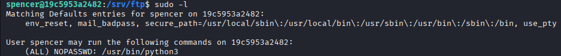

This user had permissions to execute `python3` without a password. Proceeding to exploit this vulnerability:

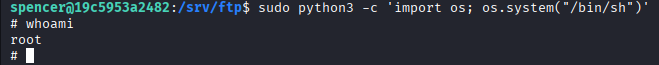

## Conclusion

**Root access obtained successfully!**
