# Rooted Penguin - Detailed Laboratory Analysis

## 1. Initial Reconnaissance

The laboratory begins with a Nmap scan revealing two open ports: **5173** and **8000**. Although initially appearing as unknown, they are quickly identified as:
- **Port 5173**: Frontend application developed with Vite and React
- **Port 8000**: Backend API that serves as support for the frontend

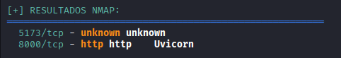

Subsequently, a deeper analysis is attempted with Gobuster, which does not produce significant results. The decision is made to visit the web application directly, discovering a page with penguin-themed content dedicated to providing support and information related to these birds.

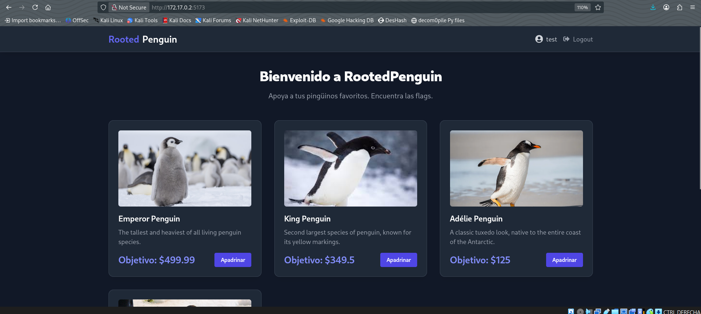

While exploring the second open port and testing different routes, it is discovered that it exposes the complete documentation of the API endpoints of the system.

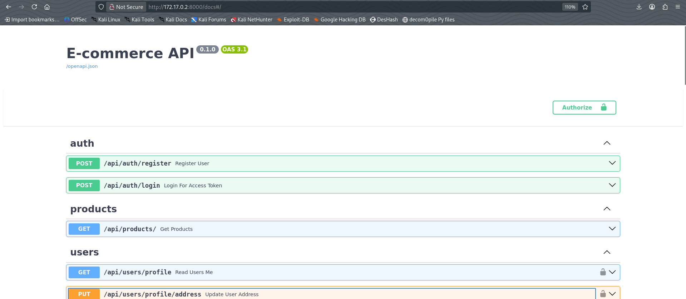

## 2. Discovery of the First Vulnerability: Information Disclosure

The system provides user registration and login functions. During the reconnaissance phase, the "admin" user is tested to verify its existence. The server's response reveals sensitive information: **the user already exists**, disclosing the existence of a user with elevated permissions.

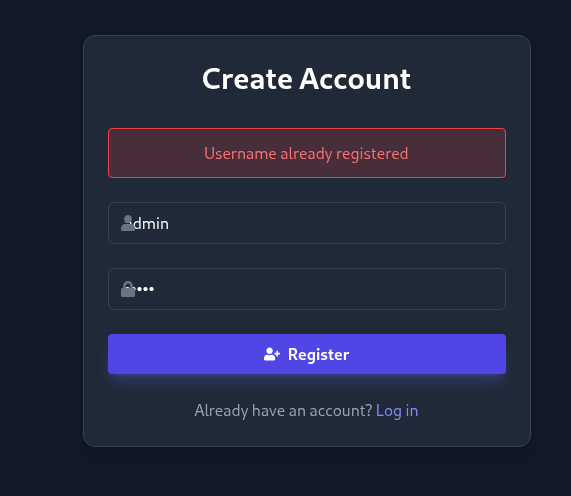

This **information disclosure** vulnerability is critical as it allows an attacker to identify valid administrator accounts without authorization.

## 3. Analysis of User Profile

A test user is created with credentials `user:user` and its profile is accessed:

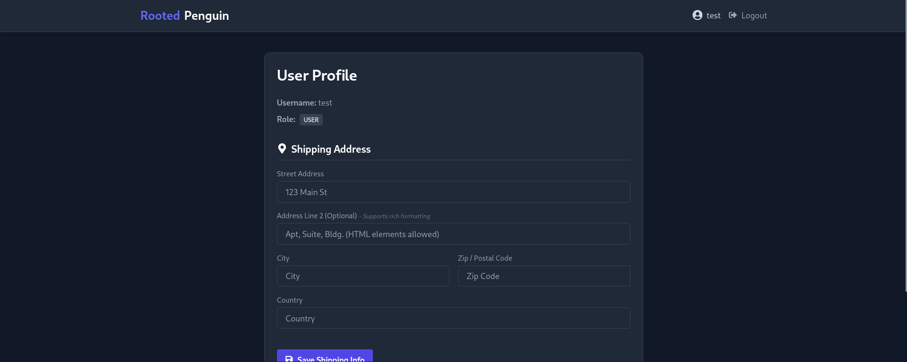

In this section, several relevant aspects are observed:
- The system implements a hierarchical role model
- The "address" field (specifically line 2) is susceptible to **XSS (Cross-Site Scripting) attacks**
- Although the XSS vulnerability exists, it is not immediately apparent

Given that there are no other immediate attack vectors, the network traffic is analyzed using Burp Suite to better understand the registration and login flow.

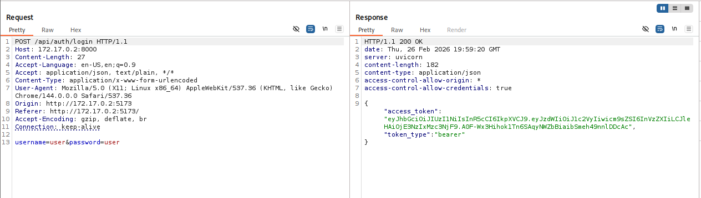


## 4. JWT Token Analysis

The analysis of the intercepted traffic reveals a critical finding: **the session token (JWT) is exposed**. This token is fundamental for escalating privileges and must be analyzed.

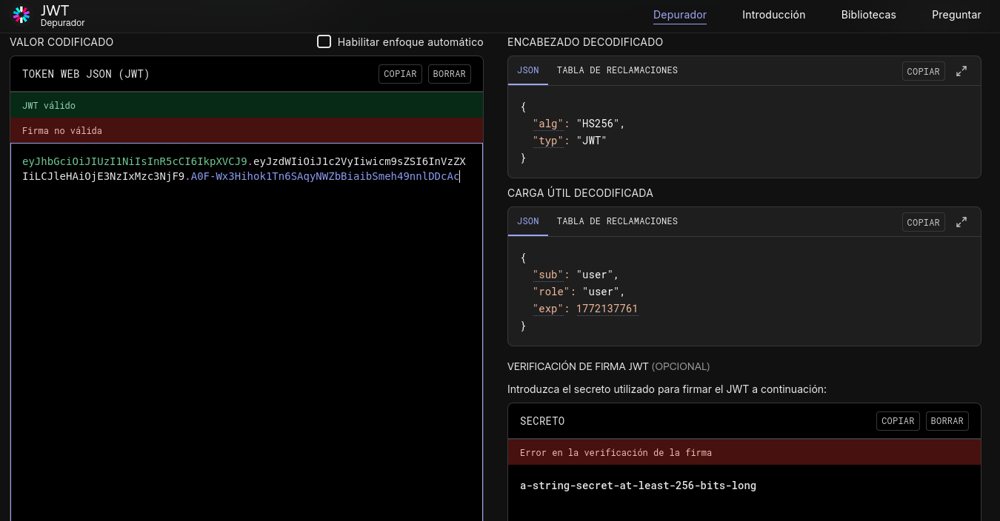

The JWT is decoded and observed to be signed, but the secret is not immediately apparent. Given that the application contains no useful keywords, a **brute force (BF) attack** is performed using John the Ripper to discover the secret key:

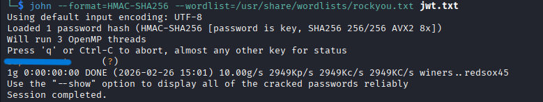

**Success!** The secret is discovered to be weak. With this compromised secret, a clear attack vector opens up.

## 5. Token Manipulation and Privilege Escalation

The strategy is clear: create a new JWT token signed with the discovered secret, but with data from a higher-privileged user (in this case, "admin"). JWT.io is used to perform this manipulation:

**Payload of the new token:**
```json
{
    "sub": "admin",
    "role": "admin",
    "exp": 1772137761
}
```

After generating the forged token, verification is performed by accessing a protected endpoint (for example, `/users`), which reveals all users in the system. This is itself another serious vulnerability: **the unauthorized exposure of user data**.

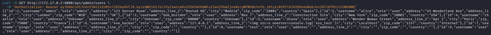

## 6. Token Injection into localStorage

The frontend stores the session token directly in `localStorage` without additional protection. Exploiting this weakness, the local storage is intercepted to replace the current login token with the forged admin token:

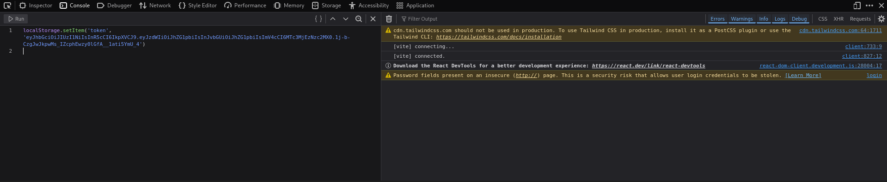

This allows access to the "admin" user's session without knowing their password.

## 7. Access to the Administrative Panel

With the admin token injected, complete access to the administrative panel and the administrator's profile is obtained:

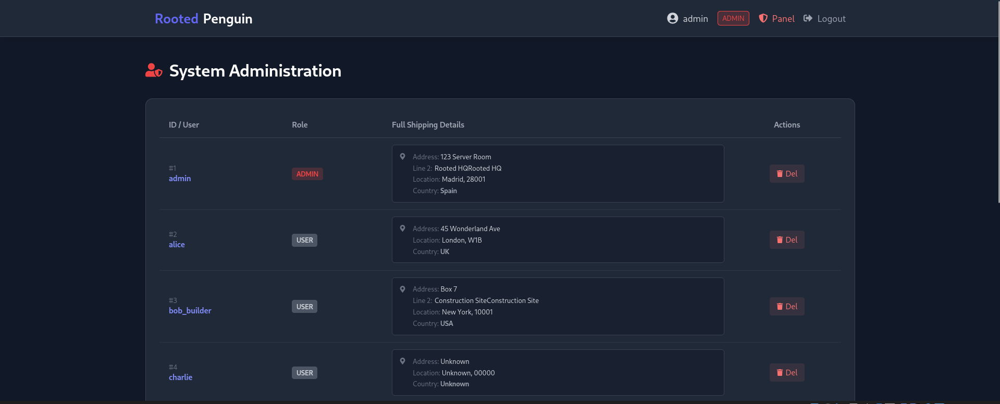
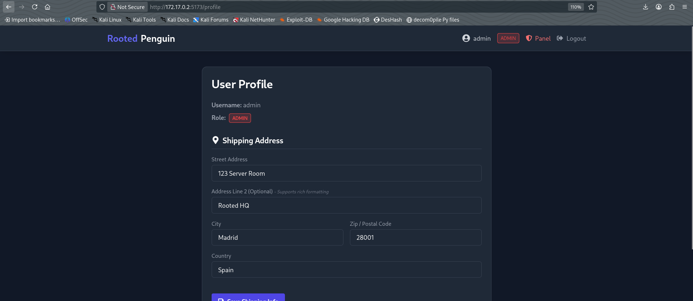

In the administration panel, a listing of all users in the system is found. A user is identified whose address field (vulnerable to XSS) contains what appears to be an image or icon, suggesting a possible injected XSS payload.

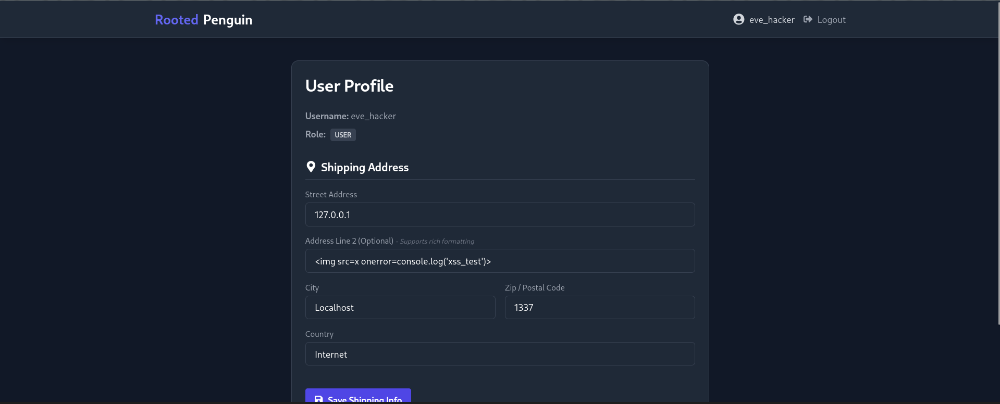

## 8. Testing the XSS Vulnerability

It is confirmed that the address field of the user allows the execution of JavaScript through image XSS payloads:

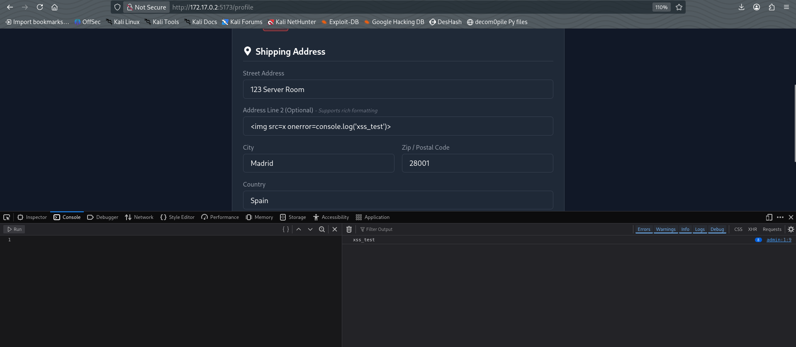

Although this vulnerability is real and critical, it proves tedious to exploit in practice. Therefore, an alternative, more direct path is explored.

## 9. Discovery of Command Injection

Upon careful review of the API endpoints, it is identified that the **DELETE** endpoint is susceptible to **command injection**. This endpoint accepts a `{username}` parameter that is not properly sanitized.

An initial test is performed with the `sleep` command to validate the vulnerability:

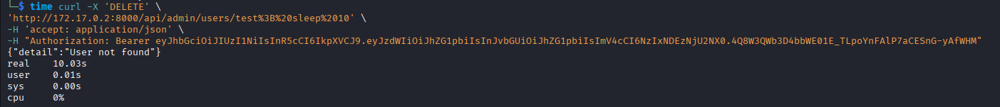

**Confirmed!** The command injection works. A payload is now crafted to send a reverse shell signal to the attacker's machine on port 4444:

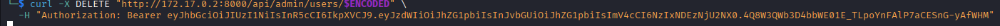

**⚠️ Important Notes:**
- The payload must be encoded in **Base64** and **URL-encoded**. Otherwise, it may fail. (Researcher's note: over 60 minutes were spent investigating this behavior)
- Ensure you have a listener active on port 4444 before executing the payload

## 10. Obtaining Root Access

Finally, the reverse shell connects successfully, revealing **direct access as the root user**:

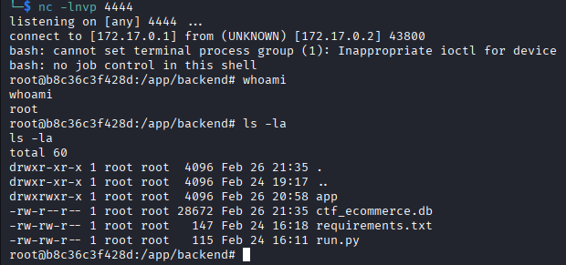

## 11. Summary of Exploited Vulnerabilities

1. **Information Disclosure** - Disclosure of valid users during registration
2. **Weak JWT Secret** - Weak secret susceptible to brute force
3. **Token Manipulation** - Possibility of forging valid JWT tokens
4. **Insecure localStorage** - Storage of sensitive credentials without protection
5. **Broken Authorization** - Privilege escalation through manipulated tokens
6. **Reflected XSS** - Cross-Site Scripting in user fields
7. **OS Command Injection** - Injection of operating system commands

---

## 12. Mitigation Recommendations

### 1. Mitigation of Information Disclosure in Registration
**Vulnerability:** The system reveals whether a user exists when validating registration.

**Recommendation:** Implement generic responses during registration. In case of conflict, return a message such as "The email/user is already registered" without specifying which field caused the conflict. Additionally, use detailed logs for internal monitoring.

---

### 2. Mitigation of JWT with Weak Secret
**Vulnerability:** The secret used to sign JWTs is weak and can be deciphered by brute force.

**Recommendation:** Use a sufficiently long (minimum 256 bits) and random secret key. Consider using more robust algorithms such as RS256 (RSA) instead of HS256 (HMAC). Generate secrets using secure cryptographic generators and store them in protected environment variables.

---

### 3. Mitigation of JWT Token Manipulation
**Vulnerability:** It is possible to forge valid JWT tokens by knowing the secret.

**Recommendation:** Although this vulnerability is a consequence of the previous one (weak secret), implement additional validation such as: including an issue timestamp (iat) and verifying it is not too old, implementing a blacklist of revoked tokens, using asymmetric algorithms (RS256), and validating the token on each sensitive request.

---

### 4. Mitigation of Insecure localStorage Storage
**Vulnerability:** Tokens are stored in `localStorage` without protection, accessible to scripts and XSS attacks.

**Recommendation:** Store tokens in **HttpOnly** and **Secure** cookies, preventing JavaScript from accessing them. If using localStorage is necessary, implement token rotation every 15-30 minutes, encrypt the content on the client side (although with certain limitations), and ensure mandatory HTTPS.

---

### 5. Mitigation of Privilege Escalation
**Vulnerability:** An authenticated user can change their role and escalate privileges.

**Recommendation:** Implement strict role and permission validation on the backend for each sensitive endpoint. Roles should never be trusted from the frontend. Maintain a detailed audit log of role changes. Implement multifactor verification for critical administrative operations.

---

### 6. Mitigation of Cross-Site Scripting (XSS)
**Vulnerability:** The address field allows the execution of JavaScript code.

**Recommendation:** Implement input sanitization: validate and filter special characters, use libraries such as DOMPurify. Encode output in HTML entities when displaying user data. Establish a restrictive **Content Security Policy (CSP)** that prevents the execution of inline scripts. Perform regular XSS testing.

---

### 7. Mitigation of Command Injection
**Vulnerability:** The DELETE endpoint is susceptible to operating system command injection.

**Recommendation:** Never construct commands by concatenating user input. Use secure API functions that do not invoke a shell (e.g., spawn in Node.js instead of exec). Implement a whitelist of allowed values for critical parameters. Run the application with minimum privileges (not as root). Implement strict input validation and sanitization. Use sandboxing if possible.

---

**We are root!**
